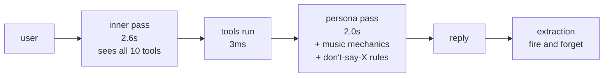
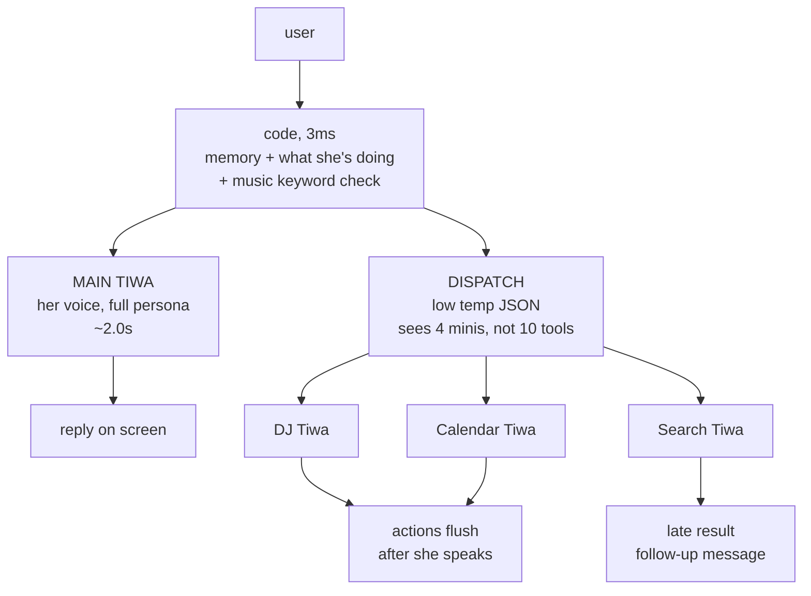
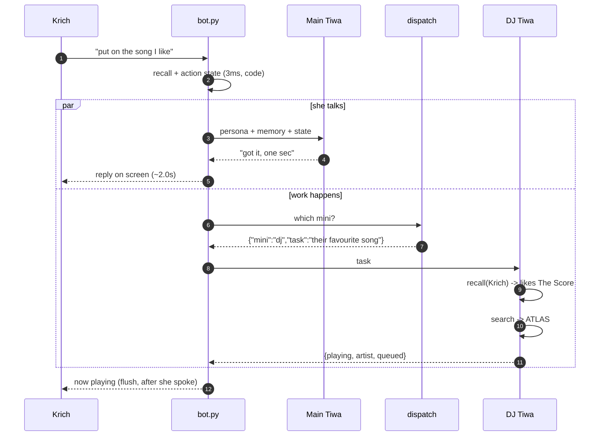
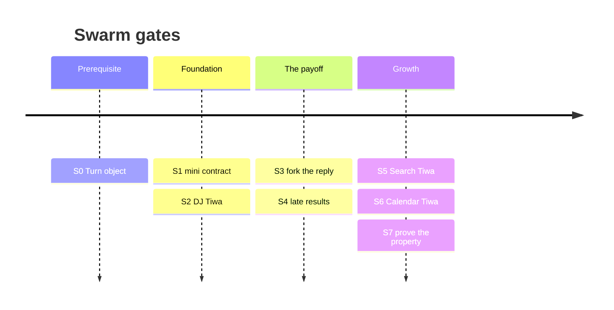

# SWARM — the Mini Tiwa plan

Status: **not started.** This is the picture to argue with before any code moves.

Companion to `PLAN.md`. Same rules: every gate ships alone, every gate has one
runnable check, and a gate that can't be judged by running something isn't done.

---

## The one-sentence version

Main Tiwa decides **what** to do. Mini Tiwas figure out **how**.

She says "put on their favourite song." DJ Tiwa works out who "they" are, what
they like, finds it, and plays it. Main Tiwa never learns any of that.

---

## Why (the honest ranking)

Four reasons were on the table. They are not equally good, and the plan is
built on the strong ones.

| reason | holds up? |
|---|---|
| **Growth** — add skills without breaking the ones that work | **Yes. This is the whole reason.** |
| **Fewer details in her head** — facts instead of "don't say X" | **Yes**, and stronger than it first looked |
| **Latency** — she talks while work happens | **Partly.** Real, but the cause isn't what it looked like |
| **Prompt dilution** — long prompt hurting attention | **No.** Her prompts are ~2.6k tokens; the effect starts an order of magnitude higher |

### Growth is the real one

`docs/concepts/tools.md` already says it:

> More tools = worse tool selection. `now_playing` was deleted for this reason.
> Every tool you add competes with `play_music` for attention.

You deleted a working tool to protect the others. That's the ceiling, and it's
self-diagnosed. Home Assistant is next on the roadmap — lights, locks, garage,
heat — which is 5-6 more tools onto a list of 10.

Under this design, **Main Tiwa's list stays flat forever.** She sees ~4 minis.
DJ Tiwa can have nine tools inside it and Main never knows.

`now_playing` can even come back. It only had to die because it competed.

### "Facts instead of prohibitions"

Look at what's in her **voice** prompt today (`pipeline._doing()`):

> "Never say you do not know the song... Do not sing or quote its lyrics.
> You have not seen the search result yet, so do NOT name an artist, album
> or year for it."

Three prohibitions, all because she doesn't know what got played. If DJ Tiwa
hands back `{"playing": "ATLAS", "artist": "The Score", "queued": 2}`, all three
lines delete themselves. She has the artist. Nothing to forbid.

**Prohibitions are expensive. Facts are cheap.** Every capability you add today
brings its own pile of "don't say X." That's what actually bloats her.

### Latency — measured, not guessed

From her own log, 111 real turns:

| | p50 | p95 |
|---|---|---|
| whole turn | **6,431 ms** | 13,622 ms |
| inner pass (deciding about tools) | 2,597 ms | 4,173 ms |
| persona pass (her voice) | 1,958 ms | 3,243 ms |
| **the tools actually running** | **3 ms** | 4,337 ms |

The tools are free. The six seconds is her thinking about tools *before* she's
allowed to start talking. Splitting capabilities doesn't fix that — **letting
her talk and dispatch at the same time does** (gate S3).

---

## What it looks like

### Today



<figcaption>One line. Every step waits for the one before it. 6.4s.</figcaption>

### After



<figcaption>Main Tiwa never waits on a mini. That's the rule everything else
depends on.</figcaption>

### One turn, start to finish



---

## The rules that don't bend

These are guarantees, not preferences. Each one has already been broken once in
this project's history, which is why it's written down.

1. **Only Main Tiwa speaks.** Minis return structured data. Ever.
2. **Minis return facts, never instructions.** The moment a mini returns
   `"tell them it's playing"`, the prompt bloat has moved into a new file and
   the voice can leak. Facts plus a completeness flag; **code** turns the flag
   into a guard line if one is needed.
3. **Minis read, they never write beliefs.** `recall` yes. Anything that sets a
   memory, no. Offline reflection stays the only thing that changes what she
   thinks. (`docs/concepts/guards.md`)
4. **One writer.** Minis return data; `bot.py` acts on it. Already true today —
   "tools set flags, they don't act."
5. **The check-mark gate is untouched.** Calendar Tiwa can decide *what* to
   write. Krich still confirms it with a reaction.
6. **Nothing a mini does blocks her reply.** DeepSeek freed your GPU, not your
   clock. Each hop is still ~2 seconds.
7. **Minis get taste, never voice.** Taste = who "they" are and what they like
   (memory data). Voice = the Thai register, the sass, the escalation ladder.
   DJ Tiwa needs taste to find a favourite song. It never needs voice. If a mini
   seems to need voice, it's doing Main's job.

---

## The minis

### DJ Tiwa — first, and the template

53% of all tool calls today. Half of it already exists as `_TERMS_SYSTEM`.

**Its own tools:** `recall` (read), `web_search` (read), `play`, `queue`, `skip`,
`stop`, `now_playing`

**What it handles that Main Tiwa currently has to:**

- their favourite song → recall who they are, what they like, then search
- "something like this one" → read the deck, find similar
- play vs queue vs skip — the deck state decides, not her
- naming search terms (`_TERMS_SYSTEM` moves here whole)
- the missed-ask retry (`_missed_music` / `_force_music` move here)
- knowing what's on without a tool call

**Main Tiwa's music tools: 4 → 1.** Her `_doing()` music block shrinks to facts.

### Calendar Tiwa — the judgment, not the mechanics

Half of calendar is built and must **not** become an agent. The other half
doesn't exist and can only be an agent.

| work | who does it |
|---|---|
| parse a date, build the event, list events | code + `gcal._EVENT_FORMAT` (exists) |
| the write itself | check-mark gate (exists, never an agent's call) |
| "this Tuesday or next Tuesday?" | **Calendar Tiwa** |
| "does this clash with something?" | **Calendar Tiwa** |
| **"is this worth bringing up right now?"** | **Calendar Tiwa** |

That last row is why it earns the name. *Should I mention this?* is a judgment,
not a lookup — and constraint #5 says **she is not a butler**, so it has to be a
judgment she's allowed to make. Nothing in the current design can do it.

It also unblocks the grounded heartbeat on the roadmap: "lights still on at 1am,
you asleep?" is the same question.

### Search Tiwa — read-only, off the critical path

8 calls in 135, but the worst tail latency (p95 4.3s). The only mini shape that
*both* sides of the industry argument endorse: read-only workers that add
intelligence, not actions.

**Its own tools:** `web_search`, `recall` (read)

**Handles:** multi-hop ("who directed it" → "what else did they do"), dedupe
(`SEEN_URLS` already exists), and "I don't recognise this" → search instead of
hedge.

### Memory Tiwa — deferred, on purpose

`recall` is a 3ms sqlite lookup. An LLM in front of it buys two seconds and no
new ability. It also can't write, by rule — so it has nothing to reason about.

**Build it when:** a mini asks something `recall` can't answer in one lookup.
Entity normalization ("Gojo" vs "Gojo Satoru") is the trigger already on the
roadmap.

---

## Gates

Each ships alone. Each has one runnable check. Stop at any point and what's
merged still works.



### S0 · Turn object — kill the globals ✅ done 2026-08-21

**Did:** the six per-turn globals moved onto a `Turn` dataclass held in a
`contextvars.ContextVar` (`tiwa/tools.py`). asyncio copies the context into every
Task, and `asyncio.to_thread` carries it across the thread boundary — which is
the path a tool actually takes.

`pipeline.respond()` and `pipeline.idle()` call `tools.new_turn()`. The heartbeat
needs its own call because `tasks.loop` is one long-lived Task whose context
outlives a tick.

**The old names still work.** A module-level `__getattr__`/`__setattr__` shim maps
`tools.PENDING_MUSIC` onto the current turn, so `bot.py`, `chat.py`,
`dashboard.py` and seven benches did not change. That is deliberate: it is what
makes *"no behaviour changed"* checkable by running those benches **unmodified**.
Marked `ponytail:` in the source with its upgrade path — delete the shim once the
minis land and every caller says `current()` anyway.

**What it was hiding.** With one shared Turn, two concurrent turns produce:

| | old | now |
|---|---|---|
| metal turn's `PENDING_MUSIC` | `'lofi'` | `'metal'` |
| lofi turn's DJ list | 3 jobs, 2 from the other channel | its own |
| `PENDING_CALENDAR` | both channels' writes merged | separate |

The last row is the real one: a calendar change requested in one channel
appearing in another channel's ✅ gate.

**Check:** `tests/turnbench.py` — concurrency, the thread hop, the heartbeat
reset, and that assigning `tools.PENDING_MUSIC = None` doesn't shadow the shim.
No Discord, no network, no model. Verified to fail when `current()` is forced to
return one shared `Turn`.

`djbench`, `panelbench`, `test_memory` pass unmodified.

### S1 · The mini contract ✅ done 2026-08-21

**Did:** `tiwa/minis.py` — registry plus dispatch, one module, exactly the shape
`tools.py` already has. (Not a package: `tools.py` holds the decorator *and* all
ten tools in 270 lines, and there is no reason minis differ. It becomes a package
the day one mini needs its own file.)

**Nothing calls it.** `pipeline.py` is untouched — S1 ships the contract, S2 moves
music onto it. The gate is additive and revertable on its own.

A mini is `fn(db, task: str) -> dict`, registered with a description and **the
list of fact keys it may return**:

```python
@mini("plays and queues music. give it the song, mood or 'their favourite'.",
      ("playing", "artist"))
def dj(db, task): ...
```

**Declared fields are how rule 2 is enforced**, and they are the only automatic
part of it. You cannot reliably detect `"tell them it's playing"` at runtime — but
you can make adding a field a visible edit someone reviews. A mini that starts
smuggling voice has to say so in its own signature first. `clean()` drops
undeclared keys, nested objects, and non-dict returns.

`run()` degrades to `{}` on a crash, an unknown mini, or an unusable return —
never raises. Same stance as tools: a bad mini is a no-op she asks about, not a
dead turn.

Dispatch schema, as built:

```json
{
  "dispatch": [{"mini": "dj", "task": "their favourite song"}],
  "ask": "which friday did they mean"
}
```

- `"dispatch": []` is the **common** case — 59% of turns need no mini. The prompt
  says so in those words: *"An empty list is the normal answer, not a failure."*
- Ambiguous? Empty dispatch + a populated `ask`. Not new — the inner pass already
  emits `ask them: ...` lines.
- `mini` is a **strict enum of the live registry**. The tool pass has to cope with
  invented names; this pass cannot produce one.
- The task is a **goal, not a plan** — "their favourite song", not the user's
  sentence and not steps. The mini works out the rest.
- No `blocking` field. One rule instead: **LLM dispatches never block; code
  (recall, action state) runs inline.** A knob here is a knob that gets set wrong.

**Two traps this repo has already been bitten by, both now checked offline:**
OpenRouter rejects a strict `json_schema` whose properties are not *all* required
(`gcal._EVENT_FORMAT` carries the same note), and DeepSeek returns **empty
content** unless the prompt literally contains the word "json". `llm.chat`
asserts the second, but only on a live call — and a live call needs a key.

**Check:** `py -X utf8 -m tiwa.minis` (registry contract) and
`tests/minibench.py` (schema strictness at every depth, the "json" word, temp 0,
and six routing cases including an invented mini and non-JSON junk). No key, no
network, no model.

### S2 · DJ Tiwa ✅ built 2026-08-21 · not yet wired

**This gate was written wrong and reading `djbench` is what showed it.** The plan
said move `_TERMS_SYSTEM`, `_missed_music`, `_force_music` and the deck state into
the mini. Two of those must not move, and one of them for a reason that matters
more than the test.

#### `_missed_music` stays in the turn layer — it is the net UNDER the router

It fires when the model **failed to notice** a music ask — about 1 ask in 4–6.
Put it inside DJ Tiwa and it only ever runs on turns where the router already
dispatched DJ, which is exactly the turns that never needed it. A safety net
inside the thing it is catching is not a safety net.

So it stays in `pipeline`, deterministic, on every turn, in front of dispatch.
That is the cheap layer of a hybrid router, and it is already built and already
measured — 24 cases in `djbench`, every one traced to a dated live-log failure.

`_doing()` and `_asked_deck()` stay too: they compose Main Tiwa's state from
*every* mini, not just music.

#### What actually moved

`_TERMS_SYSTEM` plus the play/queue/skip/stop choice, into `minis.dj`. One
schema-constrained call at temp 0 returns `{action, terms}`.

The deck is **read**, never asked for — `music.NOW` and `music.QUEUE` go into the
prompt as facts. That is the tool call this mini deletes: Main Tiwa used to need
four competing tools and had to remember which one the deck state called for.

The action is then applied through the existing tool functions, so they still
write to the `Turn` and `bot._flush_music` still drains it **unchanged**.

Facts out: `action`, `terms`, `playing`, `queued`. Not `play_music`'s return
value — that is a paragraph of *"do NOT name the artist, album or year"*, which
is a prohibition, belongs to `_doing()`, and is precisely what rule 2 keeps out
of a mini. `djminibench` asserts none of it leaks.

#### Not wired yet

`pipeline.respond()` is untouched and the four music tools are still registered.
Wiring means removing them from Main's list in the same change that starts
calling dispatch — otherwise music gets decided twice. That belongs with S3,
which has to make dispatch concurrent anyway; serial dispatch would add ~2s to
every turn for no gain.

**Check:** `tests/djminibench.py` — the contract, the deck reaching the decision,
each action landing on the `Turn`, the empty-terms veto, and junk leaving the
deck untouched. Offline, canned model.

`djbench` passes **unmodified** — `git diff tests/djbench.py` is empty.

### S3 · Fork the reply ✅ built 2026-08-21 · live latency unmeasured

**Did:** `tiwa/turn.py`. She starts talking at t≈3ms while dispatch runs beside
her. `TIWA_TURN=serial|concurrent` picks the path *inside* `pipeline.respond()`,
so `bot.py`, `chat.py`, `dashboard.py` and every bench are untouched — same trick
as `TIWA_MODE` in `llm.py`. Default stays `serial`.

**The tool pass is gone from this path**, because the log says it was never the
work that was slow:

| | p50 |
|---|---|
| whole turn | 6,431 ms |
| inner pass | 2,597 ms **× 1.7 rounds** |
| persona | 1,958 ms |
| **tools actually running** | **3 ms** |

1.7 × 2,597 + 1,958 ≈ 6,373. The six seconds was her deciding what to look up
before she was allowed to open her mouth. Where each tool went:

| tool | calls | now |
|---|---|---|
| `recall` | 55 | `memory.mentioned()` — sqlite, 3 ms |
| music | 71 | DJ Tiwa, dispatched, flushed after she speaks |
| `web_search` | 8 | Search Tiwa, arrives late (S4) |
| `calendar_read` | 1 | Calendar Tiwa |

**`memory.mentioned()`** is what makes the fork safe. `turn_context()` already
covered the person talking; `recall` existed for third parties, and it was the
single most common reason the tool pass ran a second round. It is a substring
scan over 25 entities. Precision-biased like `_MUSIC_ASK`, with `MENTION_MIN`
keeping short Thai names out of unrelated words.

**Sight stays on the critical path** on purpose. She is reacting to a picture
already on screen, "I can't see it" a second later is worse than waiting, and it
is the rarest turn there is.

**The confabulation guard had to survive being early.** On a music turn she
speaks *while* DJ searches, so there is nothing in the `Turn` to name.
`_doing(dispatching_music=True)` gives her the same text minus the title: *it IS
happening, and you have not seen the result, so name no artist, album or year.*
True either way, and if DJ finds nothing the follow-up (S4) corrects it.

**Both paths share the words.** `pipeline._state()` and `pipeline.say()` were
extracted so serial and concurrent build the identical inner-state block with
identical sampling. `forkbench` asserts it — if the blocks differ, the A/B is
measuring two things at once.

**Check:** `tests/forkbench.py` — wall-clock proof of overlap (2 calls in 1×
delay, not 2×), no tool pass, the env switch routing both ways, `mentioned()`,
the safety net still catching a music ask the router missed, and the guard text
holding mid-dispatch. Offline.

**Not yet measured live: p50 latency.** `OPENROUTER_API_KEY` returns 401, so the
3,500 ms target is unverified. The bench proves the calls overlap; only a live
run proves the number.

### S4 · Late results ✅ done 2026-08-21

**The split is actions vs speech**, and it falls straight out of `bot.py`: the
flush runs the moment `respond()` returns, so anything that produces an **action**
has to finish first. Anything that produces **speech** does not.

| | minis | when |
|---|---|---|
| **actions** | `dj`, `calendar` | before she speaks — the flush needs them |
| **speech** | `search`, anything new | after, as a follow-up message |

**Writing this found a real gap in S3.** `forkbench` gave every fake call the same
delay, which hid the fact that `gather` waits for the *slowest* branch — so a
music turn was still bound by dispatch + DJ ≈ 4.1s even though her words were
ready at 2.0s. Two fixes:

- **DJ starts at t=0, not after dispatch.** `_missed_music` already knows it is a
  music ask, deterministically and for free. Making the song wait ~2.6s for a
  model to agree is the exact round trip this design exists to delete.
- **Speech minis are spun off**, not awaited. `latebench` uses the *measured*
  uneven delays — dispatch 2.6s, persona 2.0s, mini 1.5s, p95 search 4.3s — which
  is what makes the difference visible at all.

**Only she speaks.** A late result does not reach the channel as facts; it goes
through `pipeline.say()` and comes out in her voice, one line. `latebench`
asserts the raw fact string never appears in what was sent.

**Never a silent drop.** A timeout at `LATE_TIMEOUT` (6s — tool p95 is 4,337ms)
says nothing rather than something invented, and logs why. Silent drops are how
she starts believing things nobody told her.

**Cancellation, one rule:** a new message from the same person cancels their
pending **speech**; actions are untouched. A stale search dies, the song they just
asked for still plays. `latebench` drives exactly that pair.

**`on_late`** is one optional async callable. `bot.py` passes the channel's send;
`chat.py`, the dashboard and the benches pass nothing and late results are logged
and dropped, because none of them can receive a second message.

**Check:** `tests/latebench.py` — six scenarios, offline. Note the harness runs
one event loop per scenario and holds it open: `asyncio.run()` cancels pending
tasks when its coroutine returns, which would kill every late task the instant
she stopped speaking. `bot.py` has one long-lived loop, so that is the real shape.

### S5 · Search Tiwa ✅ done 2026-08-21

Keywords, then one search. Read-only, and never on the path to her mouth — it is
the p95 tool (4,337 ms) and S4 is what makes that free.

The keyword rules move here **whole** from the `web_search` tool description:
strip `what is` / `มึงรู้ไหมว่า`, keep names and numbers, add the current year,
search in the language the answer lives in. Nothing about them is new. What
changed is that they are now the **only** thing in the prompt instead of one of
ten tool descriptions competing for attention.

**One hop, not multi.** Multi-hop was the argument for Search being a real agent
rather than a function — but it is 8 calls in 135 and nothing has missed yet.
Marked `ponytail:` with the trigger: add the second hop when a real question
needs one.

**A failed search returns nothing, not an error.** `web_search` never raises, so
a network flake arrives as the string `"search failed: …"`. Handing that back as
a finding is how she ends up reading an exception at someone. Empty `found` means
`_late()` says nothing at all.

**Reused rather than rewritten:** `pipeline._terms()` already strips the
`<think>` the 8B leaks, takes the first real line, unquotes and caps it — it does
this for the music retry. The first draft reimplemented it and got `<think>`
wrong; the bench caught it.

**Check:** `tests/searchminibench.py` — the rules are present, the model's answer
is parsed rather than pasted, today's date reaches the prompt (she was searching
*"ราคา RTX 5090 2025"* in July 2026), a blank answer falls back to the task rather
than searching `""`, and a flake stays quiet. Plus a source scan asserting **no
mini can reach a memory write** — the coercion guarantee, checked rather than
trusted. `searchbench` still owns the live index.

### S6 · Calendar Tiwa

Judgment layer over the existing `gcal` code. Check-mark gate untouched.
**Check:** `calbench`, plus a new case: an ambiguous date produces an `ask`,
not a guess.

### S7 · Prove the property — the whole thesis in one number

**Do:** add a trivial 4th mini (a timer, whatever). Count Main Tiwa's prompt
tokens before and after.

**They must be the same.**

If Main's prompt grew when you added a mini, the contract leaked and this design
didn't do the thing it exists for. You find that out in an afternoon rather than
a month.

---

## Repo

Feature branch. Not a separate repo — `memory.py` and its guards are shared, and
two diverging copies means one of them stops being the guarantee.

```
git switch -c swarm
```

```
tiwa/
  tools.py         # S0: Turn lives here, next to the flags it replaced
  minis.py         # S1: @mini + clean() + dispatch(). S2 adds DJ Tiwa here
  pipeline.py      # untouched — the control arm for A/B
  record.py        # later: JSONL export, tagged
tests/
  turnbench.py     # S0: concurrency
  minibench.py     # S1: dispatch layer, offline
  dispatchbench.py # later: routing accuracy, live
  latbench.py      # later: p50/p95 per arch
```

One module per layer until a file gets long enough to hurt — `tools.py` carries a
registry and ten tools in 270 lines and nobody has wanted it split.

One knob, mirroring `TIWA_MODE`: `TIWA_TURN=serial|concurrent`, default `serial`.

### Fine-tune data stays clean

The recorder doesn't exist yet (`PLAN.md:345` lists it as unbuilt), so design it
once, now. Every row gets `arch`, `turn_id`, `pass`.

The persona training set is `WHERE pass='persona'` — **identical under both
architectures**, because Main Tiwa's call shape doesn't change. Mini traces are
different `pass` values and never match the filter.

### Abandon if

- p50 turn latency isn't under 3,500ms after S3, **and** S7 shows Main's prompt
  growing anyway — then you got neither thing you came for
- dispatch accuracy is worse than today's tool selection (`dispatchbench`)
- **`test_memory.py` needs a single line changed to pass**

That last one is not a test to update. It's the exit condition firing. The
coercion guarantee lives below the turn layer; if concurrency reaches it,
something is in the wrong place.

---

## How to know it worked

| question | how you check |
|---|---|
| Does adding a skill stay cheap? | **S7.** Main's prompt token count doesn't move |
| Does she pick the right mini? | `dispatchbench` — labels mined free from the 135 tool calls already in `log`, weighted by real traffic (53% music, 41% recall, 6% search). Report the **false-positive rate on the 59% of turns that should dispatch nothing** |
| Is she faster? | `latbench` — p50 < 3,500ms |
| Does she still sound like herself? | Blind A/B: same input, serial vs concurrent, judge picks which is more Tiwa. **Not** 1-5 scoring — LLM judges only hit ~69% on role identification vs 90.8% for humans. Weight the set toward the escalation ladder, since sharp personas drift hardest |
| Is she still coercion-proof? | `test_memory.py`, unchanged, green |

---

## Open

1. **`note_provisional`** — the one genuinely new write path. Needs a TTL and a
   guard chain, and tests written *before* the tool exists. Or drop it.
2. **Voice or text?** If the 2s target is for voice, the budget is ~800ms and the
   answer is streaming + filler phrases — a different project.
3. **Heartbeat first?** A provider outage permanently kills the idle loop today
   (`docs/open-questions.md`, still open). Adding threads around an unguarded
   loop makes it intermittent instead of reproducible. It's a `try` block.
