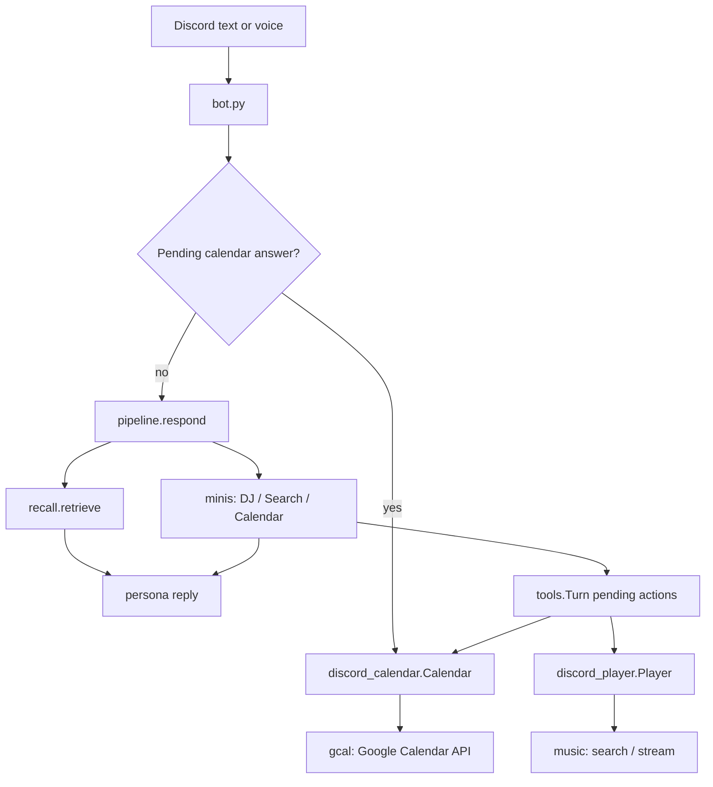

# Architecture and file map

## A Discord request

`bot.py` owns the Discord client, per-channel history/locks, and transcript delivery.
It wires a `Player` and `Calendar` controller to the same database and history. It
contains no Google API implementation or queue-edit implementation.

| Module | What to edit here |
|---|---|
| `pipeline.py` | Turn order, pre-reply facts, persona state, late responses, idle reflection |
| `minis.py` | Specialist schemas, dispatch, DJ/Search/Calendar planning |
| `tools.py` | Context-local pending actions and legacy actuator interfaces |
| `discord_player.py` | Discord queue operations, playback callbacks, skip/remove/leave |
| `music.py` | Music text cleanup, YouTube candidates, AI evidence selection, stream decoding |
| `discord_calendar.py` | Proposal lifecycle, requester identity, conversational approval |
| `gcal.py` | Google authorization, plan parsing/validation, reads and exact writes |
| `voice.py` | Discord voice transport, DAVE/Opus recovery, startup and spoken replies |
| `listening.py` | Per-speaker wake model, PCM capture, silence gates and delivery queue |
| `stt.py` | Select the transcription provider and account for audio usage |
| `recordings.py` | Local recording library, IDs, validation, trim/delete |
| `recall.py` | Retrieve relevant evidence before a reply |
| `memory.py` | SQLite schema, facts, episodes, history, extraction and exports |
| `llm.py` | Environment loading, model calls, usage accounting and logs |
| `eyes.py` | Image observation |
| `record.py` | Durable memory/event recording decisions |
| `dashboard_settings.py` | Dashboard setting names, defaults and explanations |

## State and concurrency

Each conversation turn gets a `ContextVar`-backed `tools.Turn`. Worker calls inherit
that context; do not replace it with shared pending globals. Channel replies are
serialized. The music player serializes accepted jobs and uses a generation counter
to ignore callbacks from replaced tracks. Its background tasks outlive the initial
voice callback, so slow searches do not discard accepted commands.

The music deck is still process-global (`music.NOW`, `music.QUEUE`). Controller
extraction does not make it multi-server. Voice audio is separated by Discord user
ID; display names are not authorization identities.

Blocking model, Google, YouTube and wake-model work belongs in worker threads.
`await voice.listen(...)` is mandatory; the wake-model constructor rejects loading
on a running event loop. Creating asyncio tasks and attaching the receiver stay on
the event loop. See the startup and group-voice regression checks.
