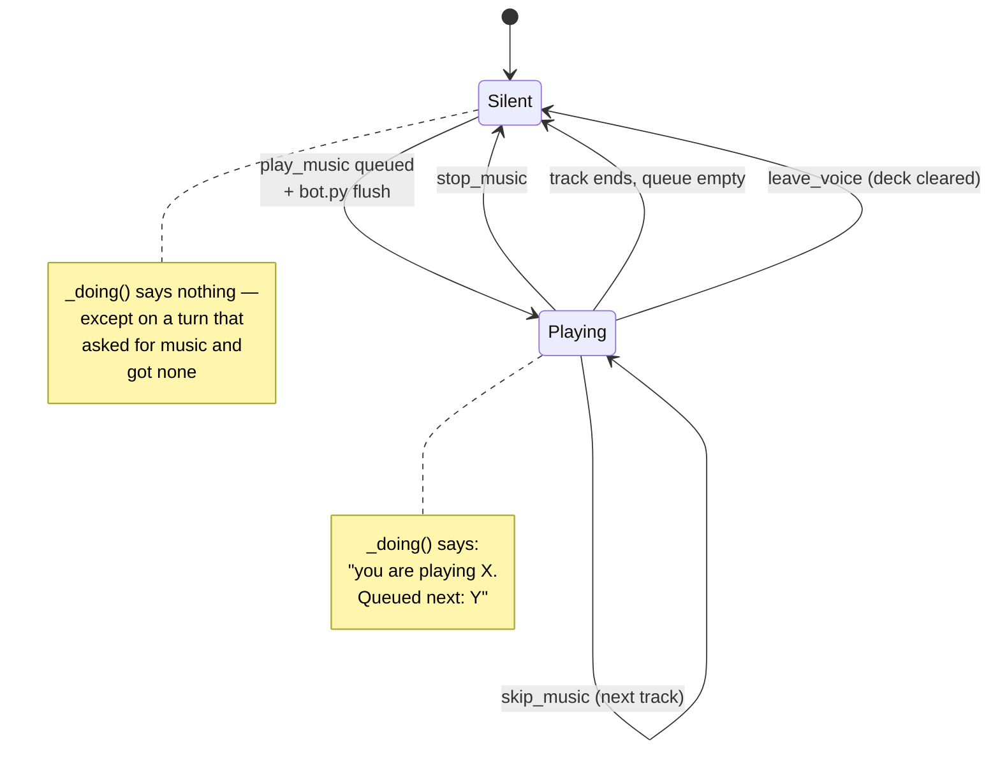

# Action state

## What this is

`pipeline._doing()` reads live state and tells her what she is actually doing right now —
when she's doing something. Today that means music. It's the extension point for anything
she gains later.

**Doing nothing says nothing.** On an ordinary turn it returns `""` and adds not one token
to her context.

## Why it's here

Two bugs, one cause: **her own actions weren't in her context.**

- She had to spend a tool call (`now_playing`) to learn what she was playing.
- She'd say *"เปิดละ"* (put it on) with nothing queued — three turns running — because
  pass 1 wrote *"putting it on now"* in its brief and pass 2 believed it.

Writing an intention is not doing a thing. So what's true is now decided from live
state, in code, and handed to her whether she asks or not.

## Diagram



<figcaption>She is told when she is doing something. Silence is not narrated at her.</figcaption>

## How it works here

```python
def _doing(missed_music: bool = False) -> str:
    out = []
    if music.NOW["title"]:
        # "You are playing X right now. Queued next: Y. You know this
        #  without looking it up — if they ask what is on, just tell them."
    if queued:      # what she set in motion THIS turn
        # "You have just done this: play bad apple. It IS happening."
    elif missed_music:
        # "They asked for music but the search came up empty and nothing
        #  is queued — do NOT say you are putting a song on."
    if tools.PENDING_LEAVE:
        # "You are leaving the voice channel as you say this."
    return " ".join(out)      # "" on a quiet turn
```

The output goes into pass 2's `[inner-state]` block, and `respond()` skips the append
entirely when it's empty. Three jobs in one function:

1. **What's playing** — so she never needs a tool call to know her own deck.
2. **What she just queued** — so she confirms it instead of denying it. This also
   carries "you don't need to recognise a song to put it on", which fixed her saying
   *"never heard of it"* while the track was already starting.
3. **What is *not* happening** — but only on a turn that asked for music and got none.

### The negative is narrow on purpose

It used to say "no music is playing" on *every* quiet turn. That's a rule about music
riding along on messages that have nothing to do with music — paid for constantly, used
almost never, and one more line competing for attention in a block that already holds her
language, her pronouns and her mood.

So it now fires only when `_missed_music()` said she was asked **and**
[`_force_music()`](../surfaces/music.md) came up empty too. On a turn where the forced
retry worked, job 2 covers it and the negative stays quiet.

The guard didn't get weaker: the case it defended against is now caught in code before the
prompt ever sees it. Prompts reduce, code decides.

### `now_playing` was deleted

Once the deck is in her context every turn, a tool that reports the deck is a wasted
round-trip. Removing it also removed one competitor for the model's attention — and
missing `play_music` was an active bug at the time. Nine tools instead of ten.

### Adding a future feature

One `if` per subsystem. When she gains lights, timers, or a download:

```python
if lights.ON:
    out.append(f"The {lights.WHERE} lights are on because you turned them on.")
```

No registry, no state machine, no event bus. The rule that matters is the one already
holding: **read live state, never what the model believes it did.**

## Gotchas

- **It's still a prompt.** `_doing()` puts *true* information in front of her, but
  nothing forces her to respect it. She was observed role-playing
  `*puts on some upbeat music*` with nothing queued, roughly 1 turn in 6. The code-level
  fix landed as [`_force_music()`](../surfaces/music.md) — on a missed ask the song is
  now really queued, so what she says becomes true instead of being argued with.
- **Nothing is asserted about silence.** A quiet turn returns `""`, which means a
  subsystem you forget to add a line for is indistinguishable from one that's idle. Add
  the `if` at the same time as the feature.
- **Lazy import of `tiwa.music`** inside the function, so `chat.py` and the benches
  don't drag in PyAV and numpy.
- **`music.NOW` is one global deck**, not per-guild. Two simultaneous voice calls would
  read each other's state.
- **Clearing the deck is `bot.py`'s job.** `_hang_up()` does it, because disconnecting
  kills the audio but leaves `NOW` claiming a song is on.

## Go deeper

- [Music and the DJ](../surfaces/music.md) — what sets this state.
- [Her persona](persona.md) — where the output lands.
- [The tool registry](tools.md) — why fewer tools is better.
