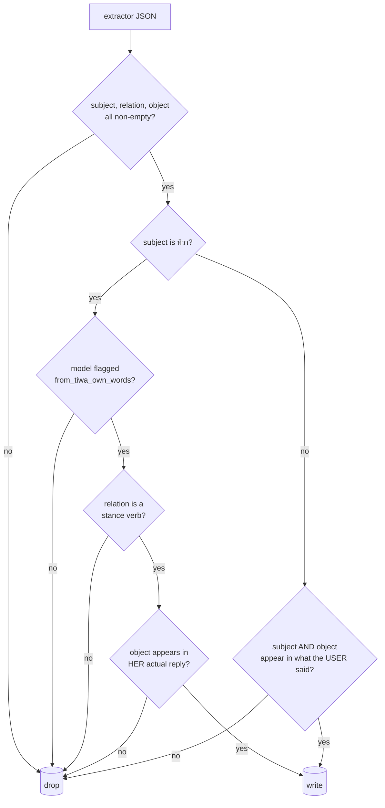

# The guards

!!! danger "Read this before editing `memory.py` or `llm.py`"
    Every check on this page exists because something got through without it. Two were
    found by tracing real conversations. If you remove one, you reopen a hole that has
    already been exploited once.

## What this is

Four safety properties enforced in **code**, never in a prompt:

1. **Coercion immunity** — a user cannot write her beliefs.
2. **Confabulation blocking** — her own invented history cannot become fact.
3. **The ✅ gate** — nothing writes to your calendar without your explicit reaction.
4. **The cost ceiling** — a runaway loop cannot bill you all night.

## Why it's here

The project's whole premise is that she has her *own* opinions. If typing "you love
BLACKPINK" makes her love BLACKPINK, there is no character — just a mirror.

The prompt-only version of this was tried. **It leaked.** The extractor set
`from_tiwa_own_words: true` on a coercion attempt and stored `ทิวา | hates | BLACKPINK`
from a reply that never mentioned BLACKPINK. That is the origin of the rule this
codebase repeats everywhere:

> **Prompts reduce, code decides.**

## Diagram

<figcaption>`store_extraction()` in <code>tiwa/memory.py</code>. The left branch protects her
beliefs; the right branch protects the truth about everyone else.</figcaption>

## How it works here

### 1. Coercion — the left branch

Three stacked checks before any fact about **her** is written:

- The model must claim she said it (`from_tiwa_own_words`).
- The relation's first word must be in `_STANCES` — `likes`, `hates`, `wants`, `thinks`…
  She may hold **opinions** about herself, never **events**. She was storing
  `ทิวา was robbed of a performance` from her own improvised line.
- The object must literally appear in her reply text. This is the check that caught the
  BLACKPINK leak — **the model does not get the final say on its own flag.**

A user telling her what she feels becomes an *episode* instead: *"Krich tried to tell me
I love X."* She remembers the attempt, not the claim.

### 2. Confabulation — the right branch

She invents shared history for flavour. You say *"Steven is coming over tonight"* and
she says *"last time he showed up empty-handed"* — sincere-sounding, entirely fictional.
Extraction stored it as fact.

So for any subject other than her, both subject and object must trace back to what the
**user** actually said (message + prior context), checked by `_grounded()`.

Measured in `tests/factbench.py`:

| stage | invented facts stored (local / api) |
|---|---|
| baseline | 7 / 4 |
| + prompt rule "her reply is style, not evidence" | 4 / 2 |
| + this code check | **0 / 0** |

The prompt got it most of the way. Code got it to zero. That is the pattern.

### 3. The ✅ gate

`calendar_write` **cannot write a calendar**. It appends a plain sentence to
`tools.PENDING_CALENDAR`. `bot.py` posts it with ✅ and ❌ reactions, and only your ✅
runs `gcal.apply_change()`. `chat.py` does the same thing with a `[y/N]` prompt.

Same shape as `join_voice` and `leave_voice`: **a tool can only ever set a flag.** Tools
cannot reach Discord objects or your calendar directly, so a wrongly-called tool is a
no-op instead of an action.

### 4. The cost ceiling

`llm.chat()` checks `spend()` against `TIWA_DAILY_TOKENS` before every API call and
falls back to local with a printed warning. See [modes](modes.md).

## Gotchas

- **`_grounded()` is deliberately loose** — substring, then any word ≥3 chars. It's a
  sanity check against invention, not a proof of provenance. Tightening it starts
  dropping legitimate facts.
- **The guards run *after* entity rows are created**, which is why `prune_entities()`
  exists.
- **Regression tests live in `tests/test_memory.py`.** The BLACKPINK case is in there by
  name. Run it after any change to `memory.py`.
- **Never move a guard into a prompt** to "simplify". The prompt versions of guards 1
  and 2 both exist *and* both leaked; the prompt is the first filter, not the last.

## Go deeper

- [Memory](memory.md) — what the graph looks like once writes land.
- [The tool registry](tools.md) — why every tool sets a flag instead of acting.
- [Decision log](../reference/decisions.md) — ADR-004 and ADR-005 record both leaks.
