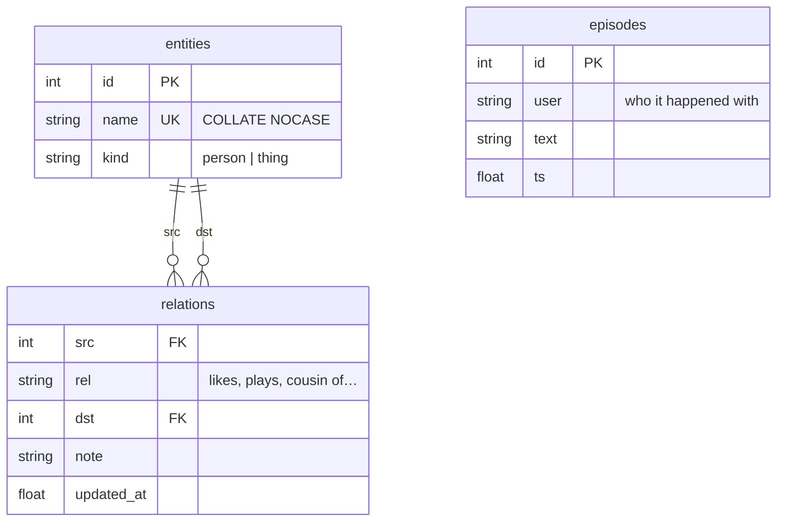

# Memory — the knowledge graph

## What this is

Her memory is a small SQLite knowledge graph, not a chat log. Facts are triples —
`Steven · plays · guitar`. Episodes are short sentences about things that mattered.
Everything lives in `data/tiwa.db`, written by `tiwa/memory.py`.

## Why it's here

A chat log doesn't survive. It grows without bound, blows the context window, and
answering "who is Steven?" means re-reading everything. A graph answers that in one
query and stays small enough to hand to a model.

The split between **facts** and **episodes** is the important part:

- A **fact** is durable and reusable. `Krich · cousin of · Steven` is true next month.
- An **episode** has a future. *"Krich promised to send the guitar recording"* matters
  later, then stops mattering.

If everything were an episode she'd have a diary. If everything were a fact she'd
remember that you said hello.

## Diagram



<figcaption>Two tables do the remembering. There is no table for feelings — that is
deliberate.</figcaption>

## How it works here

**Reading** — `lookup(db, name)` is the `recall` tool. It substring-matches entity names
in Python, then returns every relation touching a hit, in both directions:

```text
Krich cousin of Steven
Steven plays guitar
```

**Writing** — `extract()` runs after each reply, schema-constrained, and everything it
produces passes through [the guards](guards.md) before it lands. That order matters:
the model proposes, code decides.

**Automatic context** — `turn_context()` puts the last 3 episodes for that person into
every turn, so she opens with what she already knows about you.

### There is no mood table

Feelings are not stored anywhere. She reads the visible chat each turn and reacts to it.
A fight lasts exactly as long as it stays on screen, then it's gone.

This was built the other way first — a `mood` table, a decay counter, an anger word
list — and then **deleted**, because the persona model does it better unprompted.
`tests/moodbench.py` shows the arc: she fights back, stays prickly into the next topic,
and is normal about five turns later when the fight scrolls out of the window.

What survived is one line of per-turn rules telling her to hit back at the same volume
and to let it go once you do.

### Bounds

| Limit | Value | Why |
|---|---|---|
| Episodes per person | 25 | Beyond that it's a diary. Chosen, not measured |
| Model-call log rows | 400 | Prompts are big; this is a debug view |
| Discord history in RAM | 40 messages/channel | Chosen, not measured |

Orphaned entities are pruned on every write — the guards reject facts *after* the
entity row was created, and deleting a fact by hand leaves the same litter.

## Gotchas

- **"Gojo" and "Gojo Satoru" are two different nodes.** Facts about one are invisible
  to a recall of the other. Known, deliberately deferred — the fix is an alias table or
  FTS5. It gets worse as the graph grows. See [where to go next](../reference/next.md).
- **Entity names are `COLLATE NOCASE` but not normalised.** Trailing whitespace used to
  create duplicate rows; `remember()` now strips. Anything fancier is still absent.
- **`lookup` is a Python scan over all entity names**, not SQL. Fine at this size,
  marked `ponytail:` in the source as a deliberate ceiling. FTS5 when it hurts.
- **Deleting the DB is safe.** She starts empty. There's no migration system, so a
  schema change on an existing DB means either hand-written SQL or a fresh file —
  `_SCHEMA` is all `CREATE TABLE IF NOT EXISTS`.
- **Her reply is style, never evidence.** She invents shared history for flavour. Pass 3
  is explicitly told this and the code enforces it. Do not "improve" extraction by
  trusting her reply text.

## Go deeper

- [The guards](guards.md) — the four checks every write survives.
- [The control panel](../surfaces/panel.md) — browse and delete memory in a browser.
- [SQLite `INSERT OR REPLACE`](https://www.sqlite.org/lang_insert.html) ·
  [COLLATE NOCASE](https://www.sqlite.org/datatype3.html#collating_sequences)
