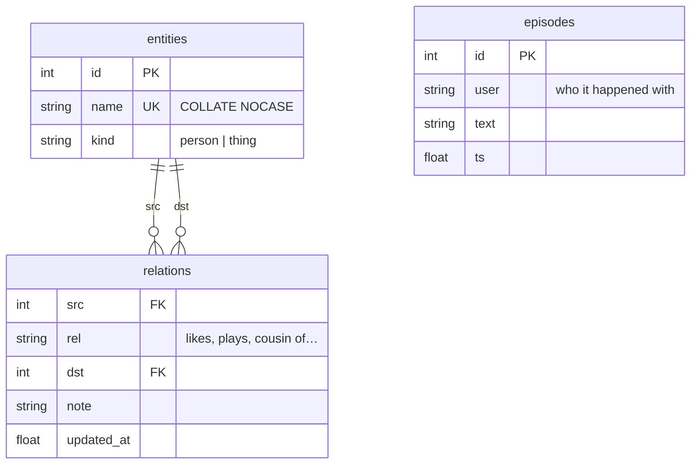

# Memory — the knowledge graph

## What this is

Her memory is a small SQLite knowledge graph, not a chat log. Facts are triples —
`Steven · plays · guitar`. Episodes are short sentences about things that mattered.
Everything lives in `data/tiwa.db`, written by `tiwa/memory.py`.

## Why it's here

A chat log doesn't survive. It grows without bound, blows the context window, and
answering "who is Steven?" means re-reading everything. A graph answers that in one
query and stays small enough to hand to a model.

The split between **facts** and **episodes** is the important part:

- A **fact** is durable and reusable. `Krich · cousin of · Steven` is true next month.
- An **episode** has a future. *"Krich promised to send the guitar recording"* matters
  later, then stops mattering.

If everything were an episode she'd have a diary. If everything were a fact she'd
remember that you said hello.

!!! danger "Episodes barely existed until August 2026"

    Pass 3 is told *"episode: almost always null"* and it obeyed almost absolutely: the
    live database held **2 episodes across 97 logged turns**, and both were written on
    the same calendar turn:

    ```text
    Tycoon asked ทิวา to put a lunch appointment at 13:00 on Sunday 2 Aug into the calendar
    ทิวา added a calendar entry for Tycoon's lunch appointment on Sunday 2 Aug at 13:00
    ```

    Read those against the prompt that produced them. It forbids an episode for *"someone
    asking a question"* and for *"anything already captured as a memory above"* — and
    these are a question, and each other. So the gate was not merely too tight, it was
    **miscalibrated**: silent for 95 turns, then twice on one turn, both times wrongly.

    The trigger is [surprise](#surprise) now, decided in code. Asking a model *"would this
    matter in a month?"* is a judgment call it declines 98% of the time and then gets
    wrong when it doesn't.

## Diagram



<figcaption>Two tables do the remembering. There is no table for feelings — that is
deliberate.</figcaption>

## How it works here

**Reading** — `lookup(db, name)` is the `recall` tool. It substring-matches entity names
in Python, then returns every relation touching a hit, in both directions:

```text
Krich cousin of Steven
Steven plays guitar
```

**Writing** — `extract()` runs after each reply, schema-constrained, and everything it
produces passes through [the guards](guards.md) before it lands. That order matters:
the model proposes, code decides.

**Automatic context** — `turn_context()` puts **what she knows about whoever is talking**
into every turn: their facts (capped at `TURN_FACTS = 12`) plus their last 3 episodes. She
opens knowing you, with no tool call.

!!! warning "This channel was dead until July 2026"

    `turn_context()` read episodes *only* — and pass 3 is told an episode is "almost
    always null", so on the real database it returned `""` on **every turn ever
    recorded**. Facts could only be reached by the model *choosing* to call `recall`,
    which across 11 logged turns it never did. Memory was write-only in practice.

    Injecting the facts instead of hoping for a tool call is the same trade as
    [deleting `now_playing`](../reference/decisions.md#adr-012). `recall` still earns its
    place — for **third parties**, someone mentioned who isn't the one talking.

**Worth, not just truth** — the extractor used to test only whether a fact was
*true*. `Tycoon requested ATLAS-The Score` is true, grounded, correctly directed
and useless a week later, and her graph filled with rows like it until they
crowded the good facts past the `TURN_FACTS` cap.

!!! danger "The first version of this rule was a fact factory"
    It said **convert, don't refuse**: a one-off action became the durable taste
    underneath it. In three days that wrote twelve `<person> likes <song>` rows,
    one per music request, none of them true — and 19 of 22 facts in the whole
    graph carried no note. Withdrawn: [ADR-030](../reference/decisions.md#adr-030).

**A request writes nothing.** Not a taste, not a weaker taste. The song played and
the activity log says so; her beliefs are not a log.

**A taste needs evidence**, and there are exactly two kinds of it:

| they said | stored | why |
|---|---|---|
| `play venom - eminem` | nothing | a request is not a preference |
| `ขอเพลงจากเกม Blue Archive` | nothing | same |
| `Mint hates coffee btw` | `Mint hates coffee` | **they said it** — a preference word, checked in code |
| `กูเกลียดเพลงลูกทุ่งมาก ฟังแล้วปวดหัว` | `Tycoon hates เพลงลูกทุ่ง [ฟังแล้วปวดหัว]` | said it, and gave the reason |
| `Mili is my favourite, listened for years` | `Krich likes Mili [has listened to them for years]` | said it |
| a `likes` with no note and nobody saying it | nothing, logged | this is the one that filled the graph |

`likes` / `hates` / `interested in` need one of the two. **Every other relation
needs neither** — `real name`, `plays`, `cousin of`: a relationship justifies
itself, a taste has to. Her own stances are exempt; the evidence is the sentence
she just said, and they already pass three harder guards.

The refusal failure is still the worse one, and still guarded. Episodes were once
asked *"would this matter in a month?"* and the model answered null **100% of the
time** — a judgment call it always declines. So `worthbench` fails if the bar eats
a real fact, and `extractbench` caught the prompt swinging too far once already:
"write nothing" started dropping turns that were *both* a request and a fact.

**Every rejection is logged** — `kind='memory'` rows naming the fact and the guard
that killed it. Six guards drop silently otherwise, which makes a working filter
and one quietly eating true facts look identical from outside. You cannot tune a
bar you cannot see.

**Third parties, without a tool call either** — `mentioned()` scans the message for known
entity names and injects what she knows about each. It exists because `recall` was **55 of
135 logged tool calls**, the single most common reason the tool pass ran a second round,
and the round trip cost about 2.6 seconds to fetch a sqlite lookup that takes 3ms. Only
[the swarm](the-swarm.md) uses it — the serial path still has the tool.

Precision-biased, like [`_MUSIC_ASK`](../surfaces/music.md): `MENTION_MIN = 3` characters,
capped at `MENTION_MAX = 3` entities. Thai does not space its own words, so a short name
can sit inside an unrelated one — that minimum is what keeps `อิง` out of every sentence
containing it.

### An episode is written when she is surprised {#surprise}

Your brain doesn't record the drive to work — it went exactly as predicted. It records
the drive where a deer ran out. Those moments are **prediction errors**, and event
segmentation theory says they are where one memory gets cut off from the next
([Prediction error and event segmentation](https://www.sciencedirect.com/science/article/abs/pii/S0149763424000010);
[EM-LLM](https://arxiv.org/abs/2407.09450), ICLR 2025, segments a token stream the same way).

`store_extraction()` already computes both signals, so this costs **no extra model call**:

| signal | episode | example |
|---|---|---|
| a **subject** she has never met | `first heard about Steven` | "my cousin Steven plays guitar" |
| a belief that **flipped** | `Steven hates durian now — loves before` | "actually Steven hates durian now" |
| anything else | *(nothing)* | "Steven plays Warframe too" |

Three rules keep the rate honest, and each one came from reading real output:

- **Only subjects count, never objects.** Otherwise every game, food and show ever
  mentioned is a life event.
- **Never the speaker.** *"first heard about Krich"* while Krich is the one typing wastes
  a `turn_context` line, and everything he said about himself is already a fact she sees.
- **Freshness is judged against a snapshot from before the batch.** One turn writes
  several facts, and the first write creates the entities the later ones name. Measured
  live: `Steven plays guitar` read as old news because `Krich cousin of Steven`
  had invented him one line earlier.

Measured on a 12-turn replay (`tests/test_memory.py`): **4 episodes**. The rate falls on
its own as the graph fills — new people get rarer, and only flips remain.

### A new belief replaces the old one

People change their minds; her graph only ever appended. Say *"Tycoon likes Marvel
Rivals"* today and *"Tycoon hates Marvel Rivals"* tomorrow and she believed **both** —
because a row is keyed on `(subject, relation, object)`, and `likes` and `hates` are
different relations, so they never collided:

```text
Tycoon likes Marvel Rivals
Tycoon hates Marvel Rivals
```

Both got injected every turn, so she read a flat contradiction and picked one at random.

`_supersede()` fixes it with an **axis** — a group of relations that are competing answers
to the *same question*. Two facts on one axis about one pair can't both be true, so the
newer one wins and the old row is deleted.

| written | result |
|---|---|
| `likes` then `dislikes` | `dislikes` only — and reported as a flip |
| `likes` then `loves` | `loves` only — same axis, same polarity, **not** a flip |
| `plays` then `likes` | both kept — different questions. You can play a game and like it |

`_AXES` holds one axis (`feel`) on purpose. Add another when a real contradiction shows
up, not before.

### She thinks about it while nobody is watching {#reflection}

Episodes are raw — *what happened*. A reflection is what they **add up to**, and she works
it out in her own time rather than during a conversation.

The heartbeat wakes every 30 minutes from 09:00–23:00 — **about 28 model calls a day** —
and is rate-limited to *speaking* once every 3 hours. Almost all of those calls decided
"nothing to say" and were thrown away. That is thinking time already paid for.

`pipeline._settle()` gives it a second job. Once `REFLECT_EVERY = 3` episodes have piled
up unprocessed, it reads them and writes back one conclusion:

```text
Krich is always the one telling me about other people, but I still don't know
what he himself thinks about anything.
```

That is a real reflection from a live run — something no single turn contained.

Two design choices worth knowing:

- **Reflections are episodes filed under her own name.** They land back in the stream
  they were drawn from, so `idle_fuel()` picks them up like anything else she lived, and
  the newest one dates the watermark for free. No new table.
  ([Generative Agents](https://arxiv.org/abs/2304.03442) does exactly this.)
- **It gets the expensive model.** Nobody is waiting on it, which makes it the one pass
  where latency genuinely does not matter — the same argument
  [Letta](https://www.letta.com/blog/sleep-time-compute/) makes for sleep-time agents.

A reflection that concludes nothing still writes a **blank row**, purely as the
watermark. `idle_fuel()` and the panel both filter `text != ''`, so `""` never reaches
her as something she lived. Without it the same three episodes get re-reflected every
half hour forever.

### Near-duplicate names get folded {#near-duplicate-names-get-folded}

`canonical()` runs on every write. Before creating an entity it checks the names already
in the graph with `difflib` and reuses a close one:

| written | stored as | ratio |
|---|---|---|
| `Marvel Rival` | **`Marvel Rivals`** | 0.96 |
| `Steve` | **`Steven`** | 0.91 |
| `Mind` | `Mind` (left alone) | 0.75 vs `Mint` |

`ALIAS_CUTOFF = 0.85`. Open extraction spells the same thing differently every time — the
real database held `Marvel Rival` while every turn said `Marvel Rivals`, so a lookup for
one missed the facts filed under the other.

Doing this properly is a research problem: [CESI](https://arxiv.org/abs/1902.00172)
(WWW 2018) canonicalizes open knowledge bases by clustering learned embeddings with side
information. At this scale a string ratio is the whole win. Revisit when two genuinely
different spellings mean the same thing — `ไอภพ` and `Phop` will never be close enough
for `difflib`.

**First spelling wins.** Folding is onto whatever is already stored, so if the wrong name
lands first it becomes canonical. Fix that with SQL, not code.

### There is no mood table

Feelings are not stored anywhere. She reads the visible chat each turn and reacts to it.
A fight lasts exactly as long as it stays on screen, then it's gone.

This was built the other way first — a `mood` table, a decay counter, an anger word
list — and then **deleted**, because the persona model does it better unprompted.
`tests/moodbench.py` shows the arc: she fights back, stays prickly into the next topic,
and is normal about five turns later when the fight scrolls out of the window.

What survived is one line of per-turn rules telling her to hit back at the same volume
and to let it go once you do.

### Bounds

| Limit | Value | Why |
|---|---|---|
| Episodes per person | 25 | Beyond that it's a diary. Chosen, not measured |
| Model-call log rows | 400 | Prompts are big; this is a debug view |
| Discord history in RAM | 40 messages/channel | Chosen, not measured |

Orphaned entities are pruned on every write — the guards reject facts *after* the
entity row was created, and deleting a fact by hand leaves the same litter.

## Gotchas

- **A failed reflection deliberately does not watermark.** If the provider is down the
  events stay unreflected and the next tick retries, rather than silently eating her week.
- **`_settle()` swallows its own errors; `idle()` does not.** A provider outage still
  takes the heartbeat's *speak* pass down — pre-existing, see
  [open questions](../open-questions.md).
- **Relations fold by 4-character stem, not by similarity.** `plays`/`playing` become one
  row; `likes`/`dislikes` stay two rel **names** — then `_supersede()` decides only one
  survives. Folding and superseding are different jobs. difflib is disqualified here and it is measured —
  `likes`/`dislikes` scores **0.769** against `plays`/`playing` at **0.667**, so any cutoff
  that folds the pair you want also merges a relation with its own opposite. Scoped to one
  (subject, object) pair.
- **Names must be copied verbatim, and that is load-bearing.** The extractor romanized
  `ไอภพ` to `Iop`, the grounding guard could not find `Iop` in the Thai text, and a true
  fact was silently dropped. Any prompt edit that weakens "copy every name character for
  character" loses facts in every non-Latin script.
- **"Gojo" and "Gojo Satoru" still split at 0.62.** Below `ALIAS_CUTOFF`, so `difflib`
  leaves them apart — a substring rule would catch this pair but would also merge things
  that shouldn't be. Deferred; see [where to go next](../reference/next.md).
- **An empty graph looks like a broken model.** Before it was seeded, `recall` was never
  called in 11 real turns and that read as a tool-selection bug. It wasn't — measured
  8/8 tool selection on the same registry. There was simply nothing to recall. Populate
  before diagnosing.
- **`lookup` is a Python scan over all entity names**, not SQL. Fine at this size,
  marked `ponytail:` in the source as a deliberate ceiling. FTS5 when it hurts.
- **Deleting the DB is safe.** She starts empty. There's no migration system, so a
  schema change on an existing DB means either hand-written SQL or a fresh file —
  `_SCHEMA` is all `CREATE TABLE IF NOT EXISTS`.
- **Her reply is style, never evidence.** She invents shared history for flavour. Pass 3
  is explicitly told this and the code enforces it. Do not "improve" extraction by
  trusting her reply text.

## Go deeper

- [The guards](guards.md) — the four checks every write survives.
- [The control panel](../surfaces/panel.md) — browse and delete memory in a browser.
- [SQLite `INSERT OR REPLACE`](https://www.sqlite.org/lang_insert.html) ·
  [COLLATE NOCASE](https://www.sqlite.org/datatype3.html#collating_sequences)
