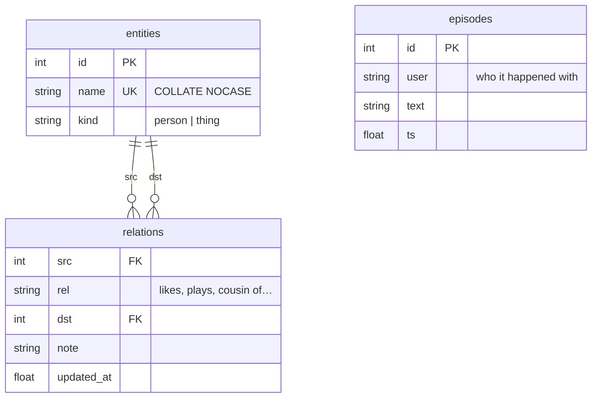

# Memory — the knowledge graph

## What this is

Her memory is a small SQLite knowledge graph, not a chat log. Facts are triples —
`Steven · plays · guitar`. Episodes are short sentences about things that mattered.
Everything lives in `data/tiwa.db`, written by `tiwa/memory.py`.

## Why it's here

A chat log doesn't survive. It grows without bound, blows the context window, and
answering "who is Steven?" means re-reading everything. A graph answers that in one
query and stays small enough to hand to a model.

The split between **facts** and **episodes** is the important part:

- A **fact** is durable and reusable. `Krich · cousin of · Steven` is true next month.
- An **episode** has a future. *"Krich promised to send the guitar recording"* matters
  later, then stops mattering.

If everything were an episode she'd have a diary. If everything were a fact she'd
remember that you said hello.

## Diagram



<figcaption>Two tables do the remembering. There is no table for feelings — that is
deliberate.</figcaption>

## How it works here

**Reading** — `lookup(db, name)` is the `recall` tool. It substring-matches entity names
in Python, then returns every relation touching a hit, in both directions:

```text
Krich cousin of Steven
Steven plays guitar
```

**Writing** — `extract()` runs after each reply, schema-constrained, and everything it
produces passes through [the guards](guards.md) before it lands. That order matters:
the model proposes, code decides.

**Automatic context** — `turn_context()` puts **what she knows about whoever is talking**
into every turn: their facts (capped at `TURN_FACTS = 12`) plus their last 3 episodes. She
opens knowing you, with no tool call.

!!! warning "This channel was dead until July 2026"

    `turn_context()` read episodes *only* — and pass 3 is told an episode is "almost
    always null", so on the real database it returned `""` on **every turn ever
    recorded**. Facts could only be reached by the model *choosing* to call `recall`,
    which across 11 logged turns it never did. Memory was write-only in practice.

    Injecting the facts instead of hoping for a tool call is the same trade as
    [deleting `now_playing`](../reference/decisions.md#adr-012). `recall` still earns its
    place — for **third parties**, someone mentioned who isn't the one talking.

### Near-duplicate names get folded {#near-duplicate-names-get-folded}

`canonical()` runs on every write. Before creating an entity it checks the names already
in the graph with `difflib` and reuses a close one:

| written | stored as | ratio |
|---|---|---|
| `Marvel Rival` | **`Marvel Rivals`** | 0.96 |
| `Steve` | **`Steven`** | 0.91 |
| `Mind` | `Mind` (left alone) | 0.75 vs `Mint` |

`ALIAS_CUTOFF = 0.85`. Open extraction spells the same thing differently every time — the
real database held `Marvel Rival` while every turn said `Marvel Rivals`, so a lookup for
one missed the facts filed under the other.

Doing this properly is a research problem: [CESI](https://arxiv.org/abs/1902.00172)
(WWW 2018) canonicalizes open knowledge bases by clustering learned embeddings with side
information. At this scale a string ratio is the whole win. Revisit when two genuinely
different spellings mean the same thing — `ไอภพ` and `Phop` will never be close enough
for `difflib`.

**First spelling wins.** Folding is onto whatever is already stored, so if the wrong name
lands first it becomes canonical. Fix that with SQL, not code.

### There is no mood table

Feelings are not stored anywhere. She reads the visible chat each turn and reacts to it.
A fight lasts exactly as long as it stays on screen, then it's gone.

This was built the other way first — a `mood` table, a decay counter, an anger word
list — and then **deleted**, because the persona model does it better unprompted.
`tests/moodbench.py` shows the arc: she fights back, stays prickly into the next topic,
and is normal about five turns later when the fight scrolls out of the window.

What survived is one line of per-turn rules telling her to hit back at the same volume
and to let it go once you do.

### Bounds

| Limit | Value | Why |
|---|---|---|
| Episodes per person | 25 | Beyond that it's a diary. Chosen, not measured |
| Model-call log rows | 400 | Prompts are big; this is a debug view |
| Discord history in RAM | 40 messages/channel | Chosen, not measured |

Orphaned entities are pruned on every write — the guards reject facts *after* the
entity row was created, and deleting a fact by hand leaves the same litter.

## Gotchas

- **Only *entity* names are canonicalized, not relations.** The seeded graph held both
  `Tycoon playing Marvel Rivals` and `Tycoon plays Marvel Rivals` — same fact, two rows,
  because `plays` and `playing` are different strings. CESI clusters relation phrases too;
  this doesn't. Deleted by hand.
- **"Gojo" and "Gojo Satoru" still split at 0.62.** Below `ALIAS_CUTOFF`, so `difflib`
  leaves them apart — a substring rule would catch this pair but would also merge things
  that shouldn't be. Deferred; see [where to go next](../reference/next.md).
- **An empty graph looks like a broken model.** Before it was seeded, `recall` was never
  called in 11 real turns and that read as a tool-selection bug. It wasn't — measured
  8/8 tool selection on the same registry. There was simply nothing to recall. Populate
  before diagnosing.
- **`lookup` is a Python scan over all entity names**, not SQL. Fine at this size,
  marked `ponytail:` in the source as a deliberate ceiling. FTS5 when it hurts.
- **Deleting the DB is safe.** She starts empty. There's no migration system, so a
  schema change on an existing DB means either hand-written SQL or a fresh file —
  `_SCHEMA` is all `CREATE TABLE IF NOT EXISTS`.
- **Her reply is style, never evidence.** She invents shared history for flavour. Pass 3
  is explicitly told this and the code enforces it. Do not "improve" extraction by
  trusting her reply text.

## Go deeper

- [The guards](guards.md) — the four checks every write survives.
- [The control panel](../surfaces/panel.md) — browse and delete memory in a browser.
- [SQLite `INSERT OR REPLACE`](https://www.sqlite.org/lang_insert.html) ·
  [COLLATE NOCASE](https://www.sqlite.org/datatype3.html#collating_sequences)
