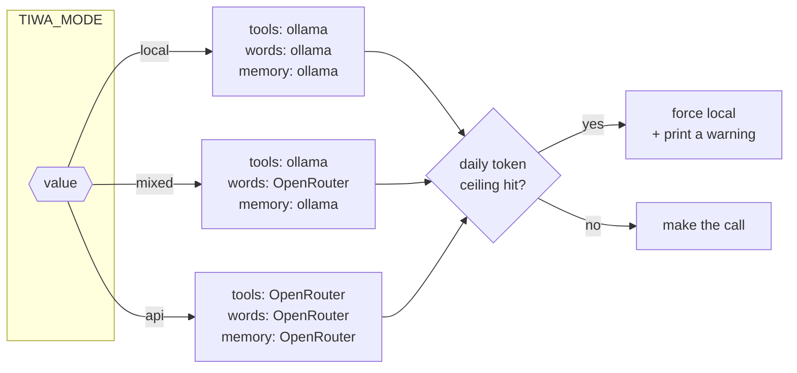

# Modes — where she runs

## What this is

`TIWA_MODE` picks which provider runs each of [the three passes](three-passes.md).
Three values: `local`, `mixed`, `api`. It's one line in `.env` and the only thing you
need to change to move her between "free on my GPU" and "no GPU at all".

## Why it's here

The machine this was built on has **8 GB of VRAM**. One 8B model fits; two don't. So
running the bot meant the GPU was busy, and gaming meant the bot was dead.

Modes fix that. `api` is the low-spec mode: heavy work goes to a paid API, your GPU is
free, and the tradeoff you accept is **cost and less freedom** — hosted models have
their own filters, and she's a bot who's supposed to swear back at you.

## Diagram



<figcaption>The cost ceiling sits below all three modes. A looping bug cannot bill you
all night.</figcaption>

## How it works here

`tiwa/llm.py:39` is the whole mechanism:

```python
_MODES = {
    "local": ("ollama", "ollama"),
    "mixed": ("ollama", "openrouter"),
    "api":   ("openrouter", "openrouter"),
}
```

The tuple is `(tools+extraction, persona)`. An unknown value **warns and falls back to
local** rather than exiting — an earlier version raised `SystemExit`, which bricked every
entry point including the dashboard you'd use to fix the typo.

| | `local` | `mixed` | `api` |
|---|---|---|---|
| GPU needed | yes | yes | **no** |
| Ollama running | yes | yes | no* |
| Costs money | no | yes | yes |
| Her voice written by | qwen3 8B | API model | API model |
| Tool latency | ~1.1 s | ~1.1 s | ~7.4 s |
| Good for | offline, free | best quality | gaming, low-spec |

\* Genuinely nothing local. A confirmed **calendar write** used to be an exception —
it built an Ollama client directly — which is [F3](../reference/findings.md#f3), fixed
2026-07-30.

### What was measured

From `PLAN.md`, on this machine:

- **Tools belong local.** Same accuracy (8/8 both), but 1.1 s vs 7.4 s — the API was
  6.6× slower from Thailand. `tests/toolbench.py`.
- **Her voice is better on the API.** The local 8B drifted into Thai on English
  messages, repeated tail tics, and slipped out of her หนู/มึง register. The API model
  did none of that. `tests/smoke.py`.
- **Extraction was measured better local** (4/5 vs 1/5) — the API reversed subject and
  object, producing `guitar plays Steven`. Since then the extraction prompt gained
  explicit direction rules and both providers score 5/5, so `api` mode is viable.
- **`reasoning: {enabled: false}` and `provider: {sort: throughput}`** cut about 40% off
  round-trip latency. Do **not** use reasoning effort `"minimal"` — it turns reasoning
  *on*.

### The cost ceiling

`TIWA_DAILY_TOKENS` (default 2,000,000 ≈ $0.30/day) is runaway insurance, not a budget.
Spend is tracked in `data/spend.json`, resets at midnight, and going over prints a loud
warning and falls back to local for the rest of the day. It's one of
[the guards](guards.md) that must stay in code.

## The other two knobs

`TIWA_MODE` decides **where** each pass runs. Two siblings decide **what shape** the turn
has and **how much of voice is live**. All three are read once at import, all three warn
and fall back rather than exiting.

| Knob | Default | What changes |
|---|---|---|
| `TIWA_MODE` | `local` | which provider runs each pass |
| `TIWA_TURN` | `serial` | `serial` = [three passes](three-passes.md); `concurrent` = [the swarm](the-swarm.md) |
| `TIWA_VOICE` | `dj` | `dj` = the voice channel is a speaker for music only; `full` = she can join and leave on her own |

`TIWA_TURN` is picked up inside `pipeline.respond()`, so `bot.py`, `chat.py`, the
dashboard and every bench call the same function either way and none of them changed
when the swarm landed.

## Gotchas

- **Mode is read once, at import.** Changing `.env` needs a restart. The control panel
  says so on every save.
- **Falling back to local requires Ollama to be running.** In `api` mode on a machine
  with no Ollama, hitting the ceiling means model calls start failing rather than
  silently degrading.
- **`PLAN.md` contradicts this page.** Its "Constraints" section says her voice must
  never leave the machine. That was the original rule; it was tested, measured, and
  reversed. This page is current. See [ADR-002](../reference/decisions.md#adr-002).

## Go deeper

- [Model providers](../toolchain/providers.md) — why these two and not others.
- [Environment variables](../reference/env.md) — every knob, explained.
- [OpenRouter docs](https://openrouter.ai/docs) ·
  [Ollama API](https://github.com/ollama/ollama/blob/main/docs/api.md)
