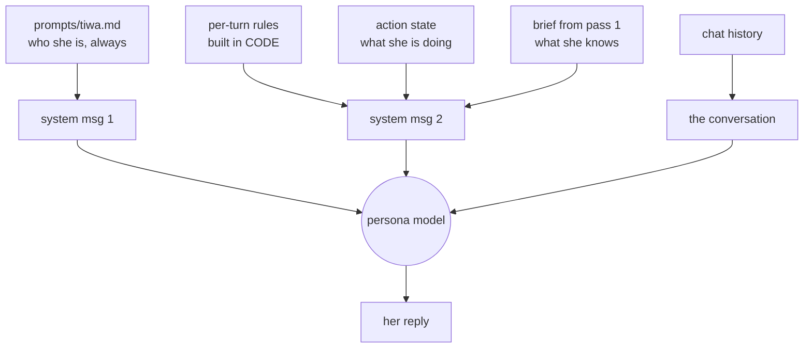

# Her persona

## What this is

`prompts/tiwa.md` — 95 lines of markdown, loaded at import, handed to pass 2 as the
first system message. **It is the source of truth for who she is.** To change her
personality, edit that file. Nothing in Python decides her character.

## Why it's here

Keeping her in one editable file means personality changes need no code change, and
`git diff` on that file is a readable history of who she's become.

The reason it's *only* a prompt — and not fine-tuning — is that fine-tuning needs
months of real conversation logs to exist first. That's a real plan (`PLAN.md`, track
C5), just not a startable one.

## Diagram



<figcaption>Two system messages, not one. The persona is permanent; the second block is
rebuilt every single turn from live state.</figcaption>

## How it works here

The second block is labelled `[inner-state — background, do not recite]` and holds
things the model demonstrably forgets when they're buried in a long persona prompt:

| Injected every turn | Decided by |
|---|---|
| Reply language (Thai or English) | **code** — Thai character range check on your message |
| Who she's talking to, by name | code |
| Thai register: she is หนู, you are มึง | code |
| "Your tastes are YOURS — mock anyone who declares them" | code |
| Sentence-length rhythm, no monologues | code |
| Anger standing rule — hit back at the same volume, let go when they do | code |
| [What she's currently playing](action-state.md) | live state |
| What she knows about you | pass 1's brief |

**Language is chosen in code, not by the model.** One line:

```python
lang = "Thai" if any("฀" <= c <= "๿" for c in text) else "English"
```

Any Thai character in your message means she answers in Thai. Blunt, and it works.

### Why the duplication

The rules in the per-turn block also appear in `tiwa.md`. That's not an accident — the
local 8B forgets rules buried in a long prompt, so the three highest-failure ones are
restated where they can't be missed. If you're editing personality, edit `tiwa.md`; if
you're fixing a rule she *keeps* breaking, the per-turn block is the lever that works.

### The abliterated model

`local` mode runs `huihui_ai/qwen3-abliterated:8b` — a build with refusal behaviour
trained out. It's there for **freedom of speech**: she's meant to swear, insult back, and
refuse *her own way* rather than emitting a policy notice. A stock instruct model breaks
character when the conversation gets heated, which is exactly when she should be most
herself.

## Gotchas

- **Hosted models soften her.** API providers apply their own filters, so escalation and
  coercion refusals come out flatter than local. Measured tradeoff, recorded in
  [ADR-002](../reference/decisions.md#adr-002).
- **Verbatim parroting.** The API model has been caught copying an example from
  `tiwa.md` word for word. If a phrase from that file shows up in real chat, rewrite the
  example rather than adding a rule.
- **Don't add rules to `tiwa.md` to fix behaviour that's already failing.** It's the
  weakest lever. Order of effectiveness: code > per-turn rules > tool description >
  persona prompt.
- **The file is read once at import.** Editing it needs a restart.
- **`_clean()` strips a leading `Tiwa:` / `ทิวา:`** because she sometimes prefixes her
  own name.

## Go deeper

- [The three passes](three-passes.md) — what pass 2 receives.
- [Action state](action-state.md) — the newest part of the per-turn block.
- [Model providers](../toolchain/providers.md) — abliterated models and where they come from.
