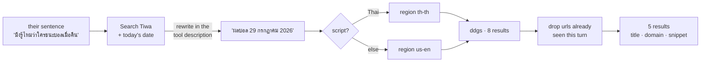

# Search and curiosity

## What this is

`web_search` is her one window onto anything she can't know from memory. It's a
DuckDuckGo call through `ddgs` — no key, no quota — wrapped in three things that decide
whether the answer is any good: **when she calls it**, **what words she passes**, and
**what she gets back**.

The same page covers curiosity, because they're the same behaviour seen from two sides.
Not knowing something should end in a search or a question — never in a hedge.

## Why it's here

Three complaints from real use, one root each:

| Symptom | Root |
|---|---|
| She rarely searched | the description said *"use ONLY for…"* — a discouragement |
| Repeating a search returned the same three pages | `max_results=3`, no dedupe |
| Wrong results for reasonable questions | she passed the user's whole sentence as the query |

The third is the expensive one, and it's a known, named problem.

### The research

[**Query Rewriting for Retrieval-Augmented Large Language Models**](https://arxiv.org/abs/2305.14283)
(Ma et al., EMNLP 2023) is the reference. Its framing is the useful part: retrieval
pipelines are usually *retrieve-then-read*, and the paper adds a step in front —
**rewrite-retrieve-read** — on the argument that "there is inevitably a gap between the
input text and the needed knowledge in retrieval." A user's sentence is not a query.

**Review: take the framing, not the method.** The paper's actual contribution is a small
language model trained as a rewriter with reinforcement learning against the frozen
reader's feedback. That is wildly out of scope here — it needs a training loop, a reward
signal and a second model resident in 8 GB of VRAM. The paper also reports only
"consistent performance improvement" in the abstract rather than headline numbers, so
treat the size of the win as unestablished by this source.

For the size of the win, the
[**query expansion survey**](https://arxiv.org/pdf/2509.07794) is the better citation: it
reports the jump from raw queries to LLM-rewritten ones at **+14.35 NDCG@10 and +23.43
Recall@10**, then finds *"rapidly diminishing returns"* — further investment past that
first rewrite "yields negligible improvements."

**Review: this is the number that set the design.** The first rewrite is nearly all of the
benefit. It is also the cheapest thing on the list, because a model that is already being
asked to produce a tool argument can be told what a good argument looks like — no extra
call, no extra model. Related work on multi-query retrieval puts 1→2 queries at **+6.7%**
average exact match with saturation by three, which is why nothing here fans out into
parallel searches.

So the rewriter is the tool description. Cheapest rung that holds.

## Diagram



<figcaption>Every box except <code>ddgs</code> is something the old version didn't
do.</figcaption>

## How it works here

### The description does the rewriting

`web_search`'s description carries the rewrite rule and four worked examples in both
languages — strip the question framing, keep names and numbers, add the year:

```text
'มึงรู้ไหมว่าใครชนะบอลเมื่อคืน'                    -> 'ผลบอลเมื่อคืน'
'what's that new gojo thing everyone's on about' -> 'Jujutsu Kaisen new season 2026'
'is the new iphone any good'                     -> 'iPhone review 2026'
```

Same lever that took `play_music` from 0/6 to 9/12 —
[the description is the code](tools.md#the-description-is-the-code).

Measured on `tests/searchbench.py --live`, she now searches on 5/5 asks and resolves the
referent while she's at it: *"that new gojo thing"* became `Jujutsu Kaisen Gojo new 2026`,
and *"เกม silksong"* became `Hollow Knight Silksong 2026`.

### She is told today's date

Search Tiwa gets `today is YYYY-MM-DD` in its prompt. Without it she searched
`ราคา RTX 5090 2025` in **July 2026** — a model dates itself from its training data unless
you tell it otherwise, and a wrong year is a wrong page back. With it, *"เมื่อคืน"*
(last night) became `ผลบอล 29 กรกฎาคม 2026`: she worked out yesterday's date herself.

### Region follows the script of the query

One keyword argument, and it decides which index answers. Measured on
`ผลบอลพรีเมียร์ลีก`:

| region | domains returned |
|---|---|
| `us-en` (the `ddgs` default) | pinterest.ru · google.com · youtube · a blogspot |
| `th-th` | thairath.co.th · trueid · kapook · labfootball |

Same query. The old code never passed the argument, so **every Thai search she ever ran
went to the US index.**

### Repeats are refused, not re-served

`SEEN_URLS` collects every link handed to her, and `pipeline._tool_chat()` clears it at
the top of each turn. A second search that surfaces nothing new returns:

```text
every result was one you already saw this turn — these keywords are spent,
search something different or answer with what you have
```

She gets three tool rounds per turn, so this turns rounds 2 and 3 from wasted duplicates
into second and third angles.

### Results carry their domain

`Title [thairath.co.th]: snippet` — the domain is the only source signal she gets, and
it's what lets her say *"เห็นไทยรัฐบอกว่า…"* instead of stating a rumour as fact.

## Curiosity is the same problem

You liked that she asks when she's unsure. That behaviour had a **suppressor** and no
amplifier.

The suppressor was a per-turn rule: *"Do NOT end every reply with a question — react,
don't interview."* It was added for a real failure — every reply closing with
`แล้วมึงล่ะ` — but it's blunt, and it also cost the asking that made her good.

The failure was never questions. It was **reflex** questions. So the rule now names the
difference:

> Never tack a question on to be polite: `แล้วมึงล่ะ`, "what about you?" as filler is
> interviewing, and it is dead air. But when you actually want to know — which of two
> things they meant, why they care about it, whether it is any good — ask, and ask like
> the answer matters to you.

The amplifier is a new line in the inner brief. Pass 1 already reported memory gaps
(*"no memory of Steven — ask"*); it now also reports the one thing she's genuinely unsure
of, as `ask them: …`, with an explicit bar attached: a question about something she could
have just searched, or that she doesn't actually care about, is worse than none.

That bar is what keeps the two halves of this page from fighting. **Not knowing a fact is
a search. Not knowing what someone means is a question.** Hedging is neither.

## Gotchas

- **DuckDuckGo's index is the ceiling.** Query quality is fixed; result quality isn't. A
  live run for *"is the new iphone any good"* still returned `vk.com` and `ispace.ge`.
  The upgrade path is a search API built for agents — see
  [where to go next](../reference/next.md).
- **Dedupe is per turn, not per conversation.** Finding the same page tomorrow is correct
  behaviour — that's a fresh question, not a repeat. Marked `ponytail:`.
- **Region is decided by the script of the *query*, not the chat.** She writes Thai
  keywords for a Thai question, so it lands right; an English query about a Thai topic
  gets the US index. Good enough, and one `if`.
- **No `timelimit`.** `ddgs` accepts `d`/`w`/`m`/`y` for freshness and nothing passes it,
  because detecting "this needs to be recent" is a guess. The date in the query does most
  of that work.
- **Three tool rounds is the hard cap.** She has been observed using all three on one
  question. That's the budget working, not a bug.

## Go deeper

- [Actuators](tools.md#the-description-is-the-code) — why the description is where the
  work goes.
- [The swarm](the-swarm.md) — Search Tiwa, and why its results never block her talking.
- [Her persona](persona.md) — the other half of how she asks.
- [The bench suite](../work/testing.md) — `searchbench.py`, offline and `--live`.
