# The swarm — Mini Tiwas

!!! note "This branch is the swarm"
    Everything on this page is how a turn works here. There is no `TIWA_TURN` knob
    and no fallback: the tool registry and its inner pass were deleted, and
    `pipeline.respond()` *is* the concurrent turn. The serial three-pass shape is
    the `main` branch — two versions, one per branch, both live and both benched.

## What this is

How a turn runs. Main Tiwa decides **what** to do; small single-purpose agents
called **Mini Tiwas** work out **how**.

She says *"put on their favourite song."* DJ Tiwa figures out who "they" are, what
they like, searches for it and plays it. Main Tiwa never learns any of that.

There are three minis today — `dj`, `search`, `calendar` — and they live in
`tiwa/minis.py`. `tiwa/tools.py` is what is left underneath them:
[the actuators](tools.md) they reach for once they have decided.

## Why it's here

The tool registry recorded the ceiling this exists to lift:

> More tools = worse tool selection. `now_playing` was deleted for this reason.
> Every tool you add competes with `play_music` for attention.

A working tool was deleted to protect the others. Home Assistant is next on
[the roadmap](../reference/next.md) with five or six more.

Under the swarm, **what Main Tiwa reads stays flat as capabilities grow.** Measured
in `tests/growthbench.py` by registering a fourth mini and counting:

| | before | after |
|---|---|---|
| minis registered | 3 | 4 |
| **Main Tiwa's prompt** | 4,609 chars | **4,609 chars** |
| the dispatch prompt | 1,823 | 1,897 (one line) |

And the containment itself:

| what she reads to handle music | chars |
|---|---|
| the four music tool descriptions | 1,643 |
| the one `dj` line that replaced them | **312** |

Five times less, and flat — DJ can gain tools forever without that number moving.

## Diagram

```mermaid
flowchart TB
    U[message] --> C["code, 3ms<br/>memory · deck · music keywords"]
    C --> D["DISPATCH<br/>which mini? ~0.9s<br/>sees 3 minis, not 10 tools"]
    D --> R{{route&#40;&#41;<br/>deterministic veto + net}}
    R --> M["MAIN TIWA speaks<br/>~1.9s"]
    R -.-> A["ACTIONS — dj, calendar<br/>awaited, then flushed"]
    R -.-> S["SPEECH — search<br/>lands after, as a 2nd message"]
```



<figcaption>She waits for the routing <em>decision</em>, never for the
<em>work</em>. That one distinction is the whole design.</figcaption>

## How it works here

### A mini declares the facts it may return

```python
@mini("plays, queues, skips or stops music. Give it what they want to hear...",
      ("action", "terms", "playing", "queued"))
def dj(db, task: str) -> dict:
    ...
```

`fn(db, task) -> dict`. The second argument is that field list, and it is how
**rule 2 — minis return facts, never instructions** — is enforced. `minis.clean()`
drops any key not declared, plus nested objects and non-dict returns.

That list is deliberately not a prose detector. `"tell them it's playing"` is 23
characters, shorter than a real song title, so no length rule can separate an
instruction from a fact. Declaring the field makes adding one a visible edit
somebody reviews.

`minis.run()` degrades to `{}` on a crash, an unknown mini or an unusable return.
Same stance as tools: [a bad tool is a no-op, never a dead turn](tools.md).

### Dispatch is one schema-constrained call

```json
{
  "dispatch": [{"mini": "dj", "task": "their favourite song"}],
  "ask": "which friday did they mean"
}
```

- The task is a **goal in one phrase**, never the user's sentence and never steps.
  Composition belongs inside the mini — the moment Main Tiwa plans, the plan is
  back in her prompt and the design has no point.
- `mini` is a strict enum of the live registry, so this pass cannot invent a name
  the way the tool pass can.
- `"dispatch": []` is the **normal** answer. The prompt says so in those words.

### The classifier overrules the model, and backs it up

`turn.route()` applies deterministic rules over the router's answer, in both
directions. Both were measured on 111 real turns (`tests/dispatchbench.py`):

| | what it does | why |
|---|---|---|
| **veto** | drops `dj` when `_DECK_Q` matches | dispatch answered `dj` to *"มึงเล่นเพลงไรอยู่เนี่ย"* — which would start a track over her answer |
| **net** | adds `dj` when `_missed_music` matches and the router did not | the model misses a music ask about 1 in 4–6; a net that only runs when the router noticed is not a net |

### Late results

Only Main Tiwa speaks. A finished search does not reach the channel as facts — it
goes through `pipeline.say()` and comes out as a second message in her voice.

| when a mini finishes | what happens |
|---|---|
| it is an action (`dj`, `calendar`) | awaited — `bot.py`'s flush runs the moment `respond()` returns |
| it is speech, they have not moved on | follow-up message, never an edit |
| they spoke again | **cancelled** — a stale search dies, the song they just asked for still plays |
| past `LATE_TIMEOUT` | nothing said, and the log says why |

### Three deadlines, each from a real failure

`ACT_TIMEOUT` and `DISPATCH_TIMEOUT` exist because one live turn ran **507
seconds** with no model call over 60s — a stalled search held in a worker thread
through `asyncio.run`'s executor shutdown. Her words had been ready since 1.9s.

`LATE_TIMEOUT` was raised from 6s to 10s because one factual question in three
promised a follow-up and never delivered one. A promise she does not keep is its
own small bluff.

## Gotchas

- **Dispatch runs *before* she speaks, on purpose.** It looks like it should run
  beside her, and it did until it was measured. Asked *"who won the premier league
  last night"* she answered *"Man City. 2-1. Haaland scored both"* — invented —
  because nothing in her state block said a lookup was running. She cannot decline
  to answer something she does not know is being looked up. It costs almost
  nothing: the turn was already bounded by dispatch+mini, not by her words.
- **Do not quote the user's message into a guard.** Telling her *"putting on what
  they asked for (play venom - eminem)"* stopped her inventing song titles and
  started her echoing the request back — *"alright, venom - eminem. coming up."*
  The persona A/B scored 0/12 on that. The prohibition carries the guarantee; the
  words do not. See [action state](action-state.md).
- **A follow-up writes its own state block**, so it inherits none of `_state()`'s
  code-decided language rule. Without it an English question came back in Thai.
- **`_missed_music` must never move into DJ Tiwa.** It fires when the model failed
  to notice, so inside the mini it would only run on turns that never needed it.
- **Reading a `Turn` flag outside the task that set it gives you a different
  Turn.** That is [the Turn object](../reference/glossary.md) working, and it is
  why `bot._flush_music` lives in the same task as the reply.
- **Search Tiwa has never had a real case.** All eight logged `web_search` calls
  were the old system identifying a *track* before playing it, which DJ does
  itself now. It is built, benched and unused by her actual traffic.
- **The router over-fires on short Thai.** Turns needing no mini get one 12.5% of
  the time, against 6.2% for the tool pass. Down from 43.8% after a prompt fix and
  one keyword rule; the remainder is genuine noise like `"1"` and `"kitp"`.

## Go deeper

- [The three passes](three-passes.md) — where dispatch sits, and what runs after.
- [Actuators](tools.md) — what a mini reaches for once it has decided.
- [The bench suite](../work/testing.md) — eight benches cover this page.
- `SWARM.md` in the repo root — the plan, the gates, and the live measurements.
- [Anthropic on multi-agent research systems](https://www.anthropic.com/engineering/multi-agent-research-system)
  and [Cognition on not building them](https://cognition.com/blog/dont-build-multi-agents) —
  the disagreement this design sits between. Both endorse read-only workers around
  a single writer, which is what this is.
