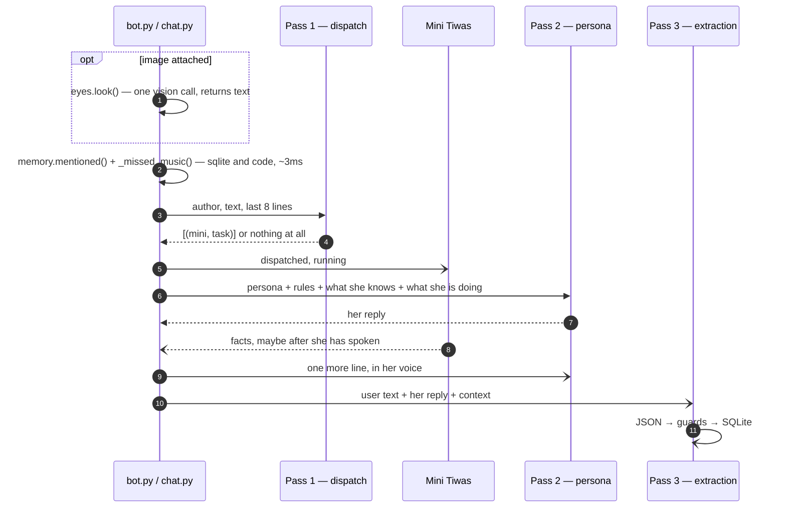

# The three passes

!!! info "This branch is the swarm"
    There is one turn shape here and no `TIWA_TURN` knob. Pass 1 is a **dispatch
    call** that names [Mini Tiwas](the-swarm.md); the tool registry it replaced —
    one model reading ten tool descriptions — lives on the `main` branch. Passes 2
    and 3 are identical on both.

## What this is

Every time Tiwa answers, three separate model calls happen. One decides **what
needs doing**, one writes **her reply**, one decides **what to remember**. They use
different prompts, different temperatures, and can run on different providers.

All three live in `tiwa/pipeline.py`.

Two more calls exist but only fire on the turns that need them, and neither is a
"pass" — they are single questions with one job each:

| extra call | when | where |
|---|---|---|
| **seeing** | the message has an image attached | [`eyes.look()`](../surfaces/eyes.md) |
| **a mini** | dispatch named one, or the music classifier did | [`minis.run()`](the-swarm.md) |

So a plain conversation turn is **2 calls** — dispatch says "nothing", she talks.
About three messages in five are exactly that. A music turn is 3, a turn with a
picture adds one more.

Two more run when **nobody is talking**, on the 30-minute heartbeat: `idle()` decides
whether to say something unprompted, and [`_settle()`](memory.md#reflection) turns what
she has lived into what she thinks. Neither is on the path between your message and her
reply.

## Why it's here

One model call would have to do three jobs with conflicting requirements at once:

- Routing wants **temperature 0** and a strict JSON schema.
- Her voice wants **high temperature** and a long personality prompt.
- Memory writing wants **temperature 0** and a different strict schema.

Squeezing those together produced a model that either sounded flat or routed badly.
Splitting them also buys something better: **her reply never waits on slow work.**
A search takes seconds and a memory write takes a second — both happen off the path
between your message and her words.

## Diagram

<figcaption>You wait for passes 1 and 2. The minis, the follow-up line and pass 3
all run behind her — note the dashed arrows.</figcaption>

## How it works here

**Pass 1 — dispatch** (`minis.dispatch`). Temperature 0, schema-constrained, and it
sees only the mini **names and one-line descriptions** — never their internals. Its
whole output is a list of `(mini, task)` and, when it genuinely cannot tell what
someone wants, the one question it would have to ask. *"Most messages need no mini"*
is stated in the prompt, because the failure mode is over-firing.

It runs **in front of** her reply, not beside it. That is deliberate and it cost a
measured bluff to learn: asked who won the football, she answered *"Man City, 2-1,
Haaland scored both"* at 1.9s and the real result arrived after. She cannot decline
to answer something she does not know is being looked up.

Two things reach the minis **without** a model call at all:

- `memory.mentioned()` — facts about anyone named in the message. This was the
  `recall` tool, 55 of 135 calls, now a sqlite scan in ~3ms.
- `_missed_music()` — a phrase classifier that starts DJ Tiwa at t=0 and
  [overrules the router in both directions](the-swarm.md).

**Pass 2 — persona** (`say`). Gets three system messages: the full `prompts/tiwa.md`,
then a per-turn `[inner-state]` block, then chat history. The inner-state block is
where code injects things the model reliably forgets — language, who she's talking to,
[what she already knows about them](memory.md), [what she's currently doing](action-state.md),
and what she can see. Temperature `0.7`.

**Pass 3 — extraction** (`memory.extract`). Schema-constrained JSON, temperature `0`.
Runs via `asyncio.create_task(asyncio.to_thread(...))` in `bot.py`, so a slow write
can't stall the next message. Everything it produces goes through
[the guards](guards.md), and now also through a [worth test](memory.md).

**The state block is context, not a script.** Pass 2 is told `[inner-state — background,
do not recite]`. When she starts reading it out loud, that instruction is what needs
strengthening.

## Gotchas

- **Dispatch deliberately does not judge her mood.** Asking a pre-pass to made things
  worse: it missed two real attacks and invented hostility in neutral chat. She reads
  the chat herself. Evidence: `tests/moodbench.py`.
- **Naming a mini is not doing the work.** Dispatch answering `dj` plays nothing —
  only `minis.run` reaching `tools.play_music` does. This is the same shape as the old
  "a brief that claims an action did not perform it". See [action state](action-state.md).
- **`hist[-9:-1]`** is the window dispatch sees. Chosen, not measured — widen it and
  pronoun resolution improves while cost rises.
- **Pass 3 can drop a whole turn.** If the model returns invalid JSON, the write is
  skipped silently and the next turn tries again. That's intentional; a malformed
  memory is worse than a missing one.
- **`_clean()` strips `<think>` and `<tool_call>` tags** because the local 8B leaks them
  as visible text.

## Go deeper

- [The swarm](the-swarm.md) — what pass 1 dispatches to, and why.
- [Modes](modes.md) — which provider each pass uses.
- [The guards](guards.md) — what pass 3 is allowed to write.
- [Her persona](persona.md) — what pass 2 reads.
- [Structured outputs](https://openrouter.ai/docs/features/structured-outputs) — the
  strict JSON schema mode passes 1 and 3 both rely on.
