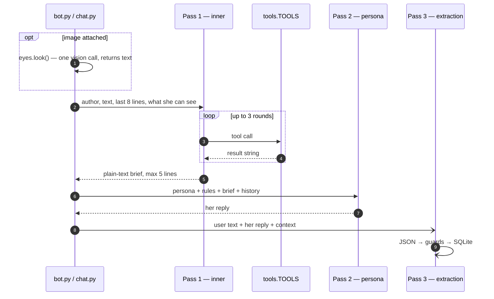

# The three passes

## What this is

Every time Tiwa answers, three separate model calls happen. One decides what to
do, one writes her reply, one decides what to remember. They use different prompts,
different temperatures, and can run on different providers.

All three live in `tiwa/pipeline.py` — about 360 lines.

Two more calls exist but only fire on the turns that need them, and neither is a
"pass" — they are single questions with one job each:

| extra call | when | where |
|---|---|---|
| **seeing** | the message has an image attached | [`eyes.look()`](../surfaces/eyes.md) |
| **search terms** | someone asked for music and pass 1 called no tool | `_force_music()` |

So a plain text turn is 3 calls, a turn with a picture is 4.

Two more run when **nobody is talking**, on the 30-minute heartbeat: `idle()` decides
whether to say something unprompted, and [`_settle()`](memory.md#reflection) turns what
she has lived into what she thinks. Neither is on the path between your message and her
reply.

## Why it's here

One model call would have to do three jobs with conflicting requirements at once:

- Tool calling wants **low temperature** and a short, mechanical prompt.
- Her voice wants **high temperature** and a long personality prompt.
- Memory writing wants **temperature 0** and a strict JSON schema.

Squeezing those together produced a model that either sounded flat or picked tools
badly. Splitting them also buys something better: **her reply never waits on slow work.**
Search takes seconds, memory writes take a second — both happen outside the path
between your message and her words.

## Diagram



<figcaption>Passes 1 and 2 are sequential and you wait for them. Pass 3 is fired and
forgotten — note the dashed arrow.</figcaption>

## How it works here

**Pass 1 — inner** (`_inner_brief`, `_tool_chat`). System prompt says *"You are ทิวา's
inner thoughts, run before she replies. You are NOT the reply."* It loops up to 3 tool
rounds, then must produce a brief addressed to her as "you":

```text
- you remember Tycoon (กาโตว์): Krich's friend, asked for Rick Astley before
- no memory of Steven — ask
```

Temperature `0.3`. Lower was tried — `0.1` measured *worse* and bimodal. Comment at
`tiwa/pipeline.py:56` records it so nobody retries.

**Pass 2 — persona** (`respond`). Gets three system messages: the full
`prompts/tiwa.md`, then a per-turn `[inner-state]` block, then chat history. The
inner-state block is where code injects things the model reliably forgets — language,
who she's talking to, [what she already knows about them](memory.md),
[what she's currently doing](action-state.md), and what she can see. Temperature `0.7`.

**Pass 3 — extraction** (`memory.extract`). Schema-constrained JSON, temperature `0`.
Runs via `asyncio.create_task(asyncio.to_thread(...))` in `bot.py`, so a slow write
can't stall the next message. Everything it produces goes through
[the guards](guards.md).

**The brief is context, not a script.** Pass 2 is told `[inner-state — background, do
not recite]`. When she starts reading her own brief out loud, that instruction is what
needs strengthening.

## Gotchas

- **Pass 1 deliberately does not judge her mood.** Asking it to made things worse: it
  missed two real attacks and invented hostility in neutral chat. The prompt now says
  so explicitly. Evidence: `tests/moodbench.py`.
- **A brief that claims an action did not perform it.** Pass 1 writing "putting it on"
  plays nothing — only a tool call does. This caused a real bug where she said
  "เปิดละ" three turns running with nothing queued. See [action state](action-state.md).
- **`hist[-9:-1]`** is the window pass 1 sees. Chosen, not measured — widen it and
  pronoun resolution improves while cost rises.
- **Pass 3 can drop a whole turn.** If the model returns invalid JSON, the write is
  skipped silently and the next turn tries again. That's intentional; a malformed
  memory is worse than a missing one.
- **`_clean()` strips `<think>` and `<tool_call>` tags** because the local 8B leaks them
  as visible text.

## Go deeper

- [Modes](modes.md) — which provider each pass uses.
- [The guards](guards.md) — what pass 3 is allowed to write.
- [Her persona](persona.md) — what pass 2 reads.
- [Ollama tool support](https://ollama.com/blog/tool-support) and
  [OpenAI function calling](https://platform.openai.com/docs/guides/function-calling) —
  the two shapes `llm.py` normalises between.
