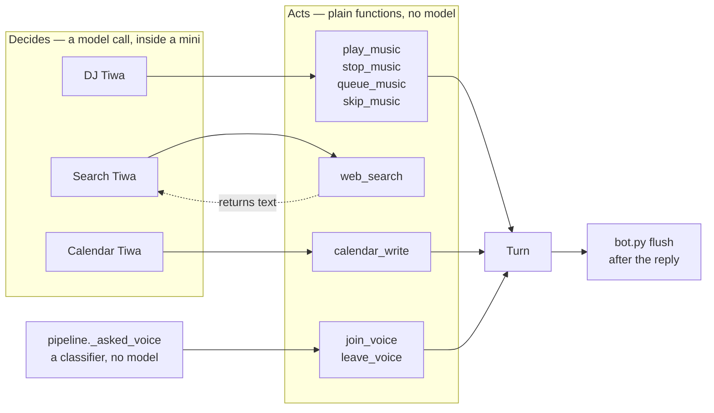

# Actuators — what actually acts

!!! info "The registry is gone from this branch"
    `tiwa/tools.py` used to be a registry of ten tool schemas handed to a
    tool-calling model. [Mini Tiwas](the-swarm.md) replaced that model pass, so
    what is left is the **Turn** and the eight functions a mini reaches for once
    it has already decided. The registry itself lives on `main`.

## What this is

Eight abilities, each a plain function taking `(db, arg: str)`. Seven return
nothing at all; one — `web_search` — returns text, because Search Tiwa needs it.

Plus the thing they all write to: `Turn`, one turn's pending actions.

## Why it's here

Nothing here decides anything. A mini decides; these carry it out. That split is
what lets `bot.py` stay a thin glue layer — it drains the Turn after her reply is
on screen and never has to know which mini filled it.

## Diagram



<figcaption>Only `web_search` hands anything back. Everything else writes a flag to
the Turn so a mini can never act on its own.</figcaption>

## How it works here

### They set flags, they don't act {#tools-set-flags-they-dont-act}

An actuator can't reach a Discord voice channel or your calendar. `play_music` sets
`PENDING_MUSIC`; `bot.py` drains it after her reply is on screen. Three payoffs:

1. Music search never delays her talking.
2. A wrongly-called actuator is a no-op, not an action.
3. Testing one needs no Discord connection.

`calendar_write` is the strongest case: it only ever appends a plain sentence to
`PENDING_CALENDAR`. The actual write is your ✅ reaction. See [the guards](guards.md).

### The Turn is per-task, not global

```python
_TURN = contextvars.ContextVar("tiwa_turn")
```

A `ContextVar`, not a module global and not `threading.local`. asyncio copies the
context into every new Task, and `asyncio.to_thread` carries it across the thread
boundary — which is exactly the path a mini takes. discord.py dispatches every
message as its own Task, so two channels talking at once get two Turns for free.

A module shim keeps the six fields readable as `tools.PENDING_MUSIC`, which is why
`bot.py`, `chat.py` and `dashboard.py` never changed when this stopped being a
registry.

### Every actuator takes one string, named `arg` {#every-tool-takes-one-string-named-name}

Deliberate, and it outlived the registry that caused it. The local 8B mangled nested
tool arguments — `{'object': {'name': X}}`, renamed keys, occasionally deep nesting —
so every tool took one flat string and a helper dug through whatever shape arrived.

The digging is gone with the tool-calling model. The flat signature stayed, because
it turned out to be the right shape anyway: a mini has *already* decided by the time
it calls one, so there is nothing to negotiate. Structured data is minted by
schema-constrained calls (see `gcal._EVENT_FORMAT` and `minis._DJ_FORMAT`), never by
a model choosing a function.

### The description is the code — it just moved {#the-description-is-the-code}

Most routing bugs are description bugs, and that has not changed; the descriptions
now live on [the minis](the-swarm.md) instead. The measured example is still worth
knowing, because it is what the mini prompts inherited:

`play_music`'s description only ever showed *named* tracks — `เปิดเพลง Rick roll ให้หน่อย`.
Asked to *pick* a song ("อยากได้เพลงเล่น Marvel rival เลือกให้หน่อย มันๆ") she had no
title to pass, so she called nothing and just talked about music instead.

| | before | after |
|---|---|---|
| music asks with no song named | **0/6** | **9/12** |
| controls that must *not* play | 2/2 | 4/4 |

The fix was entirely in the description: state that they don't have to name a song,
and that answering "which genre?" is a failure. Both sentences are now in
`minis._DJ_SYSTEM`, where they are the only thing in the prompt instead of one of
ten competing for attention.

### Adding one

You almost certainly want to [add a mini](the-swarm.md), not an actuator. Add an
actuator only when a mini needs a new *hand* — a way to touch the world that nothing
else has. Then name its caller in `tests/growthbench.py`, which fails until you do.

## Gotchas

- **More tools = worse tool selection.** This is the ceiling the swarm exists to
  lift, and the reason this page is short now. `now_playing` was deleted for it once
  [action state](action-state.md) made it redundant; every tool added competed with
  `play_music` for attention. Main Tiwa now reads one `dj` line — 312 chars instead
  of 1,643 — and it stays flat as DJ gains more.
- **An unreferenced actuator is dead silently.** There is no model pass to pick one
  up by description any more, so a function nobody calls simply never runs and no
  bench notices. `growthbench.nothing_is_orphaned` exists because exactly that
  happened to `join_voice` and `leave_voice`.
- **They must never raise.** `web_search` catches network failure and returns
  `"search failed: …"` as text — a crash would kill the whole turn. `minis.run`
  catches anything that gets through and degrades to `{}`.
- **Thai trigger phrases must be written out.** The model does not generalise from
  English examples to Thai ones. `เปิดเพลง`, `ขอเพลง`, `อยากฟัง` are all listed
  explicitly in the DJ and dispatch prompts.

## Go deeper

- [The swarm](the-swarm.md) — who decides, and what a mini may return.
- [The three passes](three-passes.md) — where dispatch sits in a turn.
- [The guards](guards.md) — why `calendar_write` cannot write.
