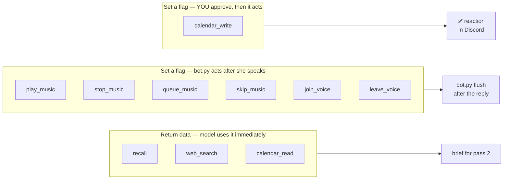

# The tool registry

## What this is

Nine abilities, each a plain function taking `(db, arg: str) -> str`, registered by a
decorator. `tiwa/tools.py` is about 200 lines and there is no framework underneath it.

## Why it's here

This *is* the framework. No LangChain, no agent library, no plugin loader. A tool is a
function plus a description, and the description is the part that actually matters —
it's the only thing the model reads when deciding whether to call it.

## Diagram



<figcaption>Three kinds of tool. Only the first kind returns real data; the other two
exist so a tool can never act on its own.</figcaption>

## How it works here

```python
@tool(
    "Web search. Use ONLY for current events or facts outside memory that the "
    "message directly asks about. Never for people you should just recall.",
    "search query",
)
def web_search(db, arg: str) -> str:
    ...
```

The decorator builds an Ollama/OpenAI-compatible JSON schema and stores it in `TOOLS`.
That's the whole registry.

### Every tool takes one string, named `name`

Deliberate. The local 8B mangled nested arguments — `{'object': {'name': X}}`, renamed
keys, occasionally deep nesting. Rather than fight it, every tool takes one flat string
and `pipeline._arg_name()` digs through whatever shape arrives until it finds one.

Structured data is minted **later**, by schema-constrained calls (see `gcal._EVENT_FORMAT`),
never by the tool-calling model.

Current measured result: **0 blank arguments across 108 logged calls.**

### Tools set flags, they don't act

A tool can't reach a Discord voice channel or your calendar. `play_music` sets
`PENDING_MUSIC`; `bot.py` drains it after her reply is on screen. Three payoffs:

1. Music search never delays her talking.
2. A wrongly-called tool is a no-op, not an action.
3. Testing a tool needs no Discord connection.

### The description is the code

Most tool bugs are description bugs. Real example: `play_music`'s description only ever
showed *named* tracks — `เปิดเพลง Rick roll ให้หน่อย`. Asked to *pick* a song
("อยากได้เพลงเล่น Marvel rival เลือกให้หน่อย มันๆ") she had no title to pass, so she
called nothing and just talked about music instead.

| | before | after |
|---|---|---|
| music asks with no song named | **0/6** | **9/12** |
| controls that must *not* play | 2/2 | 4/4 |

The fix was entirely in the description: state that they don't have to name a song, and
that answering "which genre?" is a failure. `tests/pickbench.py`.

### Adding one

See [common workflows](../work/workflows.md#add-a-tool). Short version: write the
function, decorate it, run `py -X utf8 -m tiwa.tools`.

## Gotchas

- **More tools = worse tool selection.** `now_playing` was deleted for this reason once
  [action state](action-state.md) made it redundant. Every tool you add competes with
  `play_music` for attention.
- **Thai trigger phrases must be in the description.** The model does not generalise
  from English examples to Thai ones. `เปิดเพลง`, `ขอเพลง`, `อยากฟัง` are all listed
  explicitly.
- **Module-level flags are global state.** Fine for one guild; the day she's in two
  calls at once, this is the thing that breaks. Marked `ponytail:` in the source.
- **Tools must never raise.** `web_search` catches network failure and returns
  `"search failed: …"` as text — a crash would kill the whole turn.
- **The model invents tool names.** `_tool_chat` returns `"unknown tool"` rather than
  raising.

## Go deeper

- [The three passes](three-passes.md) — where the tool loop runs.
- [The guards](guards.md) — why `calendar_write` cannot write.
- [OpenAI function calling](https://platform.openai.com/docs/guides/function-calling) —
  the schema shape being generated.
