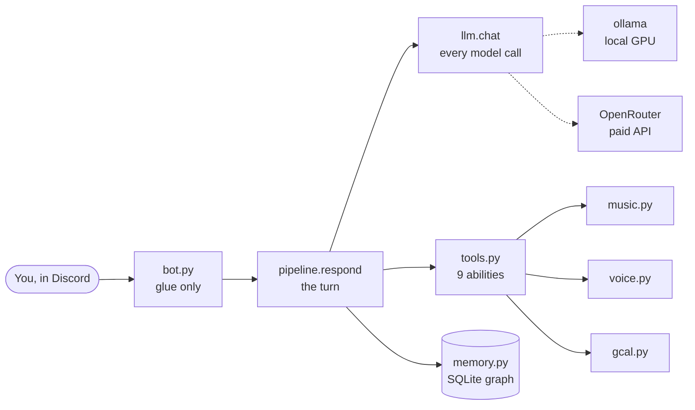

# Introduction

Tiwa (ทิวา) is a Discord companion bot with her own opinions. She talks in Thai and
English, remembers people across conversations, plays music in voice chat, and reads
your calendar. She is not an assistant that agrees with you — arguing with her is
the point.

This guide gets you from "never seen this repo" to "shipped a change" without
needing the original author.

## What you'll learn

- [Why three model calls happen every time she answers](concepts/three-passes.md), and
  which one you probably want to change.
- [How the same bot runs on your GPU, on a paid API, or split between them](concepts/modes.md)
  — one environment variable.
- [How her memory is a graph, not a chat log](concepts/memory.md), and why episodes and
  facts are different things.
- [Why users can never write her beliefs](concepts/guards.md) — the security property this
  project exists to protect, enforced in code.
- [How to give her a new ability](concepts/tools.md) by writing one function.
- [Why she streams YouTube instead of downloading it](surfaces/music.md), and how she keeps
  talking while a song plays.
- [Which library was chosen over which alternative, and what it cost](toolchain/dependencies.md).
- [Every decision that isn't obvious from the code](reference/decisions.md), with the numbers
  that drove it.
- [Three exercises](work/your-turn.md) ending in a real bug that shipped.

## Where to start

**New here?** [Before you begin](before-you-begin.md) → [Environment setup](setup.md) →
[The 10-minute tour](tour.md). About 40 minutes to a running bot you understand.

**Already running it?** Skip to [The three passes](concepts/three-passes.md) — everything
else is downstream of that one idea.

**Looking for something specific?** Search is in the header. [Common
workflows](work/workflows.md) answers "how do I add a…".

## The shape of the thing

<figcaption>Every feature hangs off one function. Learn <code>pipeline.respond()</code> and
you know where everything else plugs in.</figcaption>

## What this project is not

No agent framework. No LangChain, no vector database, no orchestration layer. The
registry in `tiwa/tools.py` **is** the framework — about 30 lines. Adding a dependency
here needs a reason, and [the decision log](reference/decisions.md) records the ones that
earned their place and the ones that were rejected.

The whole thing is **about 5,600 lines of Python** across 34 files with no build step.
You can read all of it in an afternoon. This guide exists so you don't have to.

!!! warning "The repo is ahead of its last commit"
    Most of this project is uncommitted or untracked right now — `dashboard.py`,
    `tiwa/voice.py`, `tiwa/music.py` and every bench included. So this guide points at
    **file paths and line numbers** rather than GitHub permalinks, because permalinks to
    the last commit (`21e42a3`) would 404 for half the codebase. Once it's pushed, see
    [Docs maintenance](reference/docs-maintenance.md) for turning those into real links.
