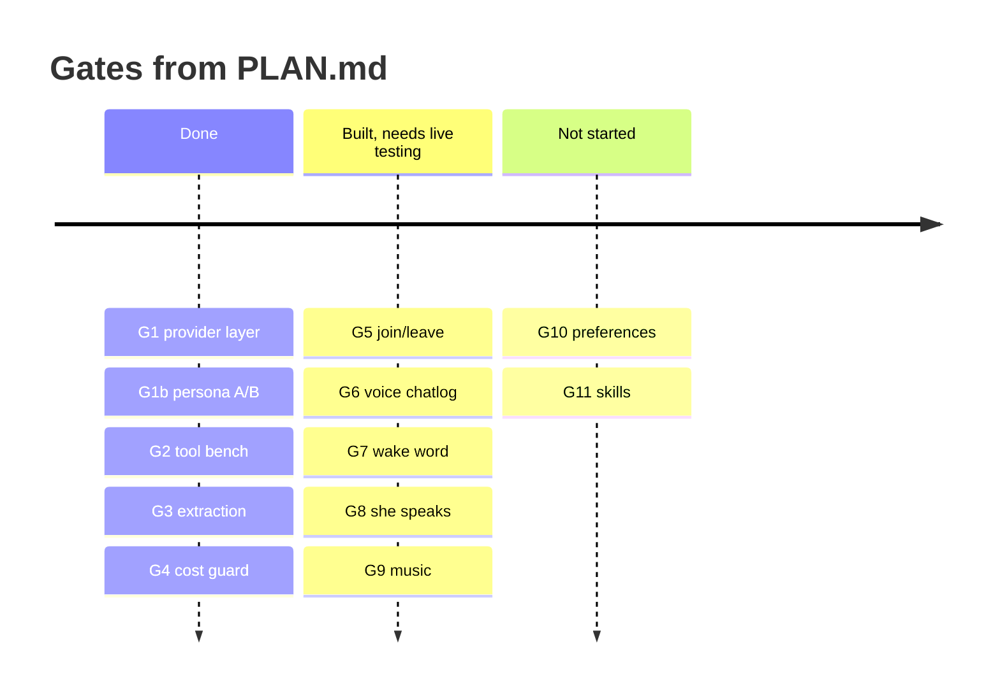

# Where to go next

You've read the guide. Here's what's actually unbuilt, roughly in the order the project
intends to build it. Full detail lives in `PLAN.md`, which is organised into five tracks.

## The state of things

<figcaption>G5–G9 pass their benches but were judged on measurements, not on a real call
with real people. G10 onwards is open ground.</figcaption>

## Good first contributions

Small, self-contained, and each one closes something this guide had to document as a
shortcoming.

**The audit findings are all closed** — see [findings](findings.md). F1, F2, F3 and F5 were
code fixes; F4 and F6 were closed by annotating rather than rewriting or deleting; F7 is an
observation that stays open on purpose, as a warning about reading this repo by file size.

**~~Force the tool call she skips.~~ Done 2026-07-30.** About 1 music ask in 4–6, she said
"ได้เลย จะเปิดให้" and called nothing. Prompt fixes took it from 0/6 to 9/12; the rest needed
code. `pipeline._missed_music()` now catches the miss and `_force_music()` asks for search
terms **as plain text** instead of retrying the tool call — a model that just declined to
call a tool declines again often enough, but it always answers a question. One extra call,
only on turns that missed. Trigger cases are asserted in `tests/djbench.py`.

**Swap the search index — if the results still annoy you.** Query quality is fixed
([search](../concepts/search.md)); the index isn't. A live run for *"is the new iphone any
good"* returned `vk.com` and `ispace.ge`. Benchmarked options as of 2026:

| | Agent score | Latency | Cost |
|---|---|---|---|
| **Brave Search API** | highest measured (14.89), ~1 point clear of Tavily | lowest, 669 ms | $5/mo credit; the perpetual free tier ended Feb 2026 |
| **Tavily** | just behind Brave, built for LLM retrieval | "Advanced" tier 5 s+ | 1,000 searches/mo free |
| **SearXNG** | depends entirely on your hosting | yours to own | free, self-hosted, Docker |
| **ddgs** (current) | not in the benchmark | fine | free, no key |

Source and review in [ADR-017](decisions.md#adr-017). Short version: **don't do this yet.**
`web_search` is one function, so the swap is cheap whenever you want it, and none of these
fixes a bad query — the rewriting had to come first either way. Do it when you catch her
answering from a junk domain, not before.

**Screenshot the control panel.** Five images would make
[that page](../surfaces/panel.md) twice as useful. See
[known gaps](docs-maintenance.md#known-gaps-in-this-guide).

## The real roadmap

### G10 · Preferences

A first-class `preference` memory type plus correction detection — "no, shorter",
"don't do that when I'm gaming" — injected into every brief.

`PLAN.md` calls this *"the biggest felt improvement per line in the whole plan"*, and it's
the one that makes her feel like she's learning you rather than just remembering you.

Files: `memory.py` (extraction schema + storage), `pipeline.py`.

### G11 · Skills

A `skills` table she writes herself: a name plus steps. One tool to save, one to run.
"goodnight" → lights off plus tomorrow's calendar. She proposes a skill after seeing the
same sequence about three times.

Gated steps still go through the ✅ gate. Hermes Agent (Nous Research, MIT) is the
reference for the *shape* — copy the idea, not the code.

### Entity normalization

"Gojo" and "Gojo Satoru" are two nodes, so facts about one are invisible to a recall of the
other. Same for "mom" and "Krich's mom".

Explicitly deferred, with a warning attached: **it gets worse as the graph grows.** The fix
is an alias table (`alias → canonical id`) written by the extractor, or FTS5/embeddings for
fuzzy matching. Revisit before the graph is large.

### Home Assistant — real-world control

Read-only first (`ha_states` over REST), then acting via
`/api/conversation/process`, with **risk tiers in code**: reversible things (lights, music,
scenes) run free and are announced after; consequential things (locks, heat, garage,
anything that heats or opens) queue behind the ✅ gate.

`PLAN.md` marks the tier list as a safety boundary that must never be simplified away. It's
the same pattern as [the guards](../concepts/guards.md) — treat it that way.

Also noted: buy bulbs Home Assistant already supports. Don't write per-vendor integrations.

### Grounded heartbeat

Feed the idle turn real context — time, today's calendar, sensor states — so unprompted
messages become *"lights still on at 1am, you asleep?"* instead of poetry.

### Fine-tuning

LoRA/SFT on collected transcripts, so she sounds like herself without prompt crutches.
Cannot be started early and cannot be shortcut with more prompt work: it needs roughly a
thousand good exchanges to exist first. Logging and a JSONL export are the prerequisite.

## Explicitly deferred

Don't build these until they hurt: an MCP client (adopt at 3+ external services) · FTS5 or
embeddings for recall · a per-user register for her Thai pronouns · a trained wake-word
model · a bigger local model or a dedicated inference box.

## The constraints that don't move

Whatever you build, these hold:

1. **8 GB VRAM.** Never plan two resident 8B models.
2. **Guards are code, never prompt.** Coercion, the ✅ gate, the heartbeat throttle, the
   cost ceiling.
3. **No agent framework.** The registry is the framework.
4. **A surface is not a brain.** If a new surface needs changes inside
   `pipeline.respond()`, something is wrong.
5. **She is not a butler.** She's allowed to refuse, argue, and have taste. Features that
   require obedience are the wrong features.

## And the meta one

Every stage in this project ships alone and has **one runnable check** you can read
yourself. If your change can't be judged by running something and looking at a table, it
isn't finished. See [the bench suite](../work/testing.md).
