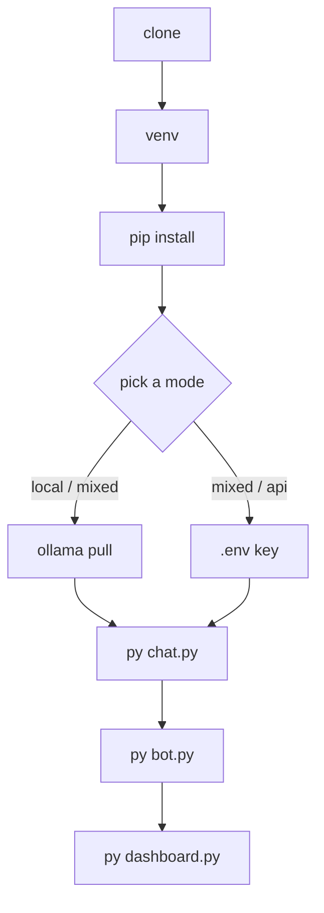

# Environment setup

Goal: talk to her in your terminal. No Discord token, no API key, no accounts.



<figcaption>Do it in this order. <code>chat.py</code> proves the brain works before Discord
can add its own failure modes.</figcaption>

## 1. Clone and isolate

```bash
git clone https://github.com/krichpapath/Tiwa-Utility-Chatbot.git
```

```bash
py -m venv .venv
```

```bash
.venv\Scripts\activate
```

A venv is not currently used in this project's own workflow, but you want one — several
dependencies pull native wheels.

## 2. Install

```bash
py -m pip install -r requirements.txt
```

That's everything — 16 packages. If you hit `ModuleNotFoundError` on anything, the
[dependency table](toolchain/dependencies.md) says what each package is for.

## 3. Pick where the models run

One variable decides everything — see [modes](concepts/modes.md) for the full picture.

=== "local — free, needs a GPU"

    ```bash
    ollama pull huihui_ai/qwen3-abliterated:8b
    ```

    Then create `.env` in the project root:

    ```ini
    TIWA_MODE=local
    ```

    Nothing else needed. No key, no network, no cost.

=== "api — no GPU, costs money"

    ```ini
    TIWA_MODE=api
    OPENROUTER_API_KEY=sk-or-v1-REPLACE_ME
    ```

    Ollama does not need to be installed. This is the low-spec mode: everything heavy
    runs on the API, and your GPU stays free for games.

=== "mixed — best quality"

    Needs both. Tools and memory run local, her replies come from the API.

    ```ini
    TIWA_MODE=mixed
    OPENROUTER_API_KEY=sk-or-v1-REPLACE_ME
    ```

!!! danger "`.env` is secrets"
    It is gitignored and must stay that way. Never paste real keys into a bug report, a
    docs page, or a screenshot. Every example here uses obvious placeholders.

## 4. Talk to her

```bash
py -X utf8 chat.py yourname
```

`-X utf8` is not optional on Windows — she replies in Thai, and the default console
encoding will throw `UnicodeEncodeError`. See [conventions](work/conventions.md#always-x-utf8).

You should get a reply in a few seconds. Say something she'd have an opinion about.
Ask her to remember a friend's name, then ask about that friend in the next message —
that is [the memory system](concepts/memory.md) working.

## 5. Add Discord

Create a bot at the [Discord developer portal](https://discord.com/developers/applications),
enable the **Message Content** intent, invite it to a server, then:

```ini
DISCORD_TOKEN=REPLACE_ME
```

```bash
py -X utf8 bot.py
```

She only answers when you **@mention** her. Everything else in the channel is recorded
for context but costs nothing — see [the Discord bot](surfaces/discord.md).

## 6. Open the control panel

```bash
py -X utf8 dashboard.py --open
```

<http://127.0.0.1:8787> — health checks, every setting with an explanation, her memory,
and every model call with its full prompt. There is also a **Chat** tab, so you can talk
to her here before Discord is set up at all. When something behaves strangely, this is
where you look first. See [the control panel](surfaces/panel.md).

## Optional: calendar

Put your Google OAuth client secret in the project root as
`client_secret_XXXX.apps.googleusercontent.com.json` (the code finds it by glob), then:

```bash
py -X utf8 gcal_auth.py
```

One browser consent, and a token lands in `data/gcal_token.json`. Skip this and
calendar tools return `calendar unavailable` instead of crashing.

## Optional: 24/7

```bash
run_forever.cmd
```

Restarts her on crash. Put a shortcut in `shell:startup` to start with Windows.
The long-term goal is for her to run all the time; right now starting and stopping her
by hand is normal and expected.

## Verify

```bash
py -X utf8 tests\test_memory.py
```

Prints `SQL checks OK`. If that passes, your install is sound. More in
[the bench suite](work/testing.md).

## Next

[The 10-minute tour](tour.md) — the architecture, once, with diagrams.
