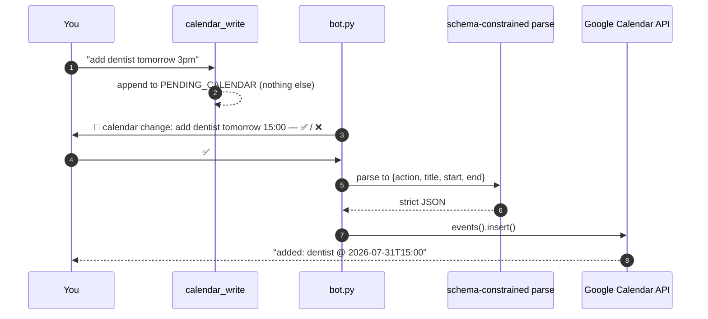

# Calendar

## What this is

She reads your Google Calendar freely and can *request* changes. Every write waits for
your ✅ in Discord. `tiwa/gcal.py`, 138 lines.

## Why it's here

Reading is safe and useful — "am I free Thursday?" should just work. Writing is not
safe: a model that misparses "cancel the dentist" can delete something real. So writes
are gated by a human, in code.

## Diagram

<figcaption>The tool cannot reach Google. Only your reaction can.</figcaption>

## How it works here

**Reads** — `upcoming(days=7)` returns one line per event. Any failure (no token, no
network) returns `"calendar unavailable: …"` as text, so the turn survives and the brief
just reports it.

**Writes** — two stages on purpose:

1. `calendar_write` stores your sentence verbatim. No parsing yet.
2. After ✅, `apply_change()` does a **schema-constrained** parse into
   `{action, title, start, end}` with `action` limited to `add` or `cancel`, then calls
   the API.

Parsing happens *after* approval so what you approve is your own words, not the model's
interpretation of them.

**Only add and cancel exist.** "Move X to Friday" is cancel-then-add; the code asks you
to rephrase instead. Marked `ponytail:` in the source — a deliberate ceiling.

**Auth** — one-time consent via `gcal_auth.py` writes `data/gcal_token.json`. The client
secret is found by glob (`client_secret*.json`) in the project root, so the filename
doesn't matter. Both files are gitignored.

Timezone is hardcoded `Asia/Bangkok`.

## Gotchas

- **Nothing works until you run `gcal_auth.py`.** Right now this project has never been
  authorized, so every calendar tool returns `calendar unavailable`. That's the expected
  state, not a bug.
- **The parse is a normal `llm.chat()` call**, so it shows up on the panel's llm tab like
  everything else — that's where to look when a date comes out wrong. It bypassed the
  provider layer until 2026-07-30 ([F3](../reference/findings.md#f3)), which made `api`
  mode secretly need Ollama.
- **`_EVENT_FORMAT` requires every field**, `end` included, because OpenRouter sends it as
  a strict schema. `end` is nullable, so the model answers `null` and `_plus1h()` fills in.
- **`cancel` deletes the first search hit.** One `maxResults=1` query against the event
  title. Wrong title, wrong deletion — the ✅ gate is the only thing between a
  misparse and a lost event.
- **Untitled events** become `(no title)`.
- **Scope is `calendar.events`** — enough to read and write events, not to manage
  calendars.

## Go deeper

- [The guards](../concepts/guards.md) — the ✅ gate as a safety property.
- [Google Calendar API](https://developers.google.com/calendar/api/v3/reference/events) ·
  [OAuth for desktop apps](https://developers.google.com/identity/protocols/oauth2/native-app)
