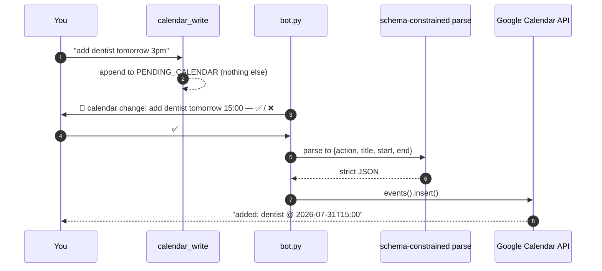

# Calendar

## What this is

She reads your Google Calendar freely and can *request* changes. Every write waits for
your ✅ in Discord. `tiwa/gcal.py`, ~160 lines.

## Why it's here

Reading is safe and useful — "am I free Thursday?" should just work. Writing is not
safe: a model that misparses "cancel the dentist" can delete something real. So writes
are gated by a human, in code.

## Diagram



<figcaption>The tool cannot reach Google. Only your reaction can.</figcaption>

## How it works here

**Reads** — `upcoming(days=7)` returns one line per event. Any failure (no token, no
network) returns `"calendar unavailable: …"` as text, so the turn survives and the brief
just reports it.

**Writes** — two stages on purpose:

1. `calendar_write` stores your sentence verbatim. No parsing yet.
2. After ✅, `apply_change()` does a **schema-constrained** parse into
   `{action, title, start, end}` with `action` limited to `add` or `cancel`, then calls
   the API.

Parsing happens *after* approval so what you approve is your own words, not the model's
interpretation of them.

**Only add and cancel exist.** "Move X to Friday" is cancel-then-add; the code asks you
to rephrase instead. Marked `ponytail:` in the source — a deliberate ceiling.

**Auth** — one-time consent via `gcal_auth.py` writes `data/gcal_token.json`. The client
secret is found by glob (`client_secret*.json`) in the project root, so the filename
doesn't matter. Both files are gitignored.

Timezone is hardcoded `Asia/Bangkok`.

### The hard part is getting the tool called at all {#getting-it-called}

Everything above works. The thing that actually failed in real use is one step earlier —
**pass 1 never calling `calendar_write`.** From the live log:

```text
21:00  Tycoon: พรุ่งนี้เช้ามีนัดกินข้าว 13.00 ช่วยลงปติทินให้หน่อย
       ทิวา:   "...มึงหมายถึงพรุ่งนี้ (อาทิตย์ 2 ส.ค.) 13.00 ป่าว"   ← reasonable question
21:00  Tycoon: ช่ายๆๆ                                              ← yes
       ทิวา:   "โอเค ลงให้ละ อาทิตย์ 2 ส.ค. 13.00"                  ← claims she wrote it
```

No `calendar_write` row. She said she'd done it and hadn't — the same confabulation as
[the music case](music.md), and the reason to trust the ****Activity log** tab, never her reply**.

The cause was in `_INNER_SYSTEM`, which gave music four lines and the calendar one word:
*"check the calendar"*. So a message leading with a calendar word mapped to
`calendar_read`. Measured with `tests/calbench.py --live`:

| case | before | after |
|---|---|---|
| bare "yes" to her own clarifying question | 0/2 | 2/3 |
| `ลงปฏิทินให้หน่อย นัดหมอฟัน…` (calendar word first) | 0/2 → `calendar_read` | 3/3 |
| direct asks, both languages, both speakers | 7/8 | 12/12 |
| **total** | **~50%** | **20/21** |

Two things worth taking from that:

- **It was never about who asked.** "Krich's calendar" in the tool description was the
  obvious suspect and the data cleared it — Tycoon and Krich behave identically.
- **A prompt fix got it to ~95%, not to 100%**, and the residual is always the bare
  confirmation. If it recurs in real use the answer is the one music already took:
  a forced retry in code. The ✅ gate makes over-firing cheap — a wrong queue costs you
  one ❌ — so that net is safe to add whenever it's worth the extra call.

## Gotchas

- **Nothing works until you run `gcal_auth.py`.** Without `data/gcal_token.json` every
  calendar tool returns `calendar unavailable` — that's the expected state on a fresh
  clone, not a bug. It opens a browser and needs your own Google sign-in, so nobody can
  run it for you.
- **She will happily say she wrote it without writing it.** See below; this is the
  failure mode to watch for, and the panel's log tab is where you check.
- **The parse is a normal `llm.chat()` call**, so it shows up on the panel's **Model calls** tab like
  everything else — that's where to look when a date comes out wrong. It bypassed the
  provider layer until 2026-07-30 ([F3](../reference/findings.md#f3)), which made `api`
  mode secretly need Ollama.
- **`_EVENT_FORMAT` requires every field**, `end` included, because OpenRouter sends it as
  a strict schema. `end` is nullable, so the model answers `null` and `_plus1h()` fills in.
- **`cancel` deletes the first search hit.** One `maxResults=1` query against the event
  title. Wrong title, wrong deletion — the ✅ gate is the only thing between a
  misparse and a lost event.
- **Untitled events** become `(no title)`.
- **Scope is `calendar.events`** — enough to read and write events, not to manage
  calendars.

## Go deeper

- [The guards](../concepts/guards.md) — the ✅ gate as a safety property.
- [Google Calendar API](https://developers.google.com/calendar/api/v3/reference/events) ·
  [OAuth for desktop apps](https://developers.google.com/identity/protocols/oauth2/native-app)
