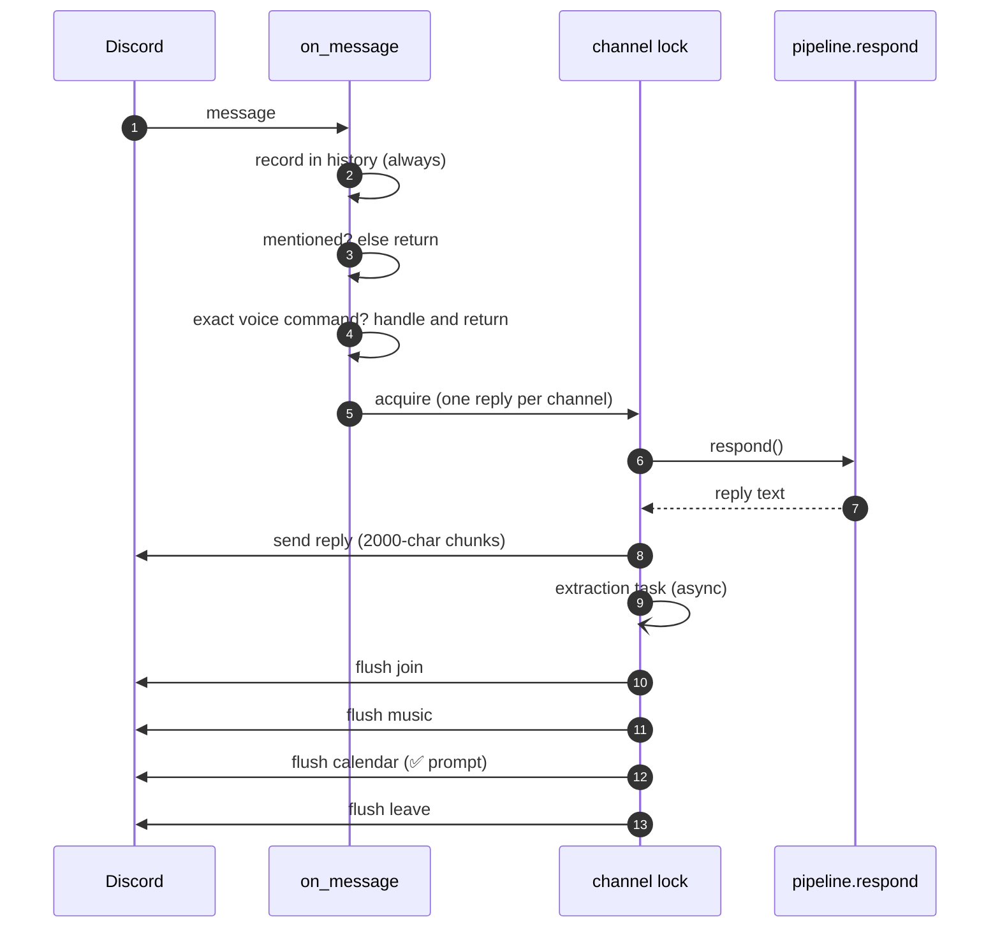

# The Discord bot

## What this is

`bot.py` — 306 lines connecting Discord to `pipeline.respond()`. It holds no reasoning.
Its real job is **ordering**: what happens before what, so a slow action never blocks a
fast reply.

## Why it's here

Discord is the primary surface. The design rule is that `bot.py` stays glue: if you're
writing logic here, it probably belongs in `pipeline.py` or a tool.

## Diagram

<figcaption>The flush order is load-bearing. Leaving is last because hanging up stops
the music.</figcaption>

## How it works here

**Everything is recorded, only mentions are answered.** Every message goes into
`history[channel_id]` (a 40-message deque) so she has context on who said what. She
replies only when `@`-mentioned. Context is free; model calls are not.

**One reply per channel at a time.** `locks[channel_id]` is an `asyncio.Lock`. Without
it, two fast messages produce two overlapping turns racing on the same history.

**Queued actions run even when her reply is empty.** This was a real bug: an early
`return` on an empty reply skipped the music flush, so you'd ask for Bad Apple and
*nothing happened*. `tests/djbench.py` now has a static AST check asserting there is no
`return` between taking the lock and flushing.

**Exact-phrase voice commands** bypass the model entirely:

| You type | Effect |
|---|---|
| `join`, `join vc`, `get in here`, `เข้ามา`, `เข้าห้อง` | joins your channel |
| `leave`, `leave vc`, `get out`, `ออกไป`, `ออกห้อง` | disconnects, clears the deck |

Exact match only, so normal conversation never triggers them. She can also decide to
join or leave herself via [tools](../concepts/tools.md) — those go through a
future-tense veto in code.

**Two background loops:**

- `keep_listening` (30 s) — restarts voice listening if it ever dies. It has died.
- `idle_turn` (30 min) — lets her speak unprompted at most once every 3 hours, only
  between 09:00 and 23:00, and only if `TIWA_HOME_CHANNEL` is set. Usually returns
  nothing.

**`asyncio.to_thread` everywhere blocking.** Model calls, web search, and YouTube search
are sync functions; they run in threads so the event loop keeps serving Discord.

## Gotchas

- **The Message Content intent must be on** in the developer portal, or `message.content`
  is empty and she never sees anything.
- **RTCP spam.** `voice_recv` logs every sender report at INFO. Silenced explicitly at
  the top of `bot.py` — harmless packets, unreadable logs.
- **2000-character chunking** is Discord's message limit, applied by hand when she
  rambles.
- **`client.run()` is behind `if __name__ == "__main__"`** so benches can import the DJ
  logic without connecting. Bugs used to hide in exactly this glue because it was
  unimportable.
- **`_heard()` mirrors voice into text**, so the voice path and the text path share one
  history. It's disabled by default; see [voice in](voice-in.md).

## Go deeper

- [The three passes](../concepts/three-passes.md) — what `respond()` does.
- [Music and the DJ](music.md) — what the music flush drives.
- [discord.py events](https://discordpy.readthedocs.io/en/stable/api.html#event-reference) ·
  [gateway intents](https://discordpy.readthedocs.io/en/stable/intents.html)
