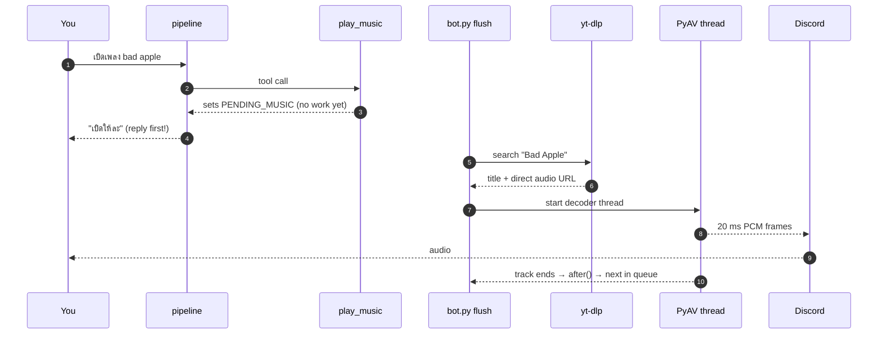

# Music and the DJ

## What this is

She searches YouTube, streams the audio into a Discord voice channel, and keeps talking
while it plays. `tiwa/music.py` (214 lines) does the audio; `bot.py` runs the deck.

**She streams. Nothing is ever downloaded to disk.**

## Why it's here

The point isn't a music bot — Discord has hundreds. The point is that she's a *person*
who happens to be holding the aux cable. She can refuse. You have to persuade her.
That's why `play_music` is a tool she *chooses* to call rather than a command that
executes.

## Diagram



<figcaption>Search happens <em>after</em> her reply is already on screen. That's why a
slow YouTube lookup never makes her look frozen.</figcaption>

## How it works here

**Search** — `yt-dlp`, metadata only (`skip_download: True`). Five flat results, one
picked, then a second call resolves that one to a direct CDN audio URL. Why it isn't just
`ytsearch1` is [below](#a-mix-is-not-a-song).

**Decode** — `PyAV` opens that URL and resamples to what Discord wants: 48 kHz, 16-bit,
stereo, 20 ms frames. A background thread fills a ~4 second queue; `read()` hands
Discord one frame at a time. The buffer absorbs network jitter, nothing more.

**No ffmpeg binary anywhere.** See [audio and speech](../toolchain/audio-speech.md).

### The deck

```python
NOW = {"title": None, "query": None}
QUEUE = []
```

`bot.py:_flush_music()` drains the actions she queued this turn:

| Action | Behaviour |
|---|---|
| `play` | search, then start immediately (stops anything playing) |
| `queue` | search, append — or start it if nothing is playing |
| `skip` | `vc.stop()`; the `after` callback pulls the next track |
| `stop` | clear queue, clear deck, stop |

Auto-advance works through Discord's `after` callback, which runs on the **audio
thread** — so it schedules `_next()` onto the bot's loop with
`asyncio.run_coroutine_threadsafe`.

**Asking for music is asking her to join.** If she's not in a voice channel, the flush
joins yours first. You never have to say "join" before "play something".

### A mix is not a song {#a-mix-is-not-a-song}

`find()` used to be `ytsearch1` — the top hit, whatever it was. For a *named* song that's
right. For a mood it is never right, and mood queries are exactly what
[`play_music` was taught to invent](../concepts/tools.md#the-description-is-the-code).

Measured 2026-07-30:

| she searches | `ytsearch1` gave her |
|---|---|
| `hype gaming EDM` | **131 min** mix — and all of the top 5 were 131–183 min |
| `lofi study` | 61 min, with a livestream at #3 |
| `เพลงลูกทุ่ง` | 61 min compilation; only #2 was a real song |

Three things break when the deck holds a three-hour mix: `queue_music` puts a track behind
something that outlives the conversation, auto-advance never fires, and
[action state](../concepts/action-state.md) reports *"playing Music Mix 2025 🎧 EDM Remixes
of Popular Songs 🎧…"*, which she can't say out loud.

**Searching deeper doesn't fix it** — `ytsearch20` for `hype gaming EDM` contained **zero**
songs. So `find()` does this instead:

1. Five flat results. Take the first that has a real length, is under
   `TIWA_MAX_TRACK_MIN` (default 12), isn't a `list=` radio mix, and isn't in `_RECENT`.
2. If none qualifies, retry against **YouTube's own "under 4 minutes" filter**
   (`sp=EgIYAQ%3D%3D`), which turns 0 usable results into 261 of 264. Capped at two
   candidates.
3. Resolve candidates one at a time and **re-check the real duration** — flat metadata
   reports `duration: None` for both "not reported" and "livestream", and that page still
   lists streams.
4. If nothing lands under the ceiling, prefer anything **finite** over a livestream. A long
   mix at least ends, so the queue eventually advances.

The `sp=` value is YouTube's constant, not ours, so it's a fallback rather than the primary
path: if it ever changes, search degrades to the old behaviour instead of breaking.

Result: 5 of 6 real queries return actual songs. `lofi study` still gets a 61-minute mix,
because YouTube genuinely has almost nothing else for it — visible in the bench as `mix`,
which is a disappointment rather than a failure.

### The same query stops replaying the same video

`_RECENT` holds the last 20 video ids. Ask for `เพลงมันๆ` twice and you get two different
songs, which is the whole point of a mood query. Same idea as
[search dedupe](../concepts/search.md), different scope: 20 tracks rather than one turn,
because replaying a song you heard five minutes ago is the annoying case.

### Surviving a dropped stream

A mid-song `OSError: [Errno 5] I/O error` from a CDN hiccup used to end the track
halfway. Four defences now:

1. libavformat's own reconnect options (`reconnect_streamed`, `reconnect_on_network_error`).
2. `_decode()` retries — 4 attempts — seeking to `self.seconds` so it **resumes** instead of
   restarting.
3. On each retry it **re-resolves the URL by video id**, which is the only thing that helps
   when the CDN link has expired rather than glitched.
4. A 30 s read timeout, because returning empty audio would end playback for good.

Defence 3 has been wrong twice, in opposite directions:

- Until 2026-07-30 it was **dead code** — `source()` accepted `query` and then called
  `cls(url)`, dropping it, so the branch could never fire ([F1](../reference/findings.md)).
- Once revived it re-ran the *search*, which was fine under `ytsearch1` and became a bug
  the moment picking got smarter: a mid-song re-resolve could land on a **different song**.
  Caught by `musicbench.py`, which asserts the re-resolve returns the original id.

So `source_for()` now carries `hit["id"]` down to `_decode()`, and the retry asks for that
exact video. A recovery path that can change the song is worse than no recovery path.

### Volume

`TIWA_MUSIC_VOLUME` (default `1.0`) wraps the source in
`discord.PCMVolumeTransformer`. Set `0.4`–`0.6` so she can be heard over the track.

`TIWA_MAX_TRACK_MIN` (default `12`) is the song/mix line above. Raise it when you *want*
long mixes — the knob exists because "put on something long" is a real request that no
amount of result filtering should override.

## Gotchas

- **She doesn't need to recognise a song to play it.** Her never-bluff rule used to fire
  on song titles, so she'd queue a track and say she'd never heard of it. Fixed in the
  tool's return text and [action state](../concepts/action-state.md).
- **She doesn't have to name the song either** — "pick something for gaming" works. That
  needed the tool description spelled out; see [the tool registry](../concepts/tools.md#the-description-is-the-code).
- **She may refuse.** *"Not in the mood for Queen right now"* with nothing queued is a
  feature, not a bug. That's also why the forced retry below can't be a hard rule.
- **A missed tool call is forced, not re-prompted.** She used to agree and queue nothing on
  about 1 ask in 4–6. `pipeline._missed_music()` spots it — phrase match, whenever no music
  tool fired — and `_force_music()` asks the model for search terms as plain text, then
  calls `play_music` itself. Deliberately keyword-based and precision-biased: a false
  positive plays a song nobody asked for. See
  [action state](../concepts/action-state.md#the-retry-does-not-care-whats-already-playing)
  for why it ignores the current deck.
- **Don't let it pad a named song.** `_force_music`'s terms prompt is told to output a named
  song plus at most its artist or game, nothing else. It once turned *"Red Line"* (Warframe)
  into `Red Line Warframe chase` — picking up "escape the police" from the sentence — and
  played a different Warframe track.
- **MRO trap.** `source()` builds `type("MusicSource", (Stream, discord.AudioSource), {})`
  — `Stream` **must** come first, or `AudioSource.read()` wins and raises
  `NotImplementedError` on every song. There's an `assert` guarding it. This shipped once.
- **`import av` is at module level on purpose.** Importing it lazily inside the decoder
  thread failed with a DLL error under CPU load.
- **One deck, all guilds.** Marked `ponytail:` — fix it the day she's in two calls.
- **`duration: None` means two different things.** "Not reported" on the filtered results
  page, "livestream" on a normal search. Conflating them shipped a livestream to the deck
  once. Trust the resolved duration, never the flat one.
- **`_RECENT` is process memory.** Restart the bot and she may replay a song from before.
  Deliberate — persisting it would mean a table, a migration and a pruning policy for a
  problem nobody has.

## Go deeper

- [Action state](../concepts/action-state.md) — how she knows what's playing.
- [The bench suite](../work/testing.md) — `djbench.py` runs the whole deck offline.
- [yt-dlp options](https://github.com/yt-dlp/yt-dlp#usage-and-options) ·
  [PyAV docs](https://pyav.org/docs/stable/)
