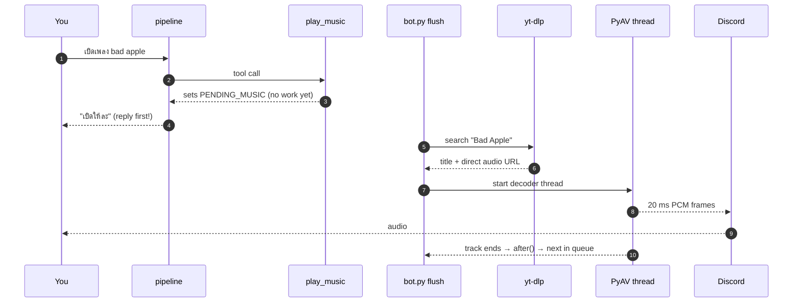

# Music and the DJ

## What this is

She searches YouTube, streams the audio into a Discord voice channel, and keeps talking
while it plays. `tiwa/music.py` (214 lines) does the audio; `bot.py` runs the deck.

**She streams. Nothing is ever downloaded to disk.**

## Why it's here

The point isn't a music bot — Discord has hundreds. The point is that she's a *person*
who happens to be holding the aux cable. She can refuse. You have to persuade her.
That's why `play_music` is a tool she *chooses* to call rather than a command that
executes.

## Diagram



<figcaption>Search happens <em>after</em> her reply is already on screen. That's why a
slow YouTube lookup never makes her look frozen.</figcaption>

## How it works here

**Search** — `yt-dlp` with `skip_download: True` and `default_search: "ytsearch1"`.
Returns title plus a direct CDN audio URL. Metadata only.

**Decode** — `PyAV` opens that URL and resamples to what Discord wants: 48 kHz, 16-bit,
stereo, 20 ms frames. A background thread fills a ~4 second queue; `read()` hands
Discord one frame at a time. The buffer absorbs network jitter, nothing more.

**No ffmpeg binary anywhere.** See [audio and speech](../toolchain/audio-speech.md).

### The deck

```python
NOW = {"title": None, "query": None}
QUEUE = []
```

`bot.py:_flush_music()` drains the actions she queued this turn:

| Action | Behaviour |
|---|---|
| `play` | search, then start immediately (stops anything playing) |
| `queue` | search, append — or start it if nothing is playing |
| `skip` | `vc.stop()`; the `after` callback pulls the next track |
| `stop` | clear queue, clear deck, stop |

Auto-advance works through Discord's `after` callback, which runs on the **audio
thread** — so it schedules `_next()` onto the bot's loop with
`asyncio.run_coroutine_threadsafe`.

**Asking for music is asking her to join.** If she's not in a voice channel, the flush
joins yours first. You never have to say "join" before "play something".

### Surviving a dropped stream

A mid-song `OSError: [Errno 5] I/O error` from a CDN hiccup used to end the track
halfway. Four defences now:

1. libavformat's own reconnect options (`reconnect_streamed`, `reconnect_on_network_error`).
2. `_decode()` retries — 4 attempts — seeking to `self.seconds` so it **resumes** instead of
   restarting.
3. On each retry it **re-resolves the URL** by searching for the original query again, which
   is the only thing that helps when the CDN link has expired rather than glitched.
4. A 30 s read timeout, because returning empty audio would end playback for good.

Defence 3 was dead code until 2026-07-30: `source()` accepted `query` and then called
`cls(url)`, dropping it, so the branch could never fire —
[F1](../reference/findings.md).

### Volume

`TIWA_MUSIC_VOLUME` (default `1.0`) wraps the source in
`discord.PCMVolumeTransformer`. Set `0.4`–`0.6` so she can be heard over the track.

## Gotchas

- **She doesn't need to recognise a song to play it.** Her never-bluff rule used to fire
  on song titles, so she'd queue a track and say she'd never heard of it. Fixed in the
  tool's return text and [action state](../concepts/action-state.md).
- **She doesn't have to name the song either** — "pick something for gaming" works. That
  needed the tool description spelled out; see [the tool registry](../concepts/tools.md#the-description-is-the-code).
- **She may refuse.** *"Not in the mood for Queen right now"* with nothing queued is a
  feature, not a bug. That's also why the forced retry below can't be a hard rule.
- **A missed tool call is forced, not re-prompted.** She used to agree and queue nothing on
  about 1 ask in 4–6. `pipeline._missed_music()` spots it — phrase match, only when the deck
  is empty and no music tool fired — and `_force_music()` asks the model for search terms as
  plain text, then calls `play_music` itself. Deliberately keyword-based and
  precision-biased: a false positive plays a song nobody asked for.
- **MRO trap.** `source()` builds `type("MusicSource", (Stream, discord.AudioSource), {})`
  — `Stream` **must** come first, or `AudioSource.read()` wins and raises
  `NotImplementedError` on every song. There's an `assert` guarding it. This shipped once.
- **`import av` is at module level on purpose.** Importing it lazily inside the decoder
  thread failed with a DLL error under CPU load.
- **One deck, all guilds.** Marked `ponytail:` — fix it the day she's in two calls.

## Go deeper

- [Action state](../concepts/action-state.md) — how she knows what's playing.
- [The bench suite](../work/testing.md) — `djbench.py` runs the whole deck offline.
- [yt-dlp options](https://github.com/yt-dlp/yt-dlp#usage-and-options) ·
  [PyAV docs](https://pyav.org/docs/stable/)
