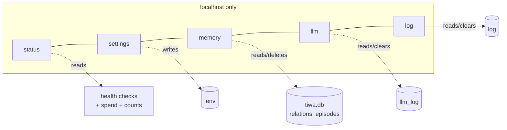

# The control panel

## What this is

A local web page at <http://127.0.0.1:8787> for seeing and changing everything about her.
`dashboard.py` — ~725 lines, stdlib `http.server`, no framework, no JavaScript build.

```bash
py -X utf8 dashboard.py --open
```

## Why it's here

Debugging a three-pass pipeline by reading console output does not scale. This is where
you answer "what did she actually send the model?" and "why does she think that?"

It's also the answer to "there are 24 environment variables and I don't know what any of
them do" — every setting on the page carries a plain-English explanation and its default.

## Diagram



<figcaption>Five tabs over one SQLite file and one <code>.env</code>. The only writer is
you.</figcaption>

## How it works here

| Tab | What you get |
|---|---|
| **status** | mode in plain words · health of Discord token, OpenRouter key, Ollama, music decoder, calendar auth, listening · tokens spent today · replies and average reply time (24 h) · recent songs |
| **settings** | every knob grouped by subsystem, each with an explanation and its default. Empty box = default. **Reset all to defaults** at the bottom |
| **memory** | facts grouped per person with a jump index, searchable, `forget` per row, plus forget-everything |
| **llm** | every model call labelled by pass — **thinking** / **her reply** / **remembering** / **seeing** / **reflecting** / **idle** — filterable by pass, provider and text. Click a row for the exact prompt and reply |
| **log** | turns, tool calls, music, voice — filter by kind or text. See [reading the tool rows](#reading-the-tool-rows) |

Exports on every tab: `memory.json`, `memory.csv`, `episodes.csv`, `llm.json`,
`log.csv`. CSVs use a UTF-8 BOM so Excel opens Thai correctly.

### Security properties

- **Binds `127.0.0.1` only.** It edits `.env` and deletes memory; it must never be
  reachable off the machine.
- **Secret values are never rendered.** Only `set` / `missing`.
- **The write whitelist.** `write_env()` refuses any key it doesn't own, so a crafted form
  cannot touch `DISCORD_TOKEN`. Same for wipes — the table name comes from a whitelist
  dict, never from the request.

`tests/panelbench.py` asserts all three against a throwaway `.env` and database.

### Reading the llm tab

The pass label is inferred from the prompt text, and it's the fastest way to answer "why
did she do that":

- **thinking** — did the tool fire? What was the brief?
- **her reply** — what rules were injected this turn?
- **remembering** — what did extraction propose, before the guards?
- **seeing** — what did the vision model actually make of the image? ([her eyes](eyes.md))
- **reflecting** — what did she conclude about someone while nobody was talking?
  ([reflection](../concepts/memory.md#reflection))
- **idle** — a heartbeat tick, which usually decides to stay quiet

### Reading the tool rows {#reading-the-tool-rows}

`_tool_chat()` logs every call as `name('argument') -> result`. The log tab splits that
into three parts, because as one string it's unreadable and the **argument** is what you're
usually hunting for:

| | shows |
|---|---|
| tool name | which tool she reached for. Click it to filter the log to just that tool |
| `argument` | **what she actually searched.** The keywords for `web_search`, the song terms for `play_music`, the filename for [`look`](eyes.md). Hidden when the tool takes no argument |
| → result | what came back, first 240 characters |

This is the page that answers *"she said she'd play something — did she?"* A turn with no
`play_music` row means the tool never fired, whatever she said. A `-> forced, the tool pass
skipped it` result means [the retry](../concepts/action-state.md) caught one.

It's also where you judge query quality, which is the whole subject of
[search and curiosity](../concepts/search.md) — if the arguments are whole sentences rather
than keywords, that's the bug.

## Gotchas

- **Settings don't affect a running bot.** They're read at import. Restart her.
- **`log` is never pruned; `llm_log` is.** The activity log keeps everything until you
  clear it, so counts there are real totals. The model-call log is a rolling 400
  (`LLM_LOG_KEEP`) because prompts are big.
- **Model calls stop being logged if `TIWA_LOG_PROMPTS=0`** — the tab just goes empty.
- **`llm_log` keeps 400 rows.** Older prompts are gone; export if you need history.
- **Two instances can't share port 8787.** If the page looks stale, an older
  `dashboard.py` is probably still running.
- **Deletes are immediate and permanent.** There's a confirm dialog and no undo.
- **No screenshots in this guide yet.** The pages here are described rather than shown —
  see [docs maintenance](../reference/docs-maintenance.md).

## Go deeper

- [Environment variables](../reference/env.md) — the same settings as reference.
- [Memory](../concepts/memory.md) · [The three passes](../concepts/three-passes.md)
- [`http.server`](https://docs.python.org/3/library/http.server.html) — the whole server.
