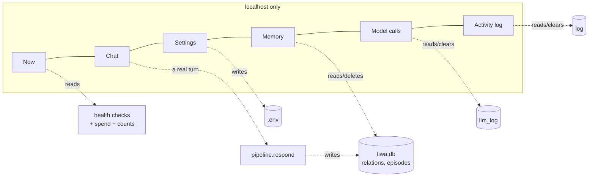

# The control panel

## What this is

A local web page at <http://127.0.0.1:8787> for seeing and changing everything about her.
`dashboard.py` — ~880 lines of [Gradio](https://gradio.app). Every table sorts, searches
and filters itself in the browser, so the file holds no filter widgets and no HTTP handler.
The one stylesheet at the bottom exists for spacing: Gradio gives every stacked block the
same gap, which puts a heading as far from its own table as from the section above it, and
equal spacing is no grouping at all. Sections here run **34 px above a heading, 10 px
below**. The page is a 1400 px column, centred. Each region is one bordered surface and
never a card inside a card: **Now** draws four objects — right-now, the pass strip, the
chart, the track list — and right-now is a single card divided into three bands by hairlines
(what she runs on, what is broken, what she holds) rather than three stacked cards.

```bash
py -X utf8 dashboard.py --open
```

## Why it's here

Debugging a three-pass pipeline by reading console output does not scale. This is where
you answer "what did she actually send the model?" and "why does she think that?"

It's also the answer to "there are 24 environment variables and I don't know what any of
them do" — every setting on the page carries a plain-English explanation and its default.

## Diagram



<figcaption>Six tabs over one SQLite file and one <code>.env</code>. Five of them only
read; <b>Chat</b> is the one that also spends.</figcaption>

## How it works here

| Tab | What you get |
|---|---|
| **Now** | in reading order: what she runs on (mode, providers, tokens spent today), then what is broken (health of Discord token, OpenRouter key, Ollama, music decoder, calendar auth, listening — six across), then what she holds (six running totals), then **one turn, three passes** with the median latency and call count of each, then replies per hour and recent songs. Health sits second because it is why you opened the page. Refreshes itself every 4 s — untick **live** to stop it |
| **Chat** | talk to her through the real pipeline, no Discord. Same brain, same database, same bill. See [chatting with her](#chatting-with-her) |
| **Settings** | every knob grouped by subsystem in a collapsed accordion, each with an explanation and its default. Empty box = default. **Reload from .env** if you edited the file by hand; **reset every setting** behind a tick box |
| **Memory** | facts held per name as a chart, then every fact, one row each, searchable. Tick **forget** on any rows and press the button; the delete goes by row id, so sorting or filtering the table first is safe |
| **Model calls** | where the calls go and how long each pass takes, as two charts, then every model call labelled by pass — **thinking** / **her reply** / **remembering** / **seeing** / **reflecting** / **idle**. Click any row for the exact prompt and reply |
| **Activity log** | turns, tool calls, music, voice. See [reading the tool rows](#reading-the-tool-rows) |

Filtering lives in the table, not in the page: every table has a search box that matches a
column or the whole row, and the headers sort. That is why there are no filter chips.

Exports on every tab: `memory.json`, `memory.csv`, `episodes.csv`, `llm.json`,
`log.csv`. CSVs use a UTF-8 BOM so Excel opens Thai correctly.

### Security properties

- **Binds `127.0.0.1` only.** It edits `.env` and deletes memory; it must never be
  reachable off the machine.
- **Secret values are never rendered.** Only `set` / `missing`.
- **The write whitelist.** `write_env()` refuses any key it doesn't own, so nothing here
  can touch `DISCORD_TOKEN`. Same for wipes — the table name comes from a whitelist dict
  in `memory.wipe()`, never from the page.
- **Every destructive button sits behind a tick box.** Gradio has no confirm dialog, so
  the handler refuses and says so until **yes, really** is ticked.

`tests/panelbench.py` asserts all three against a throwaway `.env` and database.

### Reading the three-pass strip {#three-passes}

The **Now** tab draws one turn left to right — *thinking → her reply → remembering* — with
the median latency and the call count of each, over the model log's rolling 400. It is the
first thing to read when she feels slow, because it says which pass to blame before you open
a single row. Passes that don't belong to a turn (*idle*, *reflecting*, *seeing*) are counted
underneath rather than drawn in the line.

The same three numbers appear as charts on **Model calls**: one for how many calls each pass
costs, one for how long each takes.

### Chatting with her {#chatting-with-her}

The **Chat** tab runs `pipeline.respond()` — the same three passes, the same tools, the
same `tiwa.db` the Discord bot uses. It is the fastest way to test a prompt change without
opening Discord, and the fastest way to spend money by accident.

- **Who you are** is the name she files facts under. Use your real one or you'll teach her
  about a person who doesn't exist.
- **Let her remember this** runs the extraction pass after her reply, exactly as Discord
  does. Untick it to poke at her without writing anything.
- **Music, voice and calendar writes are named, not carried out.** Those need the Discord
  bot's voice connection and its ✅ gate, so the tab drains what she asked for and appends
  it in italics — *asked for: play lofi*. She isn't lying to you; the hands aren't here.

### Reading the Model calls tab

The pass label is inferred from the prompt text, and it's the fastest way to answer "why
did she do that":

- **thinking** — did the tool fire? What was the brief?
- **her reply** — what rules were injected this turn?
- **remembering** — what did extraction propose, before the guards?
- **seeing** — what did the vision model actually make of the image? ([her eyes](eyes.md))
- **reflecting** — what did she conclude about someone while nobody was talking?
  ([reflection](../concepts/memory.md#reflection))
- **idle** — a heartbeat tick, which usually decides to stay quiet

### Reading the tool rows {#reading-the-tool-rows}

`_tool_chat()` logs every call as `name('argument') -> result`. The **Activity log** tab splits that
into three parts, because as one string it's unreadable and the **argument** is what you're
usually hunting for:

| | shows |
|---|---|
| tool name | which tool she reached for. Type it into the table's search box to see only that tool |
| `argument` | **what she actually searched.** The keywords for `web_search`, the song terms for `play_music`, the filename for [`look`](eyes.md). Hidden when the tool takes no argument |
| → result | what came back, first 240 characters |

This is the page that answers *"she said she'd play something — did she?"* A turn with no
`play_music` row means nothing ever reached the deck, whatever she said. A `mini` row
reading `dj(...) -> {'action': 'none', ...}` means DJ Tiwa looked and decided it was
not a music ask — [see action state](../concepts/action-state.md).

It's also where you judge query quality, which is the whole subject of
[search and curiosity](../concepts/search.md) — if the arguments are whole sentences rather
than keywords, that's the bug.

## Gotchas

- **Settings don't affect a running bot.** They're read at import. Restart her.
- **`log` is never pruned; `llm_log` is.** The activity log keeps everything until you
  clear it, so counts there are real totals. The model-call log is a rolling 400
  (`LLM_LOG_KEEP`) because prompts are big.
- **Model calls stop being logged if `TIWA_LOG_PROMPTS=0`** — the tab just goes empty.
- **`llm_log` keeps 400 rows.** Older prompts are gone; export if you need history.
- **Two instances can't share port 8787.** If the page looks stale, an older
  `dashboard.py` is probably still running.
- **Deletes are immediate and permanent.** The tick box is the only gate; there is no undo.
- **The tables show the newest 400 rows.** Exports are not capped — `log.csv` carries 5000.
- **Chat spends money in `mixed`/`api` mode,** at exactly the rate Discord does. Untick
  **let her remember this** to talk without writing to her memory.
- **The health list is not a table.** Six things that are either true or not, so the
  failing one is the loud one. Colour is never the only signal — each row carries a text
  label for assistive tech.
- **No screenshots in this guide yet.** The pages here are described rather than shown —
  see [docs maintenance](../reference/docs-maintenance.md).

## Go deeper

- [Environment variables](../reference/env.md) — the same settings as reference.
- [Memory](../concepts/memory.md) · [The three passes](../concepts/three-passes.md)
- [Gradio](https://www.gradio.app/docs/gradio/blocks) — `Blocks`, `Dataframe`, `Timer`,
  `ChatInterface`: the whole page.
