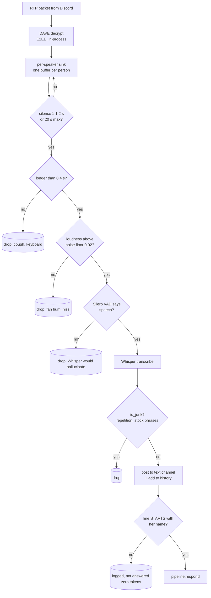

# Voice in — she listens

!!! warning "Unfinished, and off by default"
    `TIWA_LISTEN=0`. The pipeline works end to end, but **Thai accuracy on CPU is not
    good enough to use** — and Thai is the point. This page teaches it anyway, because
    it's a long way from finished, not abandoned. Everything below is real, tested code
    you can switch on today and be disappointed by.

## What this is

She joins a voice channel, transcribes everything anyone says into the text channel, and
runs the model **only** when a line starts with her name.

## Why it's here

Transcribing is cheap. Thinking is not. So the design splits them: everything becomes
chat log for context, and a wake word decides when to spend tokens.

## Diagram

<figcaption>Four gates before a single token is spent. Each one exists because of a
specific failure — noise, hallucination, or cost.</figcaption>

## How it works here

**Per-speaker streams.** Discord gives one audio stream per person, kept separate so she
knows *who* spoke — which maps directly onto per-user memory.

**Whisper via `onnx-asr`, CPU only.** The GPU belongs to the persona model.
`TIWA_ONNX_THREADS=4` is the measured optimum on this 10-core CPU — 2.3× faster than
letting onnxruntime choose (0.58 s vs 1.32 s). Sixteen threads was the *worst*.

**VAD is mandatory, not optional.** Without it, Whisper invents words from nothing:
pure silence, room hiss, and 60 Hz fan hum all produced *"Thanks for watching!"*, and
louder hiss produced 600 characters of garbage. Silero VAD returns empty for all five
noise cases while real speech still transcribes.

**The wake word is a string match, not a model.** No trained wake-word model
(openWakeWord needs custom training, Porcupine needs a key, neither handles Thai).

Her name transcribes as **"ที่ว่า"**, essentially never as "ทิวา" — on both model sizes.
So `WAKE` is a variant list plus fuzzy matching, and the line must **start** with her
name (an optional greeting is allowed first). `tests/wakebench.py` covers 32 phrasings.

**E2EE stays on.** Discord made DAVE encryption mandatory for voice on 2026-03-02 —
declaring `max_dave_protocol_version = 0` now gets rejected outright with close code
4017. `voice_recv` 0.5.2a179 has no DAVE support, so it fed opus still-encrypted
payloads → `OpusError: corrupted stream` → its router ran `finally: stop_listening()` and
her ears died permanently after one bad packet.

The fix (`voice.enable_dave_decrypt()`, applied at import) runs the payload through the
DAVE session discord.py already maintains. **Encryption is preserved for everyone in the
call.** Remove it when `voice_recv` ships its own support.

!!! note "`README.md` and `PLAN.md` are wrong about this"
    Both still say she *declines* E2EE and that calls she joins are unencrypted. That was
    the old approach and it no longer works. This page reflects the code. Finding **F4**.

## Gotchas

- **Thai transcription is the blocker.** `whisper-base` gives "กินอร่อยดี" for
  "กินอะไรดี". `whisper-small` is better and ~3× slower. `int8` quantization measured
  *slower*, not faster — don't.
- **Language auto-detect sometimes returns nothing at all**, after 35–62 seconds.
  Pinning `TIWA_WHISPER_LANG=th` fixes Thai and breaks English.
- **CPU transcription runs 1–4× realtime**, so a busy channel builds a backlog she never
  clears.
- **A dead listener used to stay dead.** Two watchdogs now: `enable_resilient_router()`
  patches the router so one bad packet can't stop everything, and `keep_listening` in
  `bot.py` restarts it every 30 s.
- **`traceback` was once unimported** in the error handler, so the handler raised
  `NameError` and killed the task it was protecting — the classic "listener hiccup, still
  listening" then silence. It's one of the [exercises](../work/your-turn.md).
- **Debug audio.** `TIWA_VOICE_DEBUG=1` writes every heard clip to
  `data/voice_debug/*.wav`. Filenames are sanitised — a transcript containing `?` used to
  crash on Windows with `OSError: Errno 22`.

## Go deeper

- [Voice out](voice-out.md) · [Discord and voice transport](../toolchain/discord-transport.md)
- [onnx-asr](https://github.com/istupakov/onnx-asr) ·
  [Silero VAD](https://github.com/snakers4/silero-vad)
