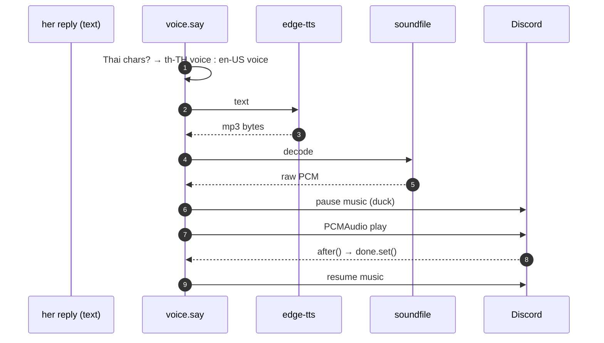

# Voice out — she speaks

## What this is

When she replies while sitting in a voice channel, she says it out loud.
`voice.say()` turns text into audio with `edge-tts` and plays it through Discord.

## Why it's here

Being in a call and typing is worse than being in a call and talking. It also needs Thai,
which eliminated most options.

## Diagram

<figcaption>mp3 in, raw PCM out, no ffmpeg. Music is paused for the duration rather than
volume-ducked.</figcaption>

## How it works here

**Voice selection is code, not model.** Same Thai-character test the persona pass uses:

| Language detected | Voice | Knob |
|---|---|---|
| Thai | `th-TH-PremwadeeNeural` | `TIWA_TTS_TH` |
| English | `en-US-AvaNeural` | `TIWA_TTS_EN` |

**Ducking is a pause, not a fade.** She talks over silence instead of over music.
Simpler, and it sounds better than competing with a chorus.

**No ffmpeg.** `edge-tts` returns mp3, `soundfile` decodes it in-process, and
`discord.PCMAudio` plays raw PCM. One less system dependency, and it works under Smart
App Control.

### The hang that made her deaf

`say()` waits for playback to finish before releasing the channel lock. An early version
read the loop from `guild._state.loop` inside the `after` callback; when that failed,
`await done.wait()` blocked **forever while holding the lock** — she answered once, then
never again.

Two fixes, both worth copying anywhere you bridge threads and asyncio:

1. Capture the loop **before** playing, not inside the callback.
2. `asyncio.wait_for(done.wait(), timeout=seconds + 15)` — never wait unbounded on a
   callback you don't control.

## Gotchas

- **`edge-tts` needs internet.** It's a free Microsoft endpoint with no key. If it
  breaks, text still works — she just goes quiet.
- **Long replies take real time to speak.** The lock is held that whole time, so nobody
  else in that channel gets a reply.
- **Thai voices are limited** — `PremwadeeNeural` (female) and `NiwatNeural` (male) are
  the practical choices.
- **She speaks only in the voice path** (`_heard`), which is off by default. In text-only
  use `say()` never runs.

## Go deeper

- [Voice in](voice-in.md) — the half that isn't finished.
- [Audio and speech](../toolchain/audio-speech.md) — why these libraries.
- [edge-tts](https://github.com/rany2/edge-tts) ·
  [voice list](https://github.com/rany2/edge-tts#list-of-voices)
