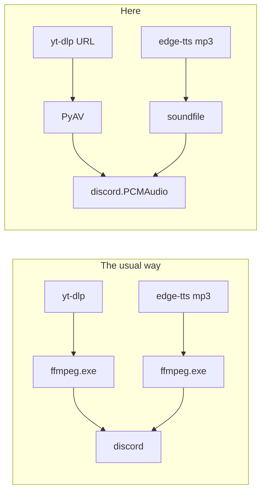

# Audio and speech

## What this is

Four libraries move audio: **PyAV** (decode YouTube), **soundfile** (decode TTS mp3),
**edge-tts** (make speech), **onnx-asr + Silero VAD** (understand speech).

## Why it's here

Two constraints picked this stack, and neither is obvious from the code.

### Constraint 1: no ffmpeg binary

Every Discord audio tutorial says install ffmpeg. This project doesn't have it. The
install kept failing, and the alternative turned out to be *less* code:

<figcaption>Same result, no system dependency and nothing to install outside pip.</figcaption>

### Constraint 2: Smart App Control

This machine runs [Smart App Control](https://support.microsoft.com/en-us/topic/what-is-smart-app-control-285ea03d-fa88-4d56-882e-6698afdb7f73) in **enforced** mode, which blocks unsigned
binaries. There is no per-file exception, and turning it off is irreversible without
reinstalling Windows.

It has vetoed two libraries here:

| Blocked | Why | Error |
|---|---|---|
| `faster-whisper` | ships unsigned `ctranslate2.dll` | `OSError WinError 4551` |
| `hf_xet` | unsigned download accelerator | model downloads fail outright |

`onnxruntime` is **Microsoft-signed**, so it loads. That single fact chose the entire
speech stack. Workaround for `hf_xet`: `HF_HUB_DISABLE_XET` — plain HTTP is slower once
and then irrelevant.

## The choices

| Package | What it does | Why chosen | Rejected | Cost to replace |
|---|---|---|---|---|
| **av** (PyAV) | FFmpeg's libraries as a Python wheel — decodes the YouTube stream | Gives libavformat without an ffmpeg binary, including its HTTP reconnect options | `ffmpeg.exe` subprocess; `pydub` (wraps ffmpeg anyway) | Medium — `music.Stream` is built around its API |
| **soundfile** | Decodes edge-tts mp3 to PCM | Small, libsndfile-backed, mp3 support since 0.12 | ffmpeg again; `pydub` | Low — a few lines |
| **edge-tts** | Text to speech | Free, no key, neural **Thai** voices | **Piper** — no Thai, disqualified. **F5-TTS-Thai** — wants the GPU the persona model has. Paid cloud TTS — a key and a bill | Low, but the Thai requirement narrows options sharply |
| **onnx-asr** | Runs Whisper on onnxruntime | Works under Smart App Control. No PyTorch — a fraction of the install | `faster-whisper` (blocked); `openai-whisper` (drags PyTorch in) | Medium |
| **onnxruntime** | Inference engine | Microsoft-signed | — | High — it's the reason speech works at all |
| **Silero VAD** | Detects whether audio contains speech | Also signed onnxruntime. Mandatory, not an optimisation | WebRTC VAD; energy-only gating (already the first gate) | High — remove it and hallucinations return |

## Measured numbers

Whisper on this CPU:

| Model | English | Thai speed | Thai accuracy |
|---|---|---|---|
| `whisper-base` (default) | ~1.0× realtime | 1–2× | rough — "กินอร่อยดี" for "กินอะไรดี" |
| `whisper-small` | ~1.4× | 2.8–3.8× | good |

- **`int8` quantization measured *slower*** on both. Don't.
- **4 threads is the optimum** — 0.58 s vs 1.32 s at onnxruntime's own default. 16 threads
  was worst of all.
- **Noise floor 0.02** sits in a measured gap: speech 0.09–0.11, quiet speech 0.023, fan
  hum 0.021, room hiss 0.002.

## Gotchas

- **`import av` must stay at module level.** Importing it inside the decoder thread failed
  with `DLL load failed while importing dictionary` under CPU load. Startup cost instead
  of play-time failure.
- **`music.ready()`** is called at bot startup so a broken decoder surfaces then, not when
  someone asks for a song.
- **`numpy` is used directly by both `music.py` and `voice.py`** — it is declared in
  `requirements.txt` rather than relied on as an onnx-asr transitive dep.
- **edge-tts needs internet.** Acceptable — OpenRouter already does.

## Go deeper

- [Music and the DJ](../surfaces/music.md) · [Voice in](../surfaces/voice-in.md) ·
  [Voice out](../surfaces/voice-out.md)
- [PyAV](https://pyav.org/docs/stable/) ·
  [soundfile](https://python-soundfile.readthedocs.io/) ·
  [edge-tts](https://github.com/rany2/edge-tts) ·
  [onnx-asr](https://github.com/istupakov/onnx-asr) ·
  [Silero VAD](https://github.com/snakers4/silero-vad)
