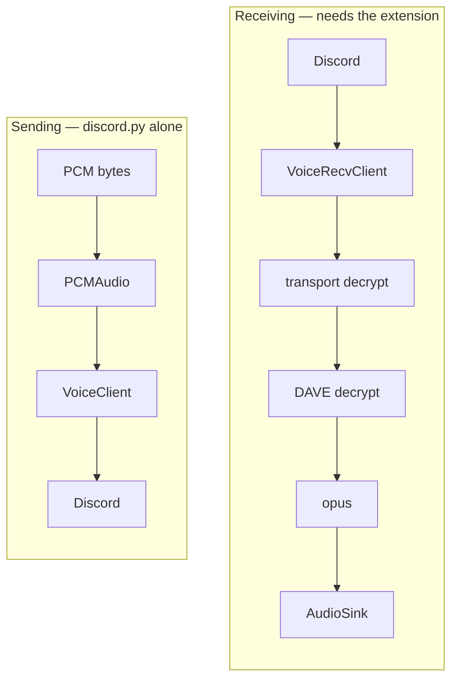

# Discord and voice transport

## What this is

Three packages put her in a voice channel: **discord.py** (the client), **PyNaCl**
(voice encryption), and **discord-ext-voice-recv** (receiving audio, which discord.py
does not do).

## Why it's here

discord.py can *send* voice but not *receive* it — that's a deliberate upstream
decision. Receiving needs a third-party extension, and that extension is where the sharp
edges live.

## Diagram

<figcaption>Two layers of encryption on the way in. The second one is why listening broke.</figcaption>

## The choices

| Package | What it does | Why chosen | Rejected | Cost to replace |
|---|---|---|---|---|
| **discord.py** 2.7.1 | Discord client, events, voice send | Mature, typed, the reference Python library | `nextcord` / `disnake` (forks, no receive either); `hikari` (different model, smaller ecosystem) | Very high — `bot.py` is built on its event model |
| **PyNaCl** 1.5 | Encrypts/decrypts the voice transport | Required by discord.py for any voice at all | none | n/a |
| **discord-ext-voice-recv** 0.5.2a179 | Receiving audio | The only maintained option | Raw websocket + opus by hand — weeks of work | High, but only affects `voice.py` |

Note the version: `0.5.2a179` is an **alpha**. That's the state of the art for voice
receive in Python, and it explains the next section.

## The two patches

Both applied at import in `tiwa/voice.py`, both idempotent, both removable when upstream
catches up.

### `enable_dave_decrypt()`

Discord made **DAVE** (its end-to-end voice encryption) mandatory for non-stage voice on
2026-03-02. Opting out with `max_dave_protocol_version = 0` is now rejected outright with
close code **4017**.

`voice_recv` has no DAVE support, so it handed opus a still-encrypted payload →
`OpusError: corrupted stream`.

discord.py already maintains a DAVE session — it needs one to *send* audio — so the patch
runs the payload through `davey.DaveSession.decrypt()` after transport decryption.
**E2EE stays fully on for everyone in the call.**

### `enable_resilient_router()`

`voice_recv`'s packet router ends its run loop with `finally: stop_listening()`. One bad
packet therefore stopped listening **permanently**. The patch wraps the loop so a single
failure is logged and skipped instead of fatal. `tests/routerbench.py` asserts the patch
is installed.

Belt and braces: `keep_listening` in `bot.py` restarts listening every 30 s if it dies
anyway.

## Gotchas

- **`davey` is a direct dependency now** (declared in `requirements.txt`, `0.1.6` here).
  It used to arrive only transitively, which meant a slimmer install silently removed her
  hearing.
- **Monkey-patching an alpha library is fragile by construction.** Both patches check a
  sentinel attribute before applying, and both should be deleted the moment `voice_recv`
  ships equivalents.
- **`VoiceRecvClient` must be passed at connect time** — `ch.connect(cls=voice_recv.VoiceRecvClient)`.
  A plain connect gives you a client that can't listen.
- **One `AudioSink` per speaker.** Don't merge them; per-speaker separation is what maps
  audio to per-user memory.
- **The Message Content intent** is a separate switch in the developer portal from voice
  permissions. Both are needed.

## Go deeper

- [Voice in](../surfaces/voice-in.md) — the gate chain this feeds.
- [discord.py voice](https://discordpy.readthedocs.io/en/stable/api.html#voice-related) ·
  [discord-ext-voice-recv](https://github.com/imayhaveborkedit/discord-ext-voice-recv)
- [Discord's DAVE protocol](https://discord.com/blog/meet-dave-e2ee-for-audio-video)
