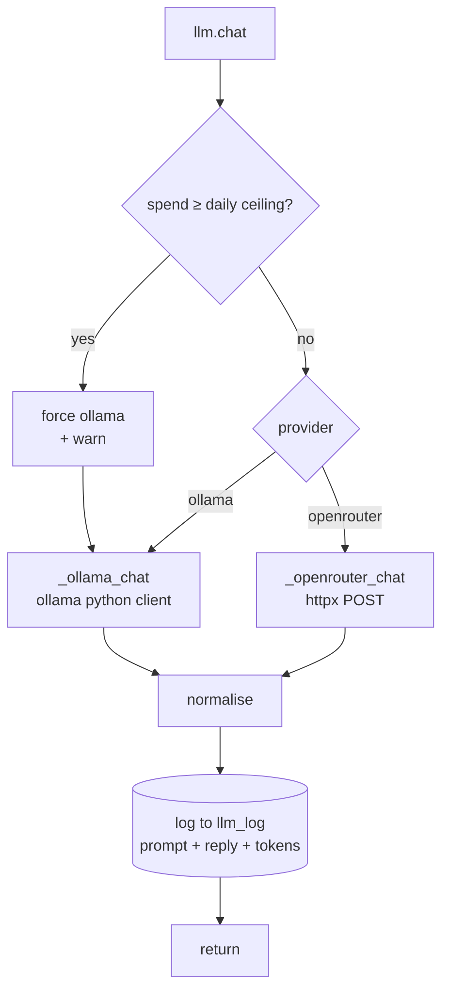

# Model providers

## What this is

Two ways to run a model: **Ollama** locally, **OpenRouter** over HTTP. `tiwa/llm.py`
normalises both behind one `chat()` so nothing upstream knows which answered.

## Why it's here

One function, one return shape, so `pipeline.py` never grows an `if provider ==` branch:

```python
{"content": str, "tool_calls": [{"id", "name", "args"}], "raw": <message to append>}
```

`chat()` is **sync on purpose**. Async callers already wrap it in `asyncio.to_thread`,
and extraction already runs in a thread. One code path beats two.

## Diagram



<figcaption>Everything funnels through one function, which is why the cost ceiling and the
debug log each exist in exactly one place.</figcaption>

## The choices

### Ollama — local

| | |
|---|---|
| **What** | Local model server with an HTTP API and a Python client |
| **Why chosen** | Free, offline, no key, no rate limit. Tool calling and JSON-schema output both supported. Trivial model swaps |
| **Model** | `huihui_ai/qwen3-abliterated:8b` |
| **Rejected** | **llama.cpp direct** — more control, much more setup. **vLLM** — built for serving many users, wants more VRAM than 8 GB. **LM Studio** — GUI-first, awkward to script |
| **Cost to replace** | Low. Any OpenAI-compatible local server would need `_ollama_chat` rewritten and nothing else |

The **abliterated** build has refusal behaviour trained out. It's there for freedom of
speech: she's supposed to swear and argue back, and a stock instruct model breaks
character exactly when things get heated. Qwen3 also handles Thai well, which is
non-negotiable here.

Vendor guidance matters: Qwen3 warns against greedy decoding, so no pass uses
temperature 0 for chat — `0.3` for tools, `0.7` for her voice, `0` only for
schema-constrained JSON.

### OpenRouter — API

| | |
|---|---|
| **What** | One OpenAI-compatible endpoint in front of many providers |
| **Why chosen** | One key for every model, so swapping is an env var. Per-request provider routing. Usage returned inline, which is what `spend()` counts |
| **Model** | `deepseek/deepseek-v4-flash` |
| **Rejected** | **Direct vendor APIs** — a key and a client per vendor. **A gateway you host** — a service to run for a one-user bot |
| **Cost to replace** | Low for another OpenAI-compatible endpoint; the body-building code is ~30 lines |

Two request fields are measured, not decorative:

- `"reasoning": {"enabled": false}` — this bot never wants chain-of-thought.
- `"provider": {"sort": "throughput"}` — about **40% faster** round-trip from Thailand.

!!! danger "Never use reasoning effort `minimal`"
    It turns reasoning **on** (measured: 105 characters, 30 tokens of it). The only way
    off is `enabled: false`.

DeepSeek also has a quirk worth knowing: it returns empty content for a JSON-schema
request unless the prompt literally contains the word "json". `chat()` asserts that
rather than letting you debug an empty string.

## Gotchas

- **Tool-result messages differ by provider.** `tool_result_msg()` handles it —
  OpenRouter wants `tool_call_id`, Ollama wants `tool_name`.
- **OpenAI-style arguments arrive as a JSON *string***, Ollama's as a dict. `_loads()`
  normalises and returns junk unchanged for `_arg_name()` to survive.
- **`load_env()` runs at import of `llm.py`**, not in `bot.py`, so every entry point —
  bot, chat, dashboard, benches — sees the same keys.
- **An unknown `TIWA_MODE` warns instead of exiting.** Exiting once bricked the dashboard
  you'd use to fix it.
- **`data/spend.json` is the only cost record.** Delete it and the day's counter resets.

## Go deeper

- [Modes](../concepts/modes.md) · [Decision log](../reference/decisions.md)
- [OpenRouter API](https://openrouter.ai/docs/api-reference/overview) ·
  [provider routing](https://openrouter.ai/docs/features/provider-routing)
- [Ollama tool support](https://ollama.com/blog/tool-support) ·
  [structured outputs](https://ollama.com/blog/structured-outputs)
- [Qwen3 sampling guidance](https://qwenlm.github.io/blog/qwen3/)
