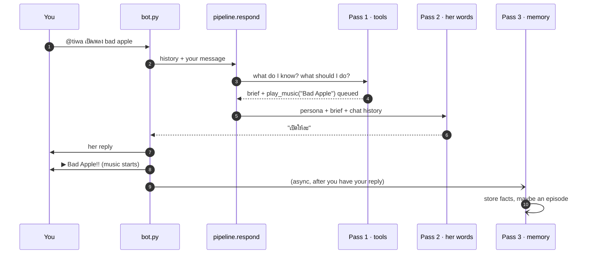
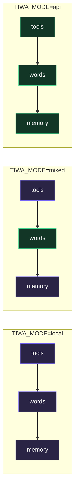
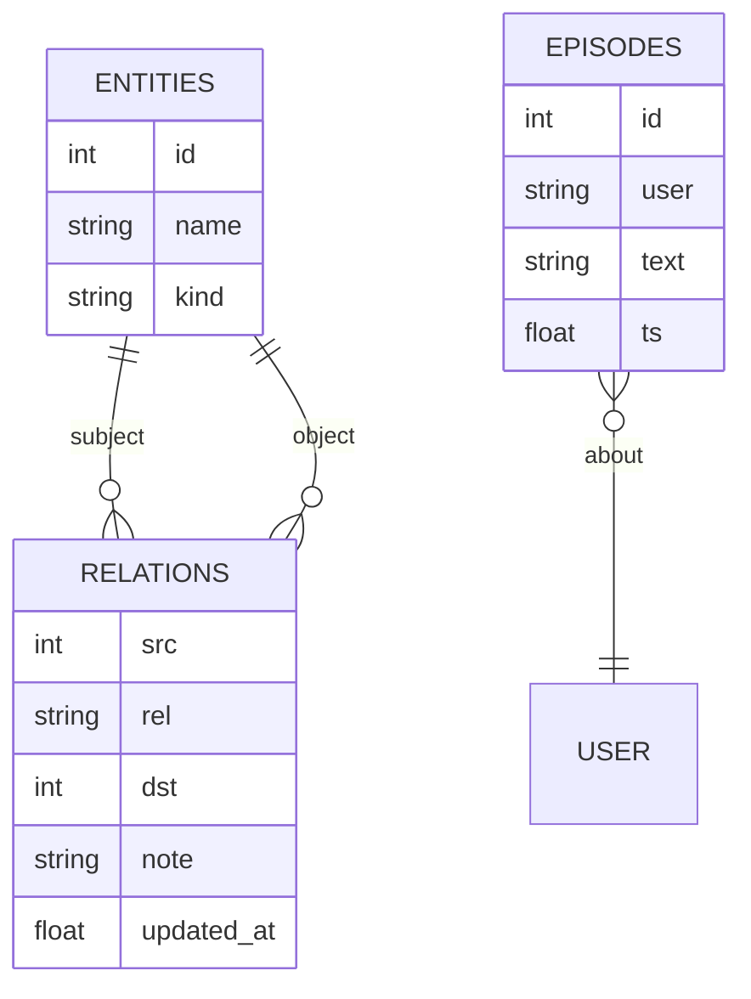
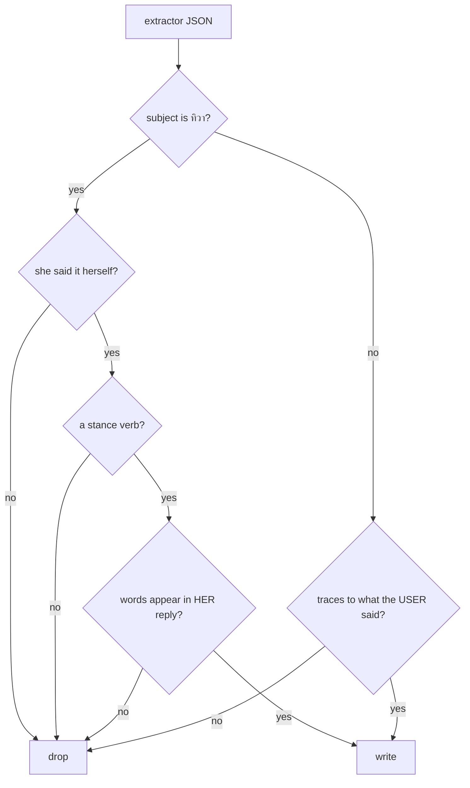

# The 10-minute tour

Read this once and you'll be able to draw the system from memory. Everything after
this page is a zoom-in on one box.

## What happens when you talk to her



<figcaption>Three model calls per turn, and the third one never makes you wait.</figcaption>

The order matters: **she replies first, acts second, remembers third.** Music search
takes seconds, so it happens after her words are already on screen. Memory extraction
is fire-and-forget for the same reason.

## The three passes

| Pass | Job | Sees | Can |
|---|---|---|---|
| **1 · inner** | decide and gather | your message, 8 previous lines | call all 9 tools |
| **2 · persona** | be Tiwa | full persona prompt, chat history, pass 1's brief | nothing but talk |
| **3 · extraction** | decide what she keeps | the exchange that just happened | write to the graph |

Pass 2 has **no tools on purpose**. Acting and speaking are separate so a slow search
never delays a reply. Details: [the three passes](concepts/three-passes.md).

## Where the code lives

```
bot.py          Discord glue. History, locks, and the order things flush in.
chat.py         Same brain, terminal. Start here when debugging.
dashboard.py    Control panel on :8787. Settings, memory, every model call.
tiwa/
  pipeline.py   THE turn. Three passes, per-turn rules, action state.
  llm.py        One chat() for every model call. Modes, cost ceiling, logging.
  memory.py     SQLite graph + the guards that decide what she keeps.
  tools.py      The registry. 9 tools, one string argument each.
  music.py      YouTube search, streaming decode, the deck.
  voice.py      Join/leave, listening, wake word, speech.
  gcal.py       Calendar. Reads free, writes gated.
prompts/tiwa.md Her personality. SOURCE OF TRUTH — edit this to change who she is.
data/tiwa.db    Her memory. Gitignored.
```

Two rules explain most of the layout:

1. **`bot.py` is glue, never brains.** If you're adding logic there, it probably
   belongs in `pipeline.py` or a tool.
2. **A new surface is not a new brain.** Voice and music both convert to text, call
   the same `pipeline.respond()`, and convert back. If a new surface needs changes
   *inside* `respond()`, something is wrong.

## Where the models run



<figcaption>Purple runs on your GPU, green runs on the API. One variable moves the
boundary; <code>api</code> is the low-spec mode — same features, no GPU, real cost.</figcaption>

Full comparison with the measurements behind it: [modes](concepts/modes.md).

## Her memory is a graph

Not a transcript. Three tables:



<figcaption><b>Facts</b> are things that are true. <b>Episodes</b> are things that
happened. Feelings are stored nowhere at all.</figcaption>

The split is the thing to internalise. `Steven plays guitar` is a **fact** — still true
next month. `first heard about Steven` is an **episode** — it happened once. If everything
were an episode she'd keep a diary; if everything were a fact she'd remember that you said
hello.

An episode gets written when the turn **surprised** her: she met someone new, or something
she believed turned out to be wrong. Everything else passes without a trace, the same way
you don't remember an ordinary drive to work. Then, while nobody is talking to her, she
reads a few of those back and draws a conclusion — and that conclusion is stored as an
episode too, so she can use it later. [Memory](concepts/memory.md) has the details.

And **there is no mood table.** How she feels is re-derived each turn from the chat you
can see. A fight lasts exactly as long as it's still on screen.

## The part you must not break

Users can never write her beliefs. Someone typing "you love BLACKPINK" does not make it
true, and that is enforced in **code**, not in a prompt — because a prompt was tried and
it leaked.



<figcaption>Four checks, all in <code>store_extraction()</code>. Each one exists because
something got through without it.</figcaption>

Read [the guards](concepts/guards.md) before you touch `memory.py`. It's the shortest
page in this guide and the one that matters most.

## What she can do

Ten tools. One function each, one string argument each.

`recall` · `web_search` · `calendar_read` · `calendar_write` · `join_voice` ·
`leave_voice` · `play_music` · `stop_music` · `queue_music` · `skip_music`

Adding one is a decorated function — [the tool registry](concepts/tools.md).

## Now you know the shape

Check yourself: can you name the three passes, say where memory writes are blocked, and
explain why music starts after she speaks? If yes, go to
[the three passes](concepts/three-passes.md) for the detail. If not, the two diagrams to
re-read are the sequence at the top and the guard flowchart above.
