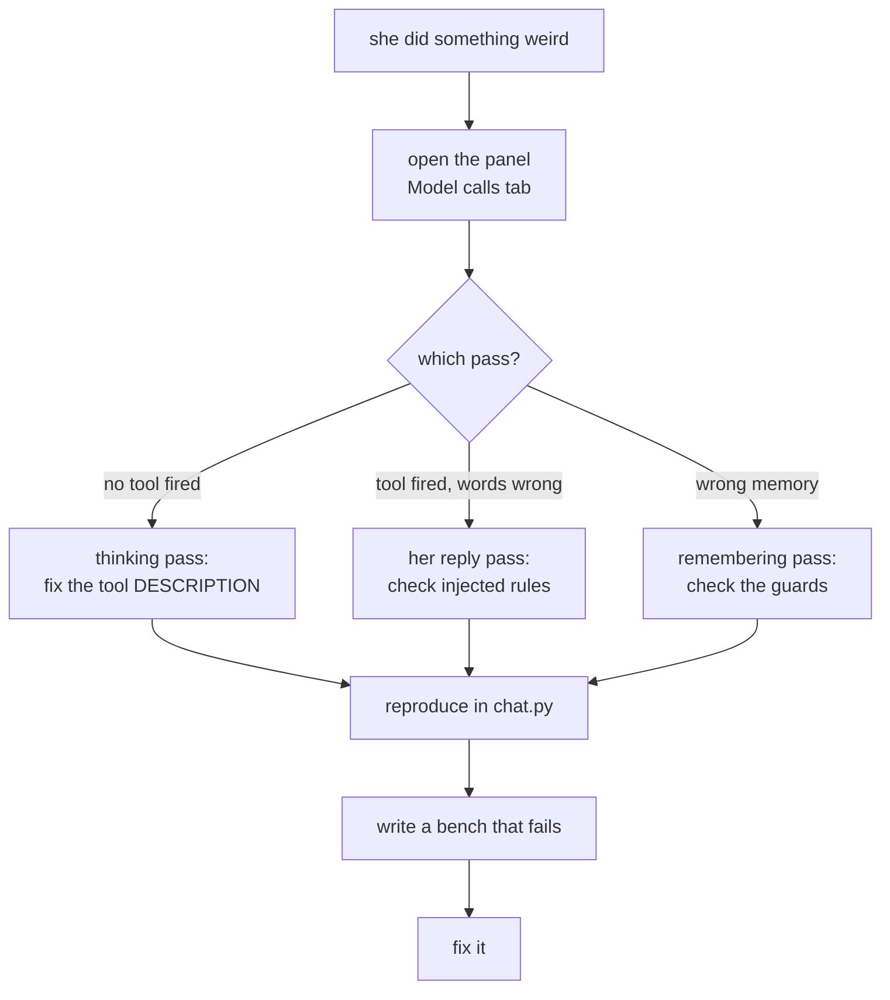

# Common workflows

How to do the things you'll actually be asked to do. Each one names the files, in order.

## Add a skill — a Mini Tiwa {#add-a-tool}

Give her a new ability. On this branch that means a **mini**, not a tool.

```
tiwa/minis.py     ← write the function, decorate it
tiwa/tools.py     ← ONLY if it needs a new hand — a way to touch the world
bot.py            ← ONLY if that hand acts on Discord (then it sets a flag)
tests/dispatchbench.py ← add a probe
tests/growthbench.py   ← name the caller of any new actuator
```

1. Write it. One string task in, a dict of **declared facts** out, never raises:

    ```python
    @mini(
        "One sentence on WHAT it does and what to give it. Then Thai trigger "
        "phrases. Written for Main Tiwa, who sees this line and nothing else.",
        ("field", "another_field"),      # every key it may return
    )
    def my_mini(db, task: str) -> dict:
        return {"field": "a fact", "another_field": 3}
    ```

    The field list is the guarantee. Anything undeclared is dropped by
    `minis.clean()` before it can reach her — that is how a mini is stopped from
    smuggling prose into her voice. Adding a field is a visible edit somebody
    reviews.

2. If it acts on Discord, don't act. Set a flag on the `Turn` and let `bot.py`
   drain it after her reply — [why](../concepts/tools.md#tools-set-flags-they-dont-act).

3. Check the contract: `py -X utf8 -m tiwa.minis`, then `py -X utf8 tests\growthbench.py`.

4. **Write the description like it's the code**, because it is. Include Thai phrasings —
   the model does not generalise from English. Say what *not* to send it.

!!! tip "This is the one that is supposed to be cheap"
    Adding a mini costs Main Tiwa's prompt **0 characters** — `growthbench` asserts it,
    by registering a fourth mini and diffing. That was the whole point of the swarm.
    Adding a *tool* used to cost every other tool some accuracy; `now_playing` was
    deleted for it.

## Add a setting

```
tiwa/<module>.py   ← read it with os.environ.get(NAME, default)
dashboard.py       ← add to SETTINGS with an explanation and default
docs/reference/env.md ← document it
```

The `SETTINGS` entry is `(key, label, help, default, options)`. The help text is for
somebody who has never seen the codebase — write the sentence you'd want.

## Change how she talks

| Want | Edit | Why there |
|---|---|---|
| Her personality, voice, values | `prompts/tiwa.md` | Source of truth |
| A rule she keeps breaking | `pipeline._state()` per-turn rules | Strongest prompt lever |
| Something that must never fail | code | Prompts reduce, code decides |

Order of effectiveness, measured repeatedly: **code > per-turn rules > mini description >
persona prompt.**

## Change what she remembers

```
tiwa/memory.py     ← _EXTRACT_SYSTEM (what to propose) and/or store_extraction (what to allow)
tests/test_memory.py  ← the guard regressions live here
tests/extractbench.py ← quality of proposals
```

!!! danger "Read [the guards](../concepts/guards.md) first"
    `store_extraction()` is a security boundary. Run `tests/test_memory.py` after any
    change to it — the coercion regression is in there by name.

## Add a bench

```
tests/<name>bench.py
```

Copy the shape of an existing one: build a scratch `memory.connect(":memory:")`, run the
real code, **print a markdown table**, assert at the end, exit non-zero on failure. No
pytest. You should be able to read the output and judge it yourself.

For anything touching Discord, import `bot` (it's import-safe) and fake the voice client
— `tests/djbench.py` does exactly that and runs the whole DJ offline.

## Debug "she did something weird"



<figcaption>The **Model calls** tab tells you which of the three passes to blame. Guessing wastes a
day.</figcaption>

Then reproduce in `chat.py`, not Discord — same brain, no gateway, instant restarts.

## Add a new surface

Audio, SMS, a web chat — the rule is **a surface is not a brain**:

1. Convert input to text.
2. Call `pipeline.respond(db, history, author, text)`.
3. Convert the reply back.
4. Drain the pending flags like `bot.py` does.

If you need to change something *inside* `respond()` to make a surface work, stop —
that's a sign the change belongs in the pipeline for everyone, or that the surface is
doing too much.
