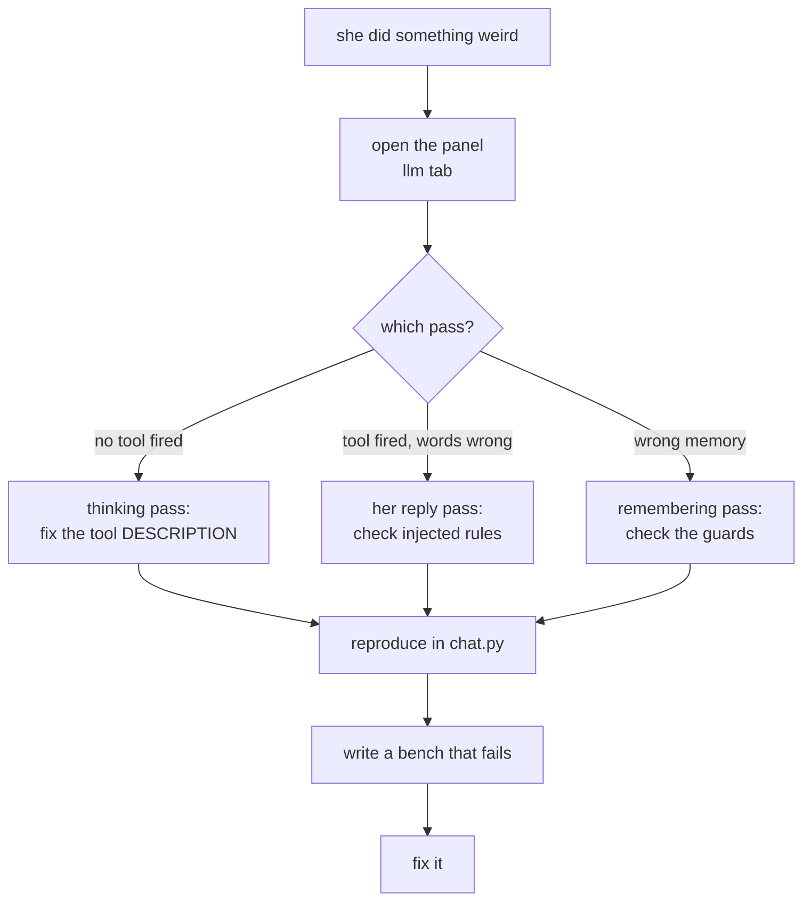

# Common workflows

How to do the things you'll actually be asked to do. Each one names the files, in order.

## Add a tool

Give her a new ability.

```
tiwa/tools.py     ← write the function, decorate it
bot.py            ← ONLY if it acts on Discord (then it sets a flag)
tests/toolbench.py ← add a probe
```

1. Write it. One string argument, returns a string, never raises:

    ```python
    @tool(
        "One sentence on WHEN to call this. Then Thai trigger phrases. "
        "Then examples of what to pass.",
        "what the argument means",
    )
    def my_tool(db, arg: str) -> str:
        return "what she should know as a result"
    ```

2. If it touches Discord, don't. Set a module flag and drain it in `bot.py` after her
   reply — [why](../concepts/tools.md#tools-set-flags-they-dont-act).

3. Check the registry: `py -X utf8 -m tiwa.tools`

4. **Write the description like it's the code**, because it is. Include Thai phrasings —
   the model does not generalise from English. Say what *not* to call it for.

!!! warning "Every tool you add competes with the others"
    More tools measurably degrades selection. `now_playing` was deleted for this reason.
    Ask whether [action state](../concepts/action-state.md) could just tell her instead.

## Add a setting

```
tiwa/<module>.py   ← read it with os.environ.get(NAME, default)
dashboard.py       ← add to SETTINGS with an explanation and default
docs/reference/env.md ← document it
```

The `SETTINGS` entry is `(key, label, help, default, options)`. The help text is for
somebody who has never seen the codebase — write the sentence you'd want.

## Change how she talks

| Want | Edit | Why there |
|---|---|---|
| Her personality, voice, values | `prompts/tiwa.md` | Source of truth |
| A rule she keeps breaking | `pipeline.respond()` per-turn rules | Strongest prompt lever |
| Something that must never fail | code | Prompts reduce, code decides |

Order of effectiveness, measured repeatedly: **code > per-turn rules > tool description >
persona prompt.**

## Change what she remembers

```
tiwa/memory.py     ← _EXTRACT_SYSTEM (what to propose) and/or store_extraction (what to allow)
tests/test_memory.py  ← the guard regressions live here
tests/extractbench.py ← quality of proposals
```

!!! danger "Read [the guards](../concepts/guards.md) first"
    `store_extraction()` is a security boundary. Run `tests/test_memory.py` after any
    change to it — the coercion regression is in there by name.

## Add a bench

```
tests/<name>bench.py
```

Copy the shape of an existing one: build a scratch `memory.connect(":memory:")`, run the
real code, **print a markdown table**, assert at the end, exit non-zero on failure. No
pytest. You should be able to read the output and judge it yourself.

For anything touching Discord, import `bot` (it's import-safe) and fake the voice client
— `tests/djbench.py` does exactly that and runs the whole DJ offline.

## Debug "she did something weird"



<figcaption>The llm tab tells you which of the three passes to blame. Guessing wastes a
day.</figcaption>

Then reproduce in `chat.py`, not Discord — same brain, no gateway, instant restarts.

## Add a new surface

Audio, SMS, a web chat — the rule is **a surface is not a brain**:

1. Convert input to text.
2. Call `pipeline.respond(db, history, author, text)`.
3. Convert the reply back.
4. Drain the pending flags like `bot.py` does.

If you need to change something *inside* `respond()` to make a surface work, stop —
that's a sign the change belongs in the pipeline for everyone, or that the surface is
doing too much.
